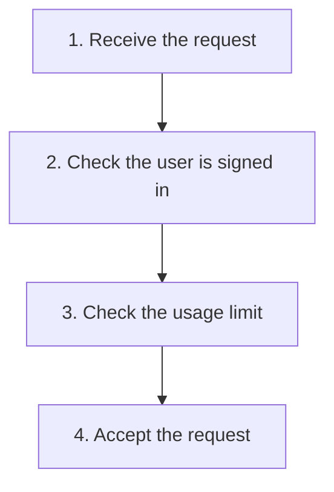
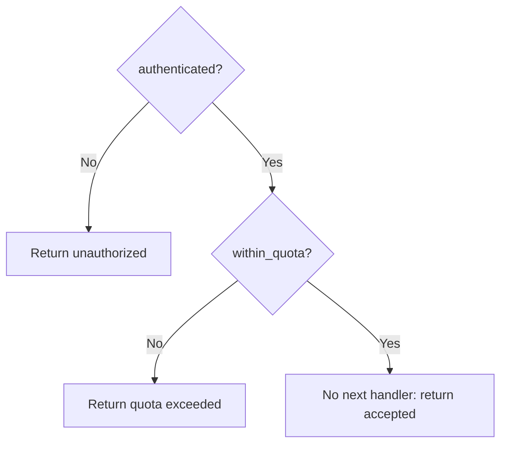
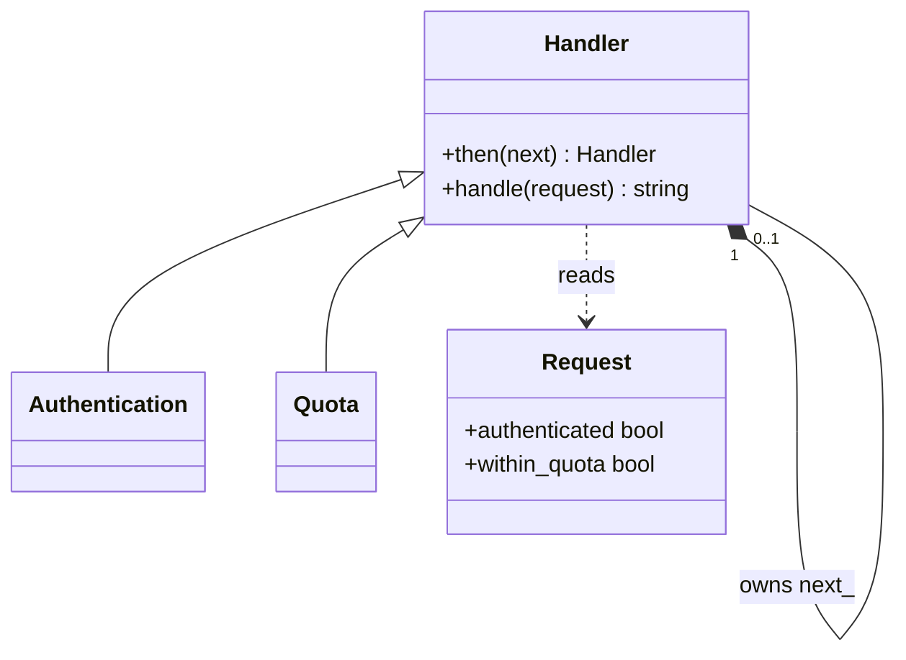
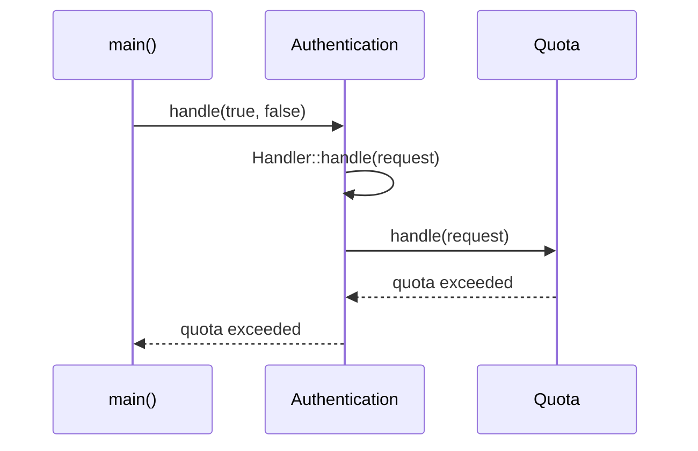

# Chain of Responsibility

## 1. Definition

**Chain of Responsibility lets objects handle a request one after another, with
each object deciding whether to stop or pass it on.**

Imagine an online request that must first prove the user is signed in, then check
that the user has not exceeded a usage limit. A failed check stops the request.
Each object performing a step is called a **handler**.

## 2. The Problem It Solves

Suppose every request must come from a signed-in user who has some quota left.
If every caller writes both checks, a new caller might forget quota or check it
first. Adding another rule means updating all those callers.

Give each check its own object and connect the objects in order. The caller sends
the request to the first one. Authentication either rejects it or passes it to
quota. Quota either rejects it or lets it continue. The caller no longer arranges
the checks itself.

## 3. Understand the Idea Step by Step

1. A handler receives the request.
2. It performs its own check or work.
3. If processing should stop, it returns a result immediately.
4. Otherwise it passes the request to the next handler.
5. Define what happens when there is no next handler.

In our checking chain, every check must pass. Another common version passes a
request along until one handler deals with it, such as finding someone who can
approve an expense. Decide which rule your chain uses, including what happens at
the end. Our code accepts a request that reaches the end without being rejected.

### Picture: The Successful Checking Path

Read downward. An arrow means "continue only if this check passed."

**Read it as a sentence:** a request passes sign-in, then usage-limit checks, then
is accepted. If either check fails, stop there; the remaining boxes do not run.

The order matters. If sign-in fails, quota is never checked. If we reverse the
handlers and both checks would fail, the caller gets a different first error.

## 4. Real-World Scenario

An employee submits an expense. A team lead can approve small expenses; larger ones
go to a manager, then finance. Each person either approves or passes it onward.
The submission form need not know every approval limit.

This approval example differs from the code below: one person handles the request,
whereas the code requires all checks to pass. Both need an explicit end-of-chain rule.

## 5. Understand the C++ Example

Open [chain_of_responsibility.cpp](../../../patterns/behavioral/chain_of_responsibility.cpp).

`Handler` contains the next handler. `Authentication` checks the sign-in flag.
`Quota` checks the usage-limit flag. `then()` connects them.

1. Connect authentication first and quota second.
2. A request without authentication returns `unauthorized` immediately.
3. A signed-in request continues to the quota check.
4. Exceeded quota returns `quota exceeded`.
5. Passing both reaches the final `accepted` result.
6. Checks cover all three results and confirm the first failure wins.

The first handler owns the next one, meaning it is responsible for its cleanup.
The yes/no fields simulate decisions; they do not verify real credentials. A real
security system may need to reject by default and ensure required checks cannot be omitted.

### C++ Flow Diagram

Read downward through the intended chain. Each diamond asks whether to stop or
forward the request; arrows are control flow, not ownership.

The drawback function removes the quota step and accepts an over-quota request.
Reversing the handlers also changes which error wins when both checks fail.

### C++ Class Diagram

Triangles mean inheritance. The filled diamond means a handler exclusively owns
its next handler; `0..1` allows the final handler to have no successor.

`then()` actually returns `Handler&`, allowing links to be added to the returned
next object. The base `handle()` forwards, or accepts if no next object exists.

### C++ Sequence Diagram

Time runs downward; solid arrows call, dashed arrows return. This request passes
authentication but fails quota, so no acceptance result is produced.

The arguments abbreviate the `Request{true, false}` object. The pattern cannot
know that a required quota handler was accidentally omitted during setup.

## 6. Benefits, Drawbacks, and Alternatives

**Benefits:** callers submit a request without knowing every check. The same quota
handler can be reused in another chain, and setup chooses which checks run in what order.

**Drawbacks:** setup can leave out an important check. The drawback example omits
quota and accepts a request that should have failed it. Changing the order also
changes which error is reported first. The pattern connects handlers; it does not
know whether the chosen chain enforces all your rules.

**Use it when:** handlers or their order need to vary. A short fixed list of ordinary
function calls can be clearer when no such variation is required.

## 7. Check Your Understanding

**Question:** Does every handler always run?

**Answer:** No. In this example, a rejection stops immediately. A request that is not
signed in never reaches the quota handler, even if its quota flag would also fail.

Optional detail: [behavioral technical notes](../../../patterns/behavioral/README.md).