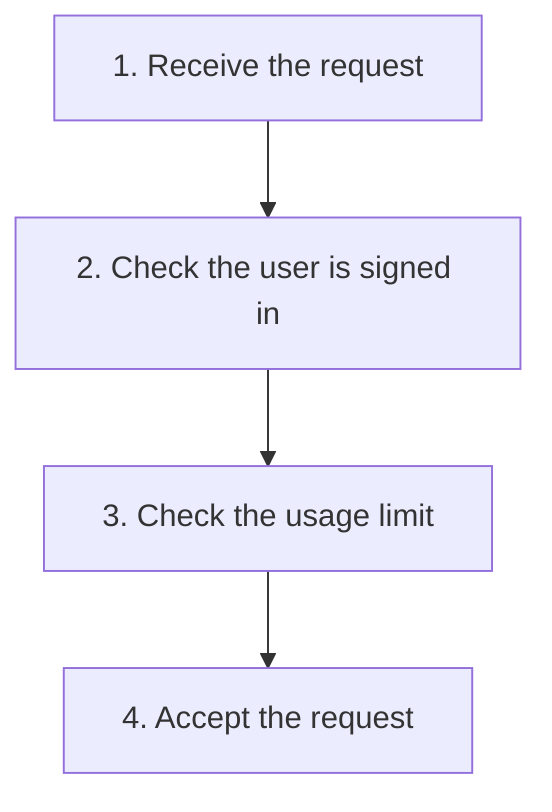

# Chain of Responsibility

## 1. Definition

**Chain of Responsibility passes a request through a series of objects. Each object
decides whether to deal with it, reject it, or pass it to the next one.**

Imagine an online request that must first prove the user is signed in, then check
that the user has not exceeded a usage limit. A failed check stops the request.
Each object performing a step is called a **handler**.

## 2. The Problem It Solves

Putting all checks into every place that sends requests repeats the rules. One
caller may forget a check or use a different order. A single giant checking function
can also become difficult to change when different requests need different steps.

Put each check in its own handler and connect the handlers in the required order.
The sender only needs to submit the request to the beginning of the chain.

## 3. Understand the Idea Step by Step

1. A handler receives the request.
2. It performs its own check or work.
3. If processing should stop, it returns a result immediately.
4. Otherwise it passes the request to the next handler.
5. Define what happens when there is no next handler.

There are two common versions. An approval chain stops when someone can approve.
A checking chain continues only while every check passes. Do not confuse these
rules: reaching the end might mean approved in one system and unhandled in another.

### Picture: The Successful Checking Path

Read downward. An arrow means "continue only if this check passed."

**Read it as a sentence:** a request passes sign-in, then usage-limit checks, then
is accepted. If either check fails, stop there; the remaining boxes do not run.

Order is part of the behavior. For example, checking sign-in first can avoid revealing
account information to an unknown user. Allowing configurable order does not make
every order correct.

## 4. Real-World Scenario

An employee submits an expense. A team lead can approve small expenses; larger ones
go to a manager, then finance. Each person either approves or passes it onward.
The submission form need not know every approval limit.

This approval example differs from the code below: one person handles the request,
whereas the code requires all checks to pass. Both need an explicit end-of-chain rule.

## 5. Understand the C++ Example

Open [chain_of_responsibility.cpp](../../../patterns/behavioral/chain_of_responsibility.cpp).

`Handler` contains the next handler. `Authentication` checks the sign-in flag.
`Quota` checks the usage-limit flag. `then()` connects them.

1. Connect authentication first and quota second.
2. A request without authentication returns `unauthorized` immediately.
3. A signed-in request continues to the quota check.
4. Exceeded quota returns `quota exceeded`.
5. Passing both reaches the final `accepted` result.
6. Checks cover all three results and confirm the first failure wins.

The first handler owns the next one, meaning it is responsible for its cleanup.
The yes/no fields simulate decisions; they do not verify real credentials. A real
security system may need to reject by default and ensure required checks cannot be omitted.

## 6. Benefits, Drawbacks, and Alternatives

**Benefits:** reusable checks, fewer details in senders, and an easy place to change
the order or selection of steps when that flexibility is genuinely needed.

**Drawbacks:** incorrect ordering can change results or weaken security. Requests
may reach the end without anyone handling them. Long chains can be hard to trace.

**Use it when:** handlers or their order need to vary. A short fixed list of ordinary
function calls can be clearer when no such variation is required.

## 7. Check Your Understanding

**Question:** Does every handler always run?

**Answer:** No. In this example, a rejection stops immediately. A request that is not
signed in never reaches the quota handler, even if its quota flag would also fail.

Optional detail: [behavioral technical notes](../../../patterns/behavioral/README.md).