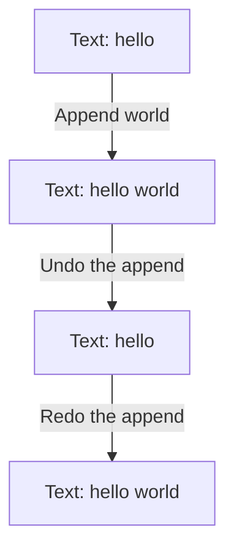

# Command

## 1. Definition

**Command stores an action as an object, including the information needed to perform it.**
Because it is stored, the action can be run later, kept in a history, or sometimes undone.

For example, an "append text" command remembers which document to edit and what
text to add. It can also remember the previous length so it can undo that addition.

## 2. The Problem It Solves

A direct function call performs work immediately. Afterward, it does not automatically
leave a record explaining how to undo the work. Menu buttons and keyboard shortcuts
may also need to trigger the same action without repeating the editing code.

Represent the request as a command. Buttons, shortcuts, and a history manager can
all run that command without knowing how the document stores text.

## 3. Understand the Idea Step by Step

1. Create a command with the target document and requested text.
2. Run its `execute()` function to apply the change.
3. Keep the command in a history if undo is supported.
4. Call its `undo()` to reverse its particular change.
5. Redo runs the action again when the document is in the appropriate earlier state.

The **receiver** is the object being changed, here the document. The **invoker** is
the code asking a command to run, here the history manager. The **command** knows
the action and its needed data. These are names for three jobs, not requirements
to memorize before understanding an append operation.

### Picture: One Edit, Undo, Redo

Read downward. Each box is the document text after the labeled action.

**Read it as a sentence:** append adds the text, undo removes that addition, and redo
adds it again. The command keeps enough information to do its own reversal.

Undo is not automatic for every action. Sending an email cannot be undone merely
by restoring a local variable. Similarly, retrying a payment could charge twice
unless the payment system explicitly recognizes repeated requests.

## 4. Real-World Scenario

A photo editor lets both a menu and a shortcut create a crop command. The command
records the crop and enough earlier image data to undo it. The history stores the
command without knowing how cropping works.

Large images may make saved undo data expensive. Uploading an image to a server
needs a separate deletion request to reverse its external effect, if reversal is allowed.

## 5. Understand the C++ Example

Open [command.cpp](../../../patterns/behavioral/command.cpp).

`Document` holds text. `Append` records the document, added text, and previous length.
`History` keeps lists of completed and undone commands.

1. Append `hello`, then ` world`, producing `hello world`.
2. Undo shortens the document to the saved length, leaving `hello`.
3. Redo adds ` world` again.
4. Undo again, then append ` C++` instead.
5. The result is `hello C++`; the abandoned redo list is cleared.
6. Checks also cover asking for undo or redo when the corresponding list is empty.

Commands borrow the document, so it must remain alive while they use it. Undo assumes
the most recent edit is undone first and no unrelated code has changed the text.
History reserves room in its list before editing, so failure to obtain memory does
not leave an edit without its history record.

## 6. Benefits, Drawbacks, and Alternatives

**Benefits:** one action can be triggered in different ways, delayed, stored, or used
in a history. Action-specific data stays beside the code that uses it.

**Drawbacks:** extra objects and saved data; the target must stay alive; undo and
retry rules can be difficult, especially for actions outside the program.

**Use it when:** actions need history, metadata, or delayed execution. A plain function
is enough for many immediate one-off tasks. Memento stores an earlier state, while
Command stores an action; a command can use a memento to support undo.

## 7. Check Your Understanding

**Question:** Why clear redo after making a new edit following undo?

**Answer:** The document now follows a different sequence of edits. The saved redo
commands describe the abandoned sequence and may no longer be valid for the new text.

Optional detail: [behavioral technical notes](../../../patterns/behavioral/README.md).