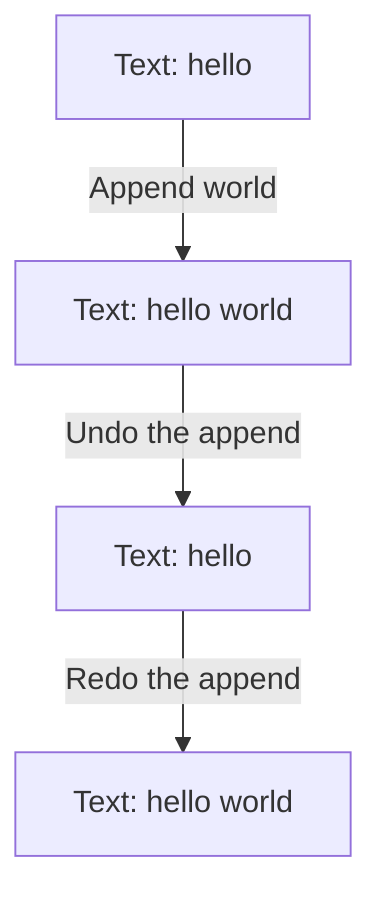
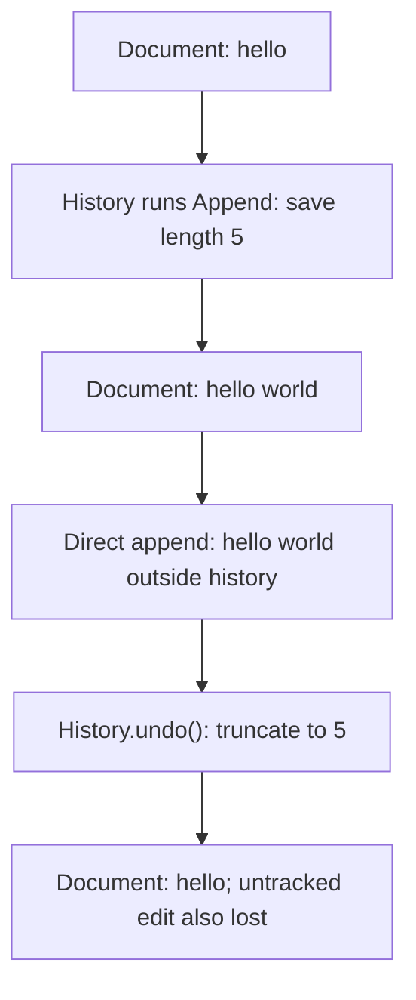
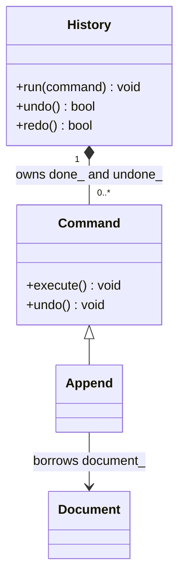
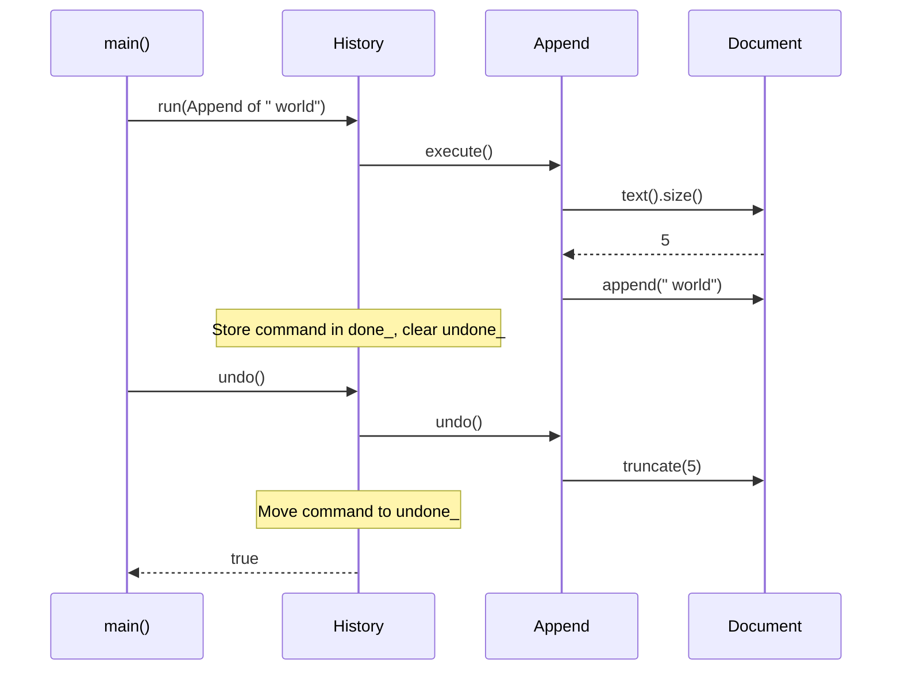

# Command

## 1. Definition

**Command turns an action into an object that remembers what to do and where to do it.**
You can run that object now, keep it for later, or give it an undo operation.

For example, an "append text" command remembers which document to edit and what
text to add. It can also remember the previous length so it can undo that addition.

## 2. The Problem It Solves

Appending text directly is easy. But then the user presses **Undo**. Which text
was added? How long was the document before it? The finished function call does
not keep those answers for us.

An `Append` command keeps the document, the text to add, and the earlier length.
The history asks it to execute, then keeps it. Later, the history can ask that same
command to undo. A menu and a keyboard shortcut can also use the same command
instead of each containing editing logic.

## 3. Understand the Idea Step by Step

1. Create a command with the target document and requested text.
2. Run its `execute()` function to apply the change.
3. Keep the command in a history if undo is supported.
4. Call its `undo()` to reverse its particular change.
5. Redo runs the action again when the document is in the appropriate earlier state.

There are three jobs: `Document` holds the text, `Append` knows how to change it,
and `History` asks the command to run. Pattern books call the document the
**receiver** and the history the **invoker**. The command connects them.

### Picture: One Edit, Undo, Redo

Read downward. Each box is the document text after the labeled action.

**Read it as a sentence:** append adds the text, undo removes that addition, and redo
adds it again. The command keeps enough information to do its own reversal.

Undo is not automatic for every action. Sending an email cannot be undone merely
by restoring a local variable. Similarly, retrying a payment could charge twice
unless the payment system explicitly recognizes repeated requests.

## 4. Real-World Scenario

A photo editor lets both a menu and a shortcut create a crop command. The command
records the crop and enough earlier image data to undo it. The history stores the
command without knowing how cropping works.

The history only needs to know "execute this" and "undo this." The crop command
decides what earlier image data it must save. Keeping that data can cost a lot of
memory for large images.

## 5. Understand the C++ Example

Open [command.cpp](../../../patterns/behavioral/command.cpp).

`Document` holds text. `Append` records the document, added text, and previous length.
`History` keeps lists of completed and undone commands.

1. Append `hello`, then ` world`, producing `hello world`.
2. Undo shortens the document to the saved length, leaving `hello`.
3. Redo adds ` world` again.
4. Undo again, then append ` C++` instead.
5. The result is `hello C++`; the abandoned redo list is cleared.
6. Checks also cover asking for undo or redo when the corresponding list is empty.

Commands borrow the document, so it must remain alive while they use it. Undo assumes
the most recent edit is undone first and no unrelated code has changed the text.
History reserves room in its list before editing, so failure to obtain memory does
not leave an edit without its history record.

### C++ Flow Diagram

Follow the text values in the drawback function. Arrows mean the next edit or undo.

Undo knows the earlier length, not which later characters came from which action.
The controlled comparison records every edit so undo removes only the latest one.

### C++ Class Diagram

The triangle means inheritance. A filled diamond means exclusive ownership; an
ordinary arrow means the borrowed document must outlive commands that use it.

Moving a command between the two vectors transfers its owner; it does not copy
the document. Running a new command clears the redo branch.

### C++ Sequence Diagram

Solid arrows call; dashed arrows return. This traces the second append and its
undo in `main()`, starting with a document that already contains `hello`.

History reserves vector capacity before changing the document. The diagram focuses
on behavior and omits those allocation-preparation calls.

## 6. Benefits, Drawbacks, and Alternatives

**Benefits:** a button, shortcut, or history can run an action without knowing its
editing details. The command keeps the information it needs to execute and undo,
and can wait in a queue before being run.

**Drawbacks:** undo must match how changes are made. The drawback example appends
text outside the history; undo then truncates to the saved length and removes that
untracked text too. Commands also need memory, and their document must stay alive.
Some actions, such as sending an email, have no simple undo.

**Use it when:** actions need history, metadata, or delayed execution. A plain function
is enough for many immediate one-off tasks. Memento stores an earlier state, while
Command stores an action; a command can use a memento to support undo.

## 7. Check Your Understanding

**Question:** Why clear redo after making a new edit following undo?

**Answer:** The document now follows a different sequence of edits. The saved redo
commands describe the abandoned sequence and may no longer be valid for the new text.

Optional detail: [behavioral technical notes](../../../patterns/behavioral/README.md).