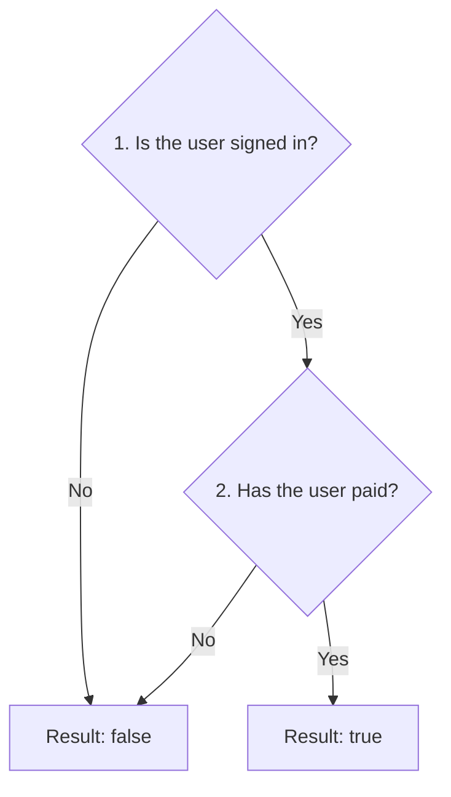

# Interpreter

## 1. Definition

**Interpreter represents the rules of a small language as objects and gives those
objects a way to work out an answer.**

For example, the rule "signed in AND paid" is true only when both facts are true.
One object reads "signed in," another reads "paid," and an AND object combines them.

## 2. The Problem It Solves

Hardcoding every possible rule combination can produce many repeated conditions.
Letting users enter unrestricted programming code is often far more powerful than
the application needs and can be unsafe.

A deliberately small rule language gives users the required choices while the
application controls which operations exist and what they mean.

## 3. Understand the Idea Step by Step

1. Represent a named fact with an object that can read its value.
2. Represent AND with an object that holds two smaller expressions.
3. Supply current facts, such as `signed_in = true` and `paid = false`.
4. Ask the rule for its result.

An **expression** is something that can produce a value. **Evaluate** means work out
that value. The **context** is the collection of current facts used in that calculation.
The nested expression objects form a **tree**, with combined expressions above the
smaller expressions they use.

### Picture: Work Out an AND Rule

Read downward. A no answer stops immediately; a yes answer needs the second fact.

**Read it as a sentence:** both facts must be true. Once the first is false, the
answer is already false, so the second need not be read. This is called **short-circuiting**.

Reading text and understanding the built rule are separate jobs. A **parser** converts
text such as `signed_in AND paid` into expression objects. An interpreter evaluates
those objects. Adding evaluation does not automatically add a parser.

## 4. Real-World Scenario

A feature-control service enables a paid feature for users who are signed in and
subscribed. It can reuse the same rule for many users by changing the supplied facts.
An OR operation could allow either of two qualifying conditions.

A real service needs limits on rule size and clear handling of unknown facts. A
large language usually deserves an existing parser and evaluator rather than an
ever-growing set of hand-written classes.

## 5. Understand the C++ Example

Open [interpreter.cpp](../../../patterns/behavioral/interpreter.cpp).

`Variable` reads a named true/false value from `Context`. `And` contains two expressions.
`Expression` describes the common evaluation operation.

1. Build the rule objects for `signed_in AND paid` directly in C++; no text is parsed.
2. Both true gives true; `paid = false` gives false.
3. If `signed_in` is false, the second expression is skipped.
4. Therefore a missing `paid` entry is harmless in that skipped case.
5. If `signed_in` is true, missing `paid` throws an exception, reporting an error.
6. Checks verify these cases, including the difference between missing and false.

Each AND object owns its children, so they are cleaned up with the tree. The supplied
context is used during evaluation without being owned by the expression.

## 6. Benefits, Drawbacks, and Alternatives

**Benefits:** rules can be combined and reused; each operation has a clear meaning;
small pieces can be checked independently.

**Drawbacks:** many objects for large rules, repeated nested calls, and extra work
for reading input text, reporting errors, and limiting resource use.

**Use it when:** a small rule language is genuinely needed. A few fixed rules may
be clearer as ordinary C++ conditions.

## 7. Check Your Understanding

**Question:** If you add an `Or` class, will the program recognize the word `OR` in text?

**Answer:** No. The class explains how an already created OR object calculates its
answer. A parser must still recognize the text and create the appropriate objects.

Optional detail: [behavioral technical notes](../../../patterns/behavioral/README.md).