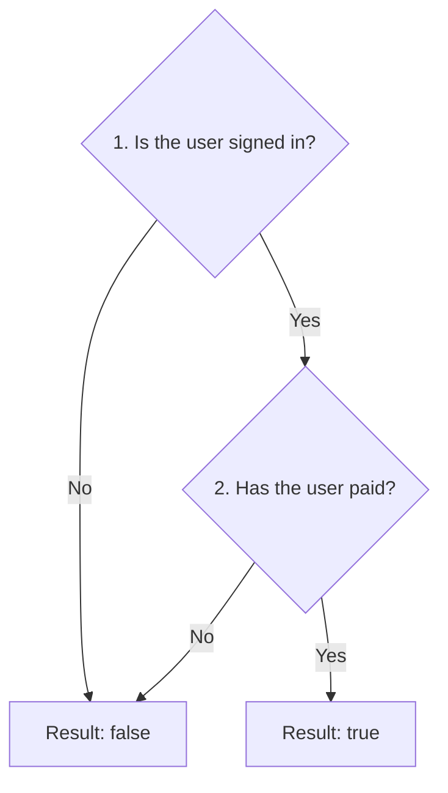
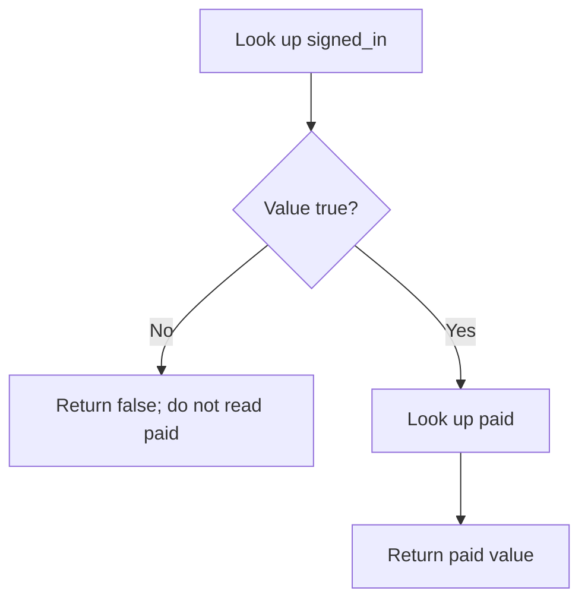
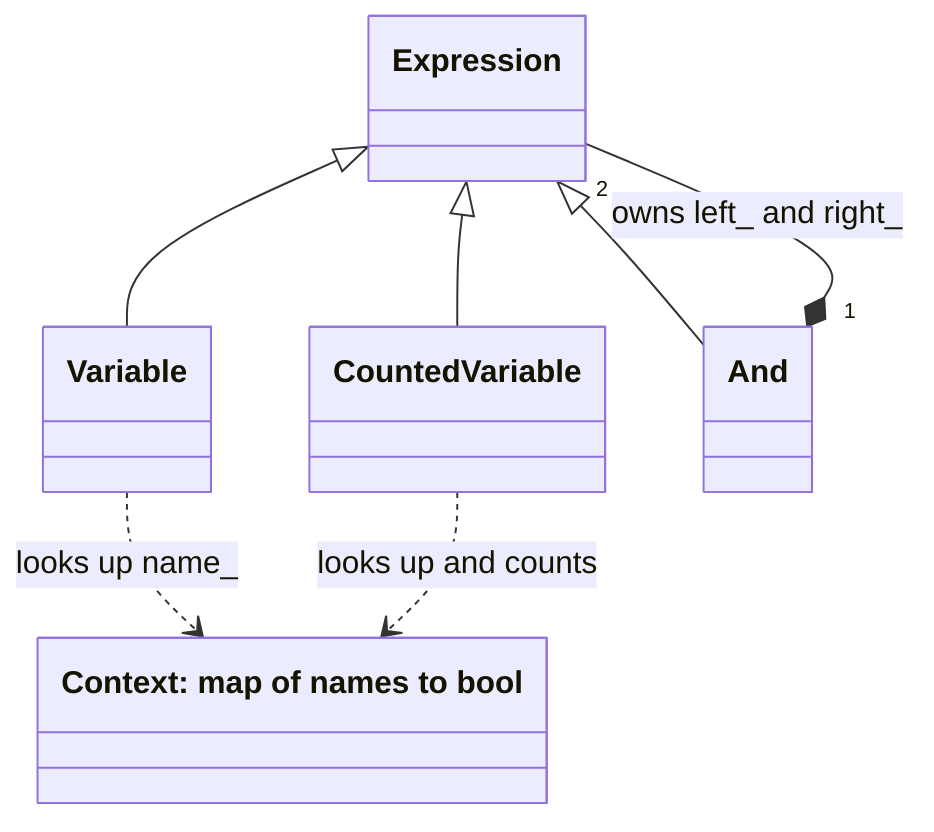
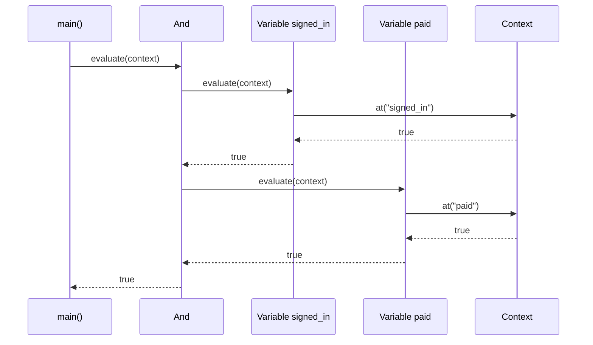

# Interpreter

## 1. Definition

**Interpreter builds a rule from small objects, then asks them to work out its answer.**

For example, the rule "signed in AND paid" is true only when both facts are true.
One object reads "signed in," another reads "paid," and an AND object combines them.

## 2. The Problem It Solves

Suppose one feature requires "signed in AND paid," while another combines a
different pair of facts. We could write a separate C++ condition for every rule.
As the combinations grow, we keep repeating the same operations with different names.

Instead, make an object that reads a named fact and another that combines two
answers with AND. Build a rule by connecting those objects. We can reuse the rule
for different users by supplying their current facts.

These objects form a small language with only the operations we choose to support.
The sample builds rules directly in C++; it does not yet accept typed rule text.

## 3. Understand the Idea Step by Step

1. Represent a named fact with an object that can read its value.
2. Represent AND with an object that holds two smaller expressions.
3. Supply current facts, such as `signed_in = true` and `paid = false`.
4. Ask the rule for its result.

`Variable("paid")` is an **expression**: something that produces a value. To
**evaluate** it means to find its answer using the current facts, called the
**context**. An AND expression asks its two smaller expressions for answers and
combines them. Nesting those objects forms an expression tree.

### Picture: Work Out an AND Rule

Read downward. A no answer stops immediately; a yes answer needs the second fact.

**Read it as a sentence:** both facts must be true. Once the first is false, the
answer is already false, so the second need not be read. This is called **short-circuiting**.

Reading text and understanding the built rule are separate jobs. A **parser** converts
text such as `signed_in AND paid` into expression objects. An interpreter evaluates
those objects. Adding evaluation does not automatically add a parser.

## 4. Real-World Scenario

A feature-control service enables a paid feature for users who are signed in and
subscribed. It can reuse the same rule for many users by changing the supplied facts.
An OR operation could allow either of two qualifying conditions.

The rule stays the same while the user's facts change. If the subscription fact
is missing, the service must decide whether to report an error or use a default;
missing information is not automatically the same as false.

## 5. Understand the C++ Example

Open [interpreter.cpp](../../../patterns/behavioral/interpreter.cpp).

`Variable` reads a named true/false value from `Context`. `And` contains two expressions.
`Expression` describes the common evaluation operation.

1. Build the rule objects for `signed_in AND paid` directly in C++; no text is parsed.
2. Both true gives true; `paid = false` gives false.
3. If `signed_in` is false, the second expression is skipped.
4. Therefore a missing `paid` entry is harmless in that skipped case.
5. If `signed_in` is true, missing `paid` throws an exception, reporting an error.
6. Checks verify these cases, including the difference between missing and false.

Each AND object owns its children, so they are cleaned up with the tree. The supplied
context is used during evaluation without being owned by the expression.

### C++ Flow Diagram

Follow the decisions in `And::evaluate()`. A missing variable throws when its
lookup is reached; it is not automatically treated as false.

The drawback checks evaluate an all-true tree twice, performing four lookups.
Creating one `Variable("signed_in AND paid")` instead looks for that entire name;
the object constructor does not parse rule text.

### C++ Class Diagram

Triangles point to the shared interface. The diamond means `And` owns two child
expressions. A dotted arrow is temporary use of the supplied variable map.

`Context` is an alias for a standard map, not a custom class with virtual methods.
`CountedVariable` also borrows a counter to make repeated work observable.

### C++ Sequence Diagram

Read downward; solid arrows call, dashed arrows return. This is the all-true
case, so both child expressions are evaluated in left-to-right order.

If the left result were false, the right-hand calls would not happen. No evaluated
answer is cached between calls in this implementation.

## 6. Benefits, Drawbacks, and Alternatives

**Benefits:** we can reuse a rule with different facts and build larger rules from
small tested pieces. The meaning of AND is written once instead of repeated for
every pair of facts.

**Drawbacks:** a large rule needs many objects and calls. This example rereads the
facts each time; its counting check shows four lookups for two all-true evaluations.
It also has no parser: putting `signed_in AND paid` in a variable name just looks
for that entire name. Reading rule text, reporting mistakes, and limiting very large
rules are additional work. For a larger language, use a suitable existing engine.

**Use it when:** a small rule language is genuinely needed. A few fixed rules may
be clearer as ordinary C++ conditions.

## 7. Check Your Understanding

**Question:** If you add an `Or` class, will the program recognize the word `OR` in text?

**Answer:** No. The class explains how an already created OR object calculates its
answer. A parser must still recognize the text and create the appropriate objects.

Optional detail: [behavioral technical notes](../../../patterns/behavioral/README.md).