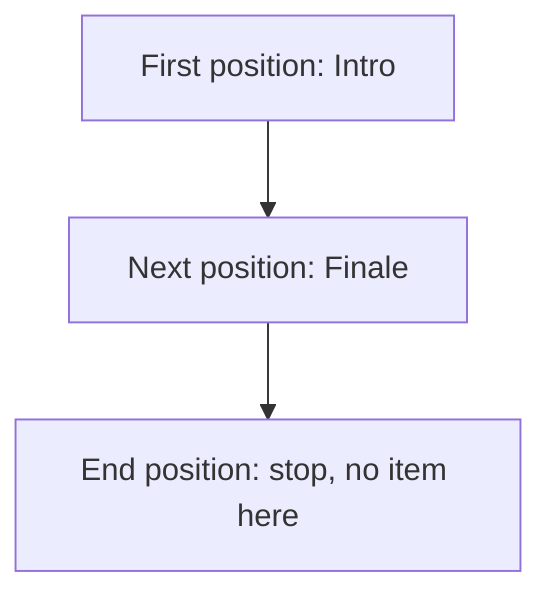

# Iterator

## 1. Definition

**Iterator is an object that keeps your current position while you visit the items
in a collection.** You can read the current item, move forward, and check whether
you have reached the end without knowing how the collection stores its items.

Think of a bookmark in a playlist. The playlist holds the songs; the bookmark tracks
which song you are looking at.

## 2. The Problem It Solves

Search code should not need separate storage-specific logic for every collection.
A list, array-like container, and tree may store items differently, yet all can
offer a way to visit items one by one.

An iterator gives algorithms a small common set of operations. An **algorithm** here
simply means a reusable procedure, such as searching for a matching item.

## 3. Understand the Idea Step by Step

1. Get the starting position with `begin()`.
2. Compare it with `end()`, the position just past the last item.
3. If they differ, read the item at the current position.
4. Advance and repeat the check.

In C++, `*iterator` reads the current item; this is called **dereferencing**.
`++iterator` moves forward. `end()` is a stopping marker, not a song you can read.
For an empty playlist, the starting position already equals the end.

### Picture: Two Songs and a Stopping Point

Read arrows as "advance one position." Do not read an item from the last box.

**Read it as a sentence:** read Intro, move to Finale, then reach the stopping point.

Not all iterators offer the same abilities. A **forward iterator** supports repeated
passes and independent copies of a position. Some input sources can only be read
once. Other iterators also move backward or jump by an offset. An algorithm must
only use the abilities its iterator promises.

## 4. Real-World Scenario

A search function visits records and stops when one matches. It can use the same
basic loop for different in-memory collections that provide suitable iterators.

A database cursor may look similar but fetch data over a network and allow only one
pass. That difference must remain clear; the shared idea of iteration does not make
all sources equally cheap or allow every operation.

## 5. Understand the C++ Example

Open [iterator.cpp](../../../patterns/behavioral/iterator.cpp).

`Playlist` stores track names in a `vector`, C++'s growable array-like container.
Its nested `Iterator` provides forward movement and read-only access to names.

1. The empty playlist has equal `begin()` and `end()` positions.
2. Add `Intro` and `Finale`.
3. Post-increment, `iterator++`, returns the old position while advancing the current one.
4. Checks show the old copy still reads `Intro` while the current position reads `Finale`.
5. `std::distance` counts two items; `std::find` locates `Finale`.
6. A range-for loop uses the same operations to print the names.

Iterators use the playlist's storage but do not keep it alive. Growing a vector can
move its storage, making old iterators unusable. This is **invalidation**. The wrapper
only promises forward iteration; counting distance need not be a single quick jump.

## 6. Benefits, Drawbacks, and Alternatives

**Benefits:** reusable search and counting code; callers do not need storage details;
separate iterators can track separate positions when supported.

**Drawbacks:** using an invalid iterator can cause incorrect behavior. The collection
must remain alive, and callers need to understand which changes invalidate positions.

**Use it when:** traversing collections. Prefer the iterators already provided by
standard containers unless a custom interface has a real purpose.

## 7. Check Your Understanding

**Question:** Can this playlist safely add tracks while an iterator-based loop is running?

**Answer:** Not without a plan. Adding tracks can move vector storage and invalidate
the loop's positions. Add them afterward or iterate over a suitable separate snapshot.

Optional detail: [behavioral technical notes](../../../patterns/behavioral/README.md).