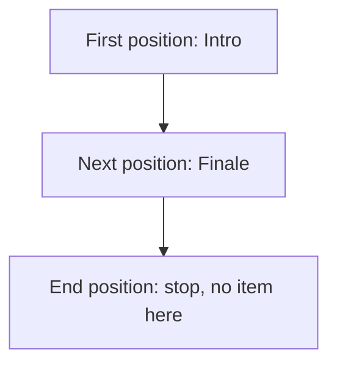
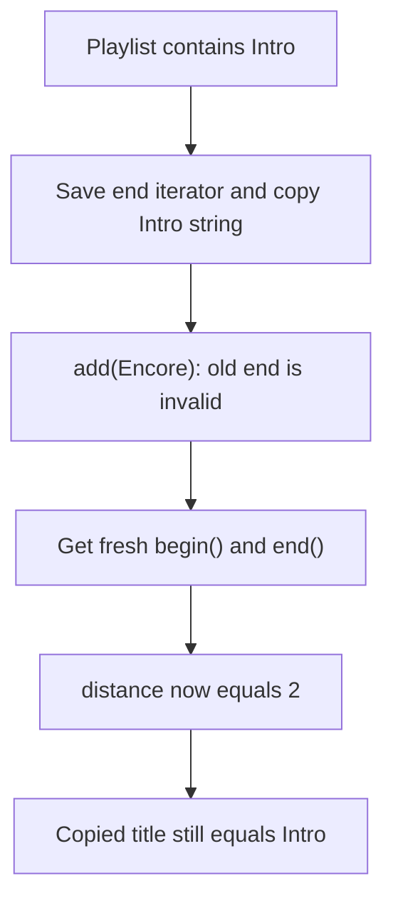
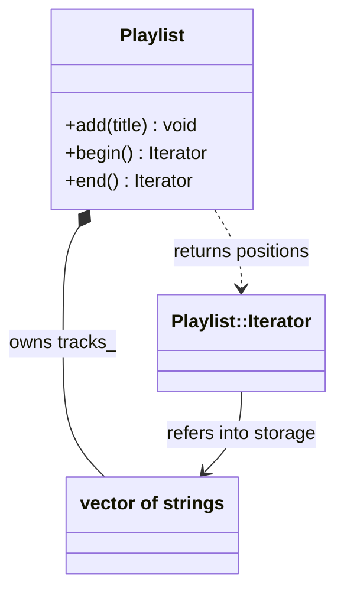
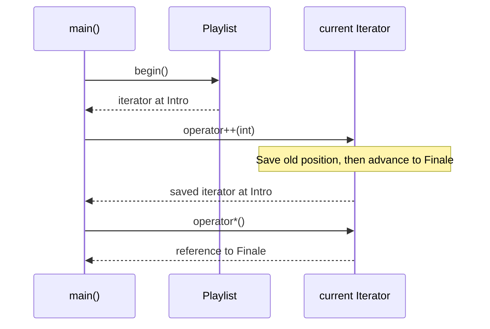

# Iterator

## 1. Definition

**Iterator keeps your place while you visit a collection one item at a time.**
It lets you read the current item, move on, and check whether you have finished.

Think of a bookmark in a playlist. The playlist holds the songs; the bookmark tracks
which song you are looking at.

## 2. The Problem It Solves

Suppose we want to find a song in a playlist. With an array we might use an index;
with a linked list we would follow links. Should the search code know both storage
layouts just to visit the songs?

An iterator gives it a simpler job: start here, read an item, then move to the next
position. The collection supplies those operations. A search procedure, or
**algorithm**, can use them without knowing how the songs are stored.

## 3. Understand the Idea Step by Step

1. Get the starting position with `begin()`.
2. Compare it with `end()`, the position just past the last item.
3. If they differ, read the item at the current position.
4. Advance and repeat the check.

In C++, `*iterator` reads the current item; this is called **dereferencing**.
`++iterator` moves forward. `end()` is a stopping marker, not a song you can read.
For an empty playlist, the starting position already equals the end.

### Picture: Two Songs and a Stopping Point

Read arrows as "advance one position." Do not read an item from the last box.

**Read it as a sentence:** read Intro, move to Finale, then reach the stopping point.

Our **forward iterator** can move forward, and copying it gives another position
that can move independently. It can also start another pass through the playlist.
Do not assume every iterator can do more: jumping backward or skipping directly
to item 100 needs operations this iterator does not offer.

## 4. Real-World Scenario

A search function visits records and stops when one matches. It can use the same
basic loop for different in-memory collections that provide suitable iterators.

A database cursor follows a similar idea, but advancing it might fetch data over
a network. It may also allow only one pass. The visiting code must use the
operations that its particular iterator supports.

## 5. Understand the C++ Example

Open [iterator.cpp](../../../patterns/behavioral/iterator.cpp).

`Playlist` stores track names in a `vector`, C++'s growable array-like container.
Its nested `Iterator` provides forward movement and read-only access to names.

1. The empty playlist has equal `begin()` and `end()` positions.
2. Add `Intro` and `Finale`.
3. Post-increment, `iterator++`, returns the old position while advancing the current one.
4. Checks show the old copy still reads `Intro` while the current position reads `Finale`.
5. `std::distance` counts two items; `std::find` locates `Finale`.
6. A range-for loop uses the same operations to print the names.

Iterators use the playlist's storage but do not keep it alive. Growing a vector can
move its storage, making old iterators unusable. This is **invalidation**. The wrapper
only promises forward iteration; counting distance need not be a single quick jump.

### C++ Flow Diagram

Arrows follow the safe invalidation demonstration. An iterator is a position in a
collection, not an independent copy of a track.

The program never compares or dereferences the invalid position. It replaces the
saved end and obtains a fresh begin before measuring the changed collection.

### C++ Class Diagram

The filled diamond means contained storage. The ordinary arrow means an iterator
refers to positions in that storage without owning the playlist.

`TrackStorage` is only a diagram label for the standard vector. Nested class
syntax does not give an iterator ownership of, or lifetime control over, a playlist.

### C++ Sequence Diagram

Time runs downward; solid arrows are operations, dashed arrows are results.
`operator++(int)` is the C++ name for post-increment, as in `current++`.

The saved and current iterators can have different positions. Both still depend
on the underlying vector remaining alive and on operations not invalidating them.

## 6. Benefits, Drawbacks, and Alternatives

**Benefits:** the same search and counting tools can use the playlist's iterators.
Callers do not need access to its internal vector, and two iterators can keep
different places in the same playlist.

**Drawbacks:** a position is not a saved copy of an item. Adding a track can make
old positions invalid, so the drawback example gets fresh iterators after the
change. Using an invalid one can cause undefined behavior. The playlist must also
remain alive while its iterators are used.

**Use it when:** traversing collections. Prefer the iterators already provided by
standard containers unless a custom interface has a real purpose.

## 7. Check Your Understanding

**Question:** Can this playlist safely add tracks while an iterator-based loop is running?

**Answer:** Not without a plan. Adding tracks can move vector storage and invalidate
the loop's positions. Add them afterward or iterate over a suitable separate snapshot.

Optional detail: [behavioral technical notes](../../../patterns/behavioral/README.md).