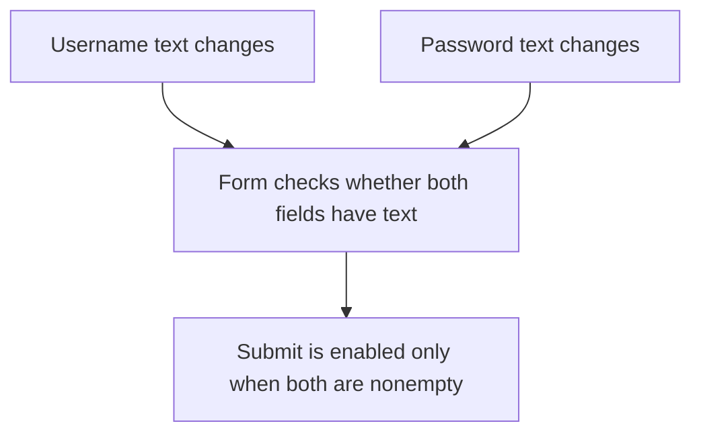
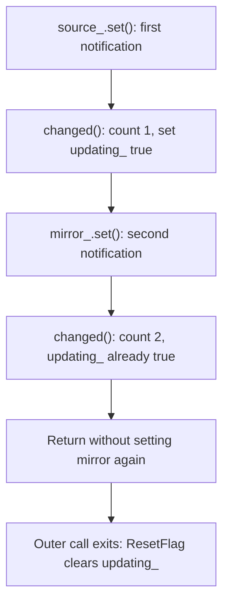
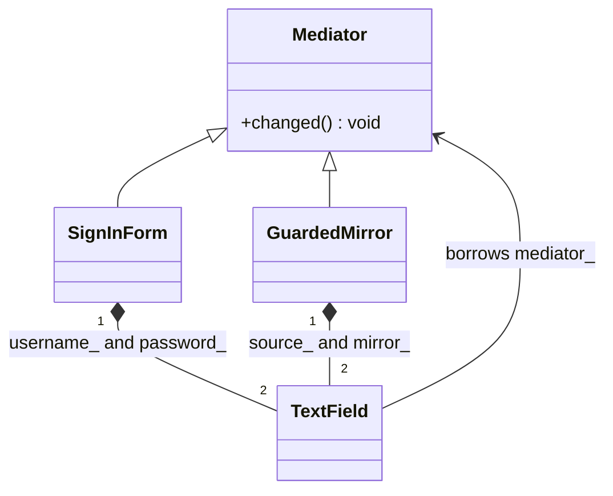
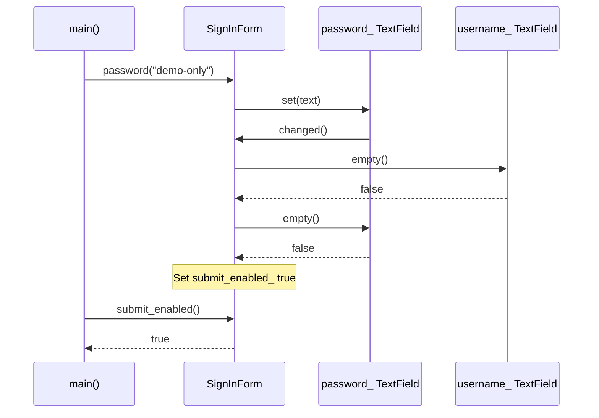

# Mediator

## 1. Definition

**Mediator is one object that decides how other objects should work together.**
They tell it what changed instead of controlling one another directly.

Imagine a sign-in form. Typing into either field may change whether Submit is enabled.
The form can own that rule; a username field does not need to control the password
field or know all the rules for the button.

## 2. The Problem It Solves

Suppose the username field enables Submit when it has text. That is not enough:
the password might still be empty. We could make each field inspect the other one
and update the button, but then both contain parts of the form's rule.

Move that rule into the form. Each field stores its text and says, "I changed."
The form checks both values and decides whether Submit should be enabled. If the
rule changes later, we change it in the form instead of teaching every field the rule.

## 3. Understand the Idea Step by Step

1. A field changes its own value.
2. It notifies the mediator.
3. The mediator examines the relevant form values.
4. The mediator updates the form's allowed actions.

The fields are sometimes called **colleagues**. Their "I changed" message is a
**notification**. The mediator does more than pass that message along: it decides
what the change means for the form.

### Picture: Fields Tell the Form, the Form Decides

Read each arrow as "reports to" until the final arrow, which means "updates."

**Read it as a sentence:** either field tells the form about a change; the form
decides whether Submit should be enabled. The fields do not control one another.

The fields no longer need to know about one another. The form still does, because
it owns the rule that depends on both values.

## 4. Real-World Scenario

A flight-search form has destination, dates, and passenger count. Changing dates may
change available flights and whether Search is enabled. A form coordinator keeps
those relationships in one place rather than inside every input field.

Enabling a button is only a user-interface decision. The server must still validate
the actual request; users may send requests without using the form.

## 5. Understand the C++ Example

Open [mediator.cpp](../../../patterns/behavioral/mediator.cpp).

`TextField` stores text and access to a mediator. `SignInForm` owns the username
and password fields and implements the `changed()` notification function.

1. Both fields start empty, so submission is disabled.
2. Set the username. The field reports the change.
3. The form sees the password is still empty and stays disabled.
4. Set the password. The form now enables submission.
5. Clear the username. Submission becomes disabled again.
6. Checks confirm each of these states.

The fields hold references to their form, meaning they refer to that existing object.
Copying the form is disabled because an automatic copy could leave fields referring
to the original form. During construction, fields store their references without
calling back into a form that has not finished being created.

### C++ Flow Diagram

Follow one `GuardedMirror::edit()` call. The arrows show synchronous calls, not
separate threads; the nested call happens before the outer call finishes.

Centralizing communication does not remove feedback loops. The included guard
stops recursion, and its local cleanup object resets the flag even on an exception.

### C++ Class Diagram

Triangles mean inheritance. Filled diamonds mean fields stored inside an owner;
the ordinary arrow back to `Mediator` is borrowed, not owning.

Each field knows a mediator, not its sibling field. Copying these forms is disabled
because blindly copying the back-references would point at the old form.

### C++ Sequence Diagram

Solid arrows call methods; dashed arrows return results. This traces the password
edit after `main()` has already supplied a nonempty username.

The mediator checks both values; it does not authenticate a user. When the username
is empty, the C++ AND expression skips the second emptiness check.

## 6. Benefits, Drawbacks, and Alternatives

**Benefits:** the button rule has one home. A field can focus on holding text and
reporting changes instead of knowing every other control in the form.

**Drawbacks:** putting every rule in one coordinator can make that class too large.
Updates can also call back into it: the mirror example changes another field while
handling a notification, which sends a second notification. Its guard stops that
from repeating forever. Centralizing the rule does not remove the need to handle
these repeated calls.

**Use it when:** several parts affect each other. A small ordinary coordinator
function may be enough. Observer sends notifications; a mediator can receive them
and decide what the collaborating objects should do next.

## 7. Check Your Understanding

**Question:** Does this form check that the username and password are correct?

**Answer:** No. It only checks that both contain text. Verifying credentials requires
separate authentication work; enabling a button is not proof of identity.

Optional detail: [behavioral technical notes](../../../patterns/behavioral/README.md).