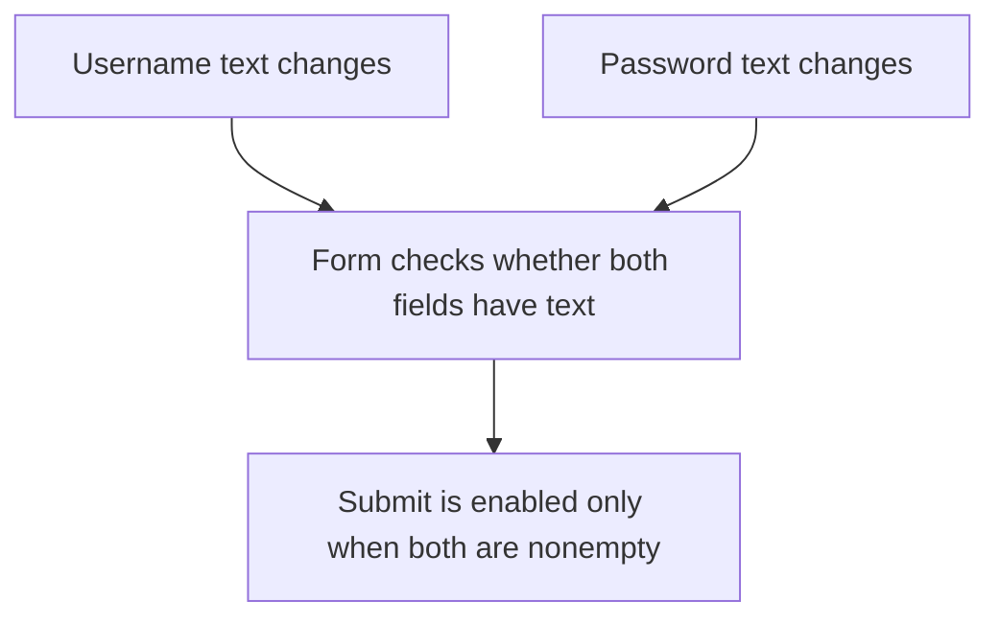

# Mediator

## 1. Definition

**Mediator puts the rules for cooperation between several objects in one coordinator.**
The objects report what happened to the coordinator instead of each controlling the others.

Imagine a sign-in form. Typing into either field may change whether Submit is enabled.
The form can own that rule; a username field does not need to control the password
field or know all the rules for the button.

## 2. The Problem It Solves

If every field directly updates several other fields and buttons, their relationships
become difficult to follow. Changing one rule may require editing many components.
Updates can even trigger each other repeatedly.

Give the coordination rule one home. Each field handles its own text and reports changes.
The mediator decides how the form should respond.

## 3. Understand the Idea Step by Step

1. A field changes its own value.
2. It notifies the mediator.
3. The mediator examines the relevant form values.
4. The mediator updates the form's allowed actions.

The participating objects are sometimes called **colleagues**. Here they are simply
fields. **Notification** means informing another object that something happened.
The mediator's useful job is making the coordination decision, not just forwarding messages.

### Picture: Fields Tell the Form, the Form Decides

Read each arrow as "reports to" until the final arrow, which means "updates."

**Read it as a sentence:** either field tells the form about a change; the form
decides whether Submit should be enabled. The fields do not control one another.

Keep the mediator focused. One coordinator for every unrelated feature would become
too large. Also check for update loops: changing a field from inside a notification
may produce another notification before the first one finishes.

## 4. Real-World Scenario

A flight-search form has destination, dates, and passenger count. Changing dates may
change available flights and whether Search is enabled. A form coordinator keeps
those relationships in one place rather than inside every input field.

Enabling a button is only a user-interface decision. The server must still validate
the actual request; users may send requests without using the form.

## 5. Understand the C++ Example

Open [mediator.cpp](../../../patterns/behavioral/mediator.cpp).

`TextField` stores text and access to a mediator. `SignInForm` owns the username
and password fields and implements the `changed()` notification function.

1. Both fields start empty, so submission is disabled.
2. Set the username. The field reports the change.
3. The form sees the password is still empty and stays disabled.
4. Set the password. The form now enables submission.
5. Clear the username. Submission becomes disabled again.
6. Checks confirm each of these states.

The fields hold references to their form, meaning they refer to that existing object.
Copying the form is disabled because an automatic copy could leave fields referring
to the original form. During construction, fields store their references without
calling back into a form that has not finished being created.

## 6. Benefits, Drawbacks, and Alternatives

**Benefits:** one place for cooperation rules; simpler individual fields; fewer
direct relationships between components.

**Drawbacks:** the coordinator can become too large; notification loops need care;
an extra class may not help a very small form.

**Use it when:** several parts affect each other. A small ordinary coordinator
function may be enough. Observer sends notifications; a mediator can receive them
and decide what the collaborating objects should do next.

## 7. Check Your Understanding

**Question:** Does this form check that the username and password are correct?

**Answer:** No. It only checks that both contain text. Verifying credentials requires
separate authentication work; enabling a button is not proof of identity.

Optional detail: [behavioral technical notes](../../../patterns/behavioral/README.md).