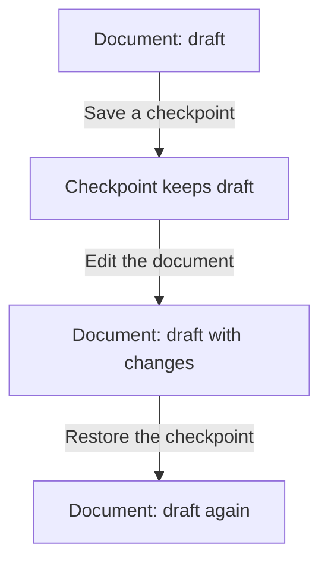

# Memento

## 1. Definition

**Memento saves an object's information so that the object can restore it later,
without making other code understand or edit its private details.**

The saved information is a **snapshot**: a record of the relevant values at one
moment. Imagine saving a document checkpoint before trying an edit you may cancel.

## 2. The Problem It Solves

A history manager could copy every document field itself, but then it must know
which fields matter and how to restore them correctly. Changes to the document's
internal design could break that external copying code.

Let the document create and restore its own snapshot. Outside code only keeps the
snapshot and returns it when restoration is requested.

## 3. Understand the Idea Step by Step

1. Ask the object to save the information needed for restoration.
2. Keep the returned snapshot somewhere safe.
3. Make changes to the object.
4. If necessary, ask the same object to restore the snapshot.

The **originator** is the object being saved, here the editor. The **memento** is
the snapshot. The **caretaker** is code that holds the snapshot without editing its
contents. **State** simply means the object's stored information.

### Picture: Save Before Trying an Edit

Read downward. Arrows name the action; boxes show the document and saved text.

**Read it as a sentence:** save the old text, try a change, and restore the saved
text if the change should be discarded. The checkpoint is not edited along with the document.

Not everything can be saved by copying memory. Open connections or running callbacks
may need to be recreated. If several fields change at once, a snapshot must not
accidentally combine values from different moments.

## 4. Real-World Scenario

A drawing tool previews a complex change to a model. Before starting, the model
saves the values needed to restore its earlier shape. Cancel returns that snapshot
to the model; the preview controller does not modify private geometry data itself.

Restoring the model cannot undo a file already exported or a message already sent.
Large models may save only changed portions, but that needs additional careful design.

## 5. Understand the C++ Example

Open [memento.cpp](../../../patterns/behavioral/memento.cpp).

`Editor::Snapshot` stores a copy of text and the identity of its editor. Its fields
are private, and `Editor` is allowed to use them. `main()` just keeps the checkpoint.

1. The editor contains `draft`.
2. `save()` returns a snapshot with a separate copy of that text.
3. Another edit changes the document to `draft with changes`.
4. `restore(checkpoint)` brings back `draft`.
5. Repeating restoration is valid.
6. Restoring the snapshot into another editor reports an error; the checks confirm it.

The snapshot does not keep the original editor alive. Its stored pointer identifies
the live editor only; it is not a permanent identifier after that object is destroyed.
The example disables editor copying and assumes restoration happens while the
original editor still exists.

## 6. Benefits, Drawbacks, and Alternatives

**Benefits:** checkpoints and cancellation without exposing private fields; saving
and restoration rules remain beside the object that understands them.

**Drawbacks:** copies consume memory and time; snapshots may retain sensitive text;
older snapshots need rules if the object format changes. External effects remain separate.

**Use it when:** restoring saved values is clearer than reversing each individual
action. Command instead records an action; it can use a snapshot when needed for undo.

## 7. Check Your Understanding

**Question:** Should the history manager edit a snapshot's private fields to fix an error?

**Answer:** No. It should ask the original object to perform a valid correction.
The point is to avoid forcing outside code to know which combinations of private
values are safe to restore.

Optional detail: [behavioral technical notes](../../../patterns/behavioral/README.md).