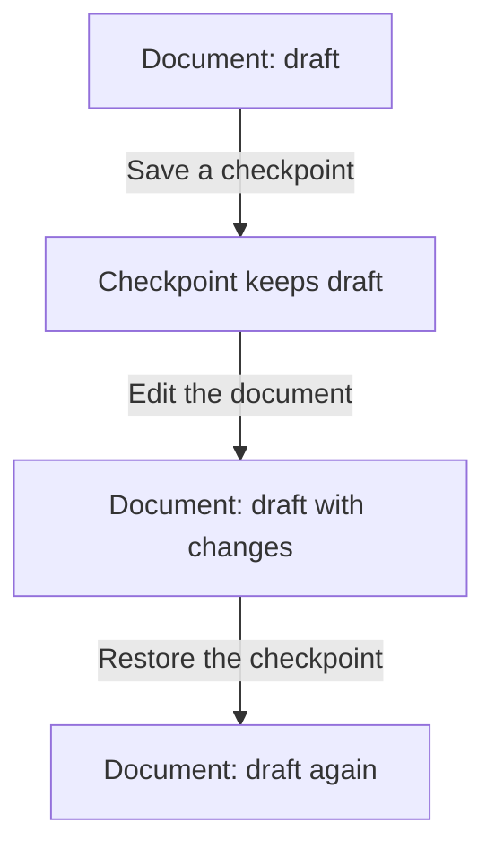
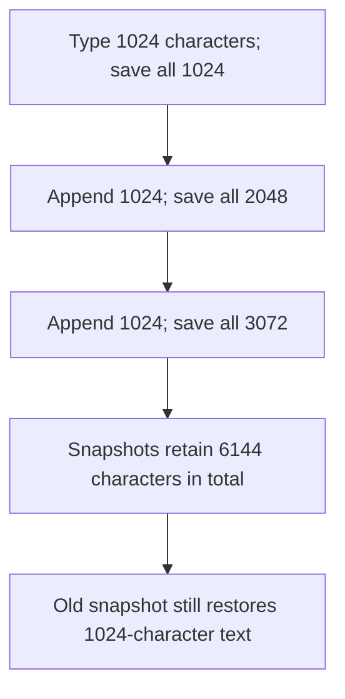
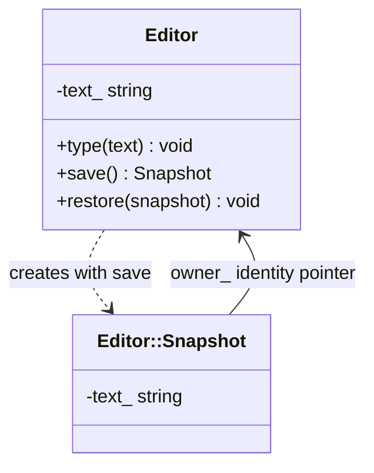
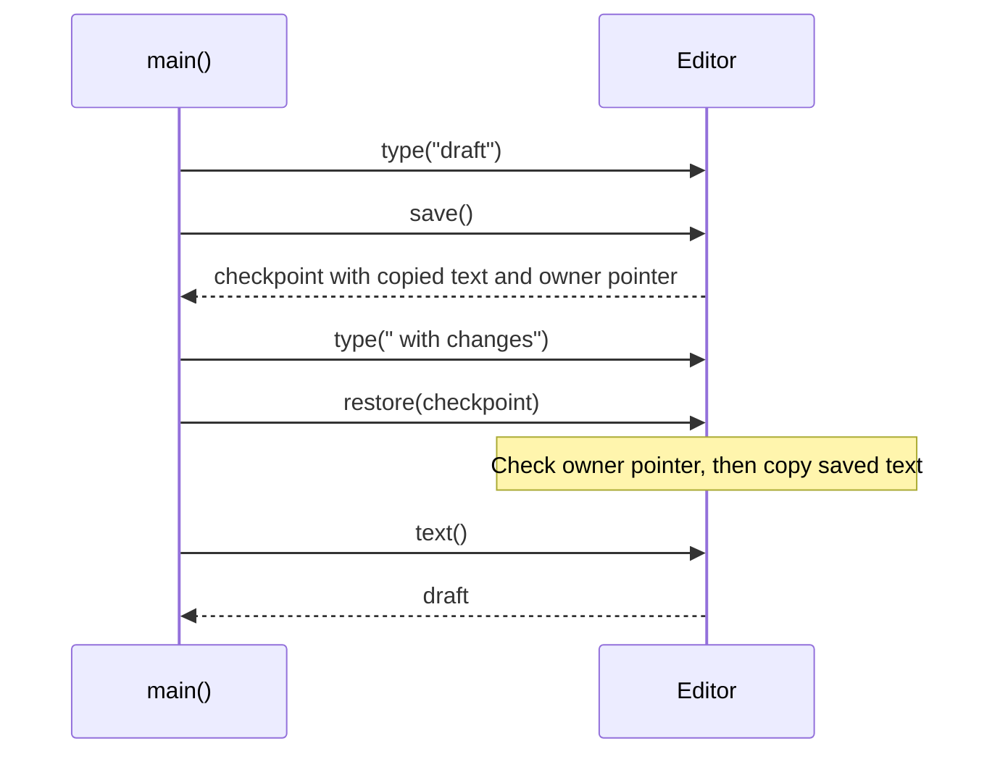

# Memento

## 1. Definition

**Memento is a saved checkpoint that an object can use to restore its earlier state.**
The object makes and restores the checkpoint; other code only keeps it.

The saved information is a **snapshot**: a record of the relevant values at one
moment. Imagine saving a document checkpoint before trying an edit you may cancel.

## 2. The Problem It Solves

Suppose an editor lets the user try an edit and then cancel it. We need the earlier
text somewhere. A history manager could copy the editor's fields itself, but then
it must know which fields matter and how they fit together. Adding another private
field could break that copying code.

Ask the editor to `save()` instead. It returns a checkpoint containing the values
it needs. The history keeps that checkpoint without looking inside. To cancel the
edit, it passes the checkpoint back to the editor's `restore()` operation.

## 3. Understand the Idea Step by Step

1. Ask the object to save the information needed for restoration.
2. Keep the returned snapshot somewhere safe.
3. Make changes to the object.
4. If necessary, ask the same object to restore the snapshot.

Here, **state** means the editor's stored text. The editor is called the
**originator**, its checkpoint is the **memento**, and the code keeping the checkpoint
is the **caretaker**. The editor knows what to save; the caretaker knows when to restore it.

### Picture: Save Before Trying an Edit

Read downward. Arrows name the action; boxes show the document and saved text.

**Read it as a sentence:** save the old text, try a change, and restore the saved
text if the change should be discarded. The checkpoint is not edited along with the document.

The saved text must be separate from the editable text. Otherwise changing the
document would also change the checkpoint, leaving nothing old to restore.

## 4. Real-World Scenario

A drawing tool previews a complex change to a model. Before starting, the model
saves the values needed to restore its earlier shape. Cancel returns that snapshot
to the model; the preview controller does not modify private geometry data itself.

Restoring the model cannot undo a file already exported or a message already sent.
Large models may save only changed portions, but that needs additional careful design.

## 5. Understand the C++ Example

Open [memento.cpp](../../../patterns/behavioral/memento.cpp).

`Editor::Snapshot` stores a copy of text and the identity of its editor. Its fields
are private, and `Editor` is allowed to use them. `main()` just keeps the checkpoint.

1. The editor contains `draft`.
2. `save()` returns a snapshot with a separate copy of that text.
3. Another edit changes the document to `draft with changes`.
4. `restore(checkpoint)` brings back `draft`.
5. Repeating restoration is valid.
6. Restoring the snapshot into another editor reports an error; the checks confirm it.

The snapshot does not keep the original editor alive. Its stored pointer identifies
the live editor only; it is not a permanent identifier after that object is destroyed.
The example disables editor copying and assumes restoration happens while the
original editor still exists.

### C++ Flow Diagram

Read downward through the three revisions in the drawback function. The counts
measure saved text characters, not allocator overhead or execution time.

Each snapshot is a full copy, so old content remains recoverable while that snapshot
exists. Restoring an old version does not delete newer snapshots in the history vector.

### C++ Class Diagram

The dotted arrow means creation. The ordinary arrow is a non-owning pointer used
to check which editor produced the snapshot, not a lifetime guarantee.

`Snapshot` is nested and grants `Editor` access to its private contents. In the
drawback function, the caller's vector owns snapshots; the editor does not own them.

### C++ Sequence Diagram

Time runs downward. Solid arrows call operations; dashed arrows return a value.
The snapshot is passed back later rather than calling the editor itself.

A foreign editor rejects this checkpoint. Pointer identity is a simple check for
this example, not a durable identifier suitable for storing snapshots across runs.

## 6. Benefits, Drawbacks, and Alternatives

**Benefits:** callers can offer Cancel or Restore without knowing the editor's
private fields. The editor keeps its saving and restoration rules together.

**Drawbacks:** full checkpoints keep repeated copies of old text. The example saves
versions of 1024, 2048, and 3072 characters, retaining 6144 characters in total.
Old snapshots can also keep text the user has since deleted, so sensitive data needs
care. Restoring text does not undo an exported file or a message already sent.

**Use it when:** restoring saved values is clearer than reversing each individual
action. Command instead records an action; it can use a snapshot when needed for undo.

## 7. Check Your Understanding

**Question:** Should the history manager edit a snapshot's private fields to fix an error?

**Answer:** No. The editor understands its own values and should make the correction.
The history's job is to keep a checkpoint and return it, not rewrite its contents.

Optional detail: [behavioral technical notes](../../../patterns/behavioral/README.md).