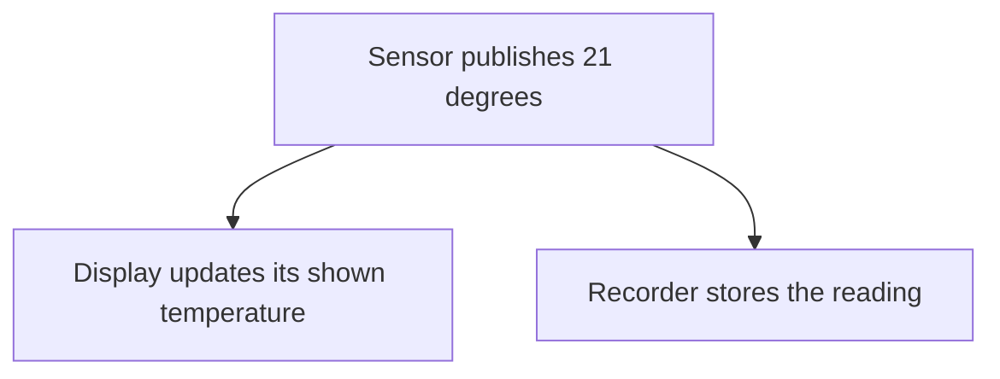

# Observer

## 1. Definition

**Observer lets interested listeners sign up for notifications from another object.**
When something happens, that object tells the listeners without needing to know
what each listener will do with the information.

For example, a temperature sensor can notify a display and a recorder. The sensor
does not need to contain screen-drawing code or file-writing code.

## 2. The Problem It Solves

If the sensor directly knows every display, alarm, and recorder, adding a new use
for readings requires changing the sensor. It becomes responsible for many unrelated jobs.

Instead, let interested code register a function to call when a reading arrives.
Listeners can join or leave while the sensor keeps its one job: publishing readings.

## 3. Understand the Idea Step by Step

1. A listener subscribes, meaning it asks to receive future events.
2. The sensor keeps the supplied function and returns an identifier for that subscription.
3. Publishing a reading calls the currently eligible listener functions.
4. Unsubscribing removes a listener using its identifier.

A **callback** is a function you give other code to call later. A **token** is the
identifier used to remove one subscription. The publishing object is often called
the **subject**, and its listeners are the **observers**.

### Picture: One Reading Reaches Several Listeners

Read each arrow as "sends the reading to." Both listeners receive the same event.

**Read it as a sentence:** the sensor announces one value, and each subscribed
listener decides what to do with it.

Decide the delivery rules explicitly. Do listeners run immediately or later? What
if one removes itself, adds another listener, or fails? The pattern's name does not
answer those questions. The code below chooses specific rules for this example.

## 4. Real-World Scenario

A building monitor sends room temperatures to a dashboard, an alarm, and a history
recorder. Each listener owns a different response to the same reading.

If recording is slow, calling it immediately could delay other work. A production
system may queue notifications for later processing, but then must decide how to
handle delays, full queues, and lost readings.

## 5. Understand the C++ Example

Open [observer.cpp](../../../patterns/behavioral/observer.cpp).

`Sensor` stores callback functions indexed by subscription tokens. `publish()` first
copies the current tokens, then looks each one up before calling its callback.

1. A display listener records readings 20 and 21.
2. A one-time listener removes itself after receiving 20.
3. It is no longer called for 21.
4. Removing the display listener prevents it receiving 22.
5. A listener added during publication waits until a later publication.

The callback itself is copied before the call, so removing its subscription does
not destroy the function currently running. This has a detail worth knowing: data
stored inside that function copy is changed only in the copy. The sample instead
refers to outside variables that remain alive during the calls.

Delivery is **synchronous**, meaning calls run immediately before publishing returns.
An exception from one callback leaves that publication early, so later listeners may
not run. Multiple threads cannot safely modify this listener collection without extra protection.

## 6. Benefits, Drawbacks, and Alternatives

**Benefits:** new listeners do not require editing the sensor; listeners can join
and leave; each listener keeps its own response code.

**Drawbacks:** indirect calls are harder to follow; callbacks may refer to destroyed
objects; slow or failing listeners can affect delivery. Notifications that publish
again from inside a callback also need careful rules.

**Use it when:** several independent listeners need events. One direct function call
is simpler for one fixed recipient. Mediator goes further by deciding how several
objects should coordinate in response to events.

## 7. Check Your Understanding

**Question:** What happens if a callback throws an exception in this example?

**Answer:** The error leaves `publish()`, and later callbacks may not run. A system
that must notify everyone despite one failure needs a different, explicit error policy.

Optional detail: [behavioral technical notes](../../../patterns/behavioral/README.md).