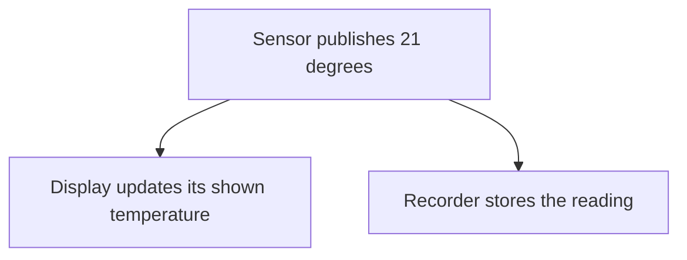
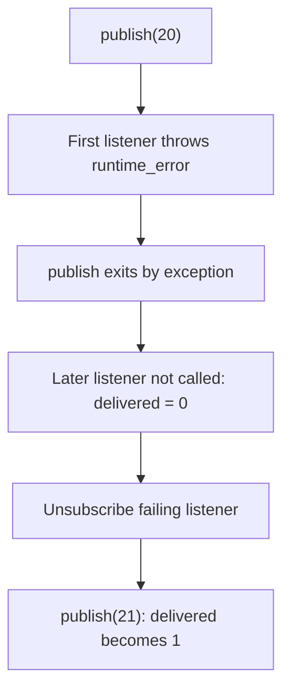
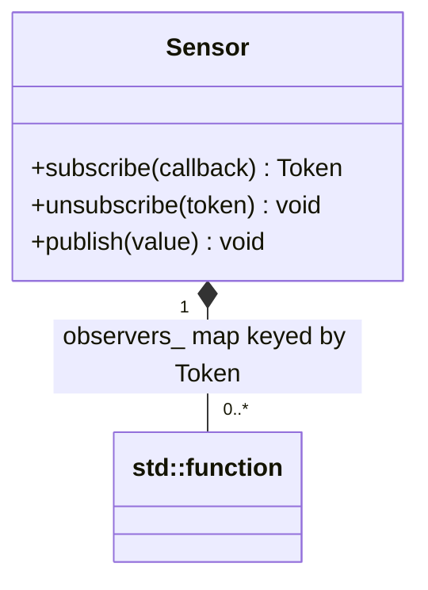
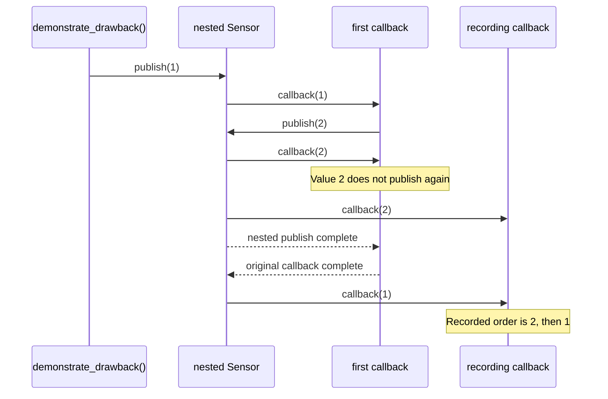

# Observer

## 1. Definition

**Observer lets objects subscribe to updates from another object.** When a new
update arrives, each listener decides what to do with it.

For example, a temperature sensor can notify a display and a recorder. The sensor
does not need to contain screen-drawing code or file-writing code.

## 2. The Problem It Solves

At first, the sensor sends readings to a display. Then we add a recorder and an
alarm. If the sensor calls each one directly, adding every new use means editing
the sensor again. Its reading code starts filling up with unrelated work.

Instead, let the display, recorder, and alarm sign up. The sensor keeps their
callbacks and calls them when a reading arrives. It does not need to know whether
a listener draws a number, saves it, or checks a limit. New listeners can subscribe
without changing the sensor's publishing code.

## 3. Understand the Idea Step by Step

1. A listener subscribes, meaning it asks to receive future events.
2. The sensor keeps the supplied function and returns an identifier for that subscription.
3. Publishing a reading calls the currently eligible listener functions.
4. Unsubscribing removes a listener using its identifier.

A **callback** is the function a listener supplies for the sensor to call. A
**token** identifies that subscription so it can be removed later. Pattern books
call the sensor the **subject** and the listeners its **observers**.

### Picture: One Reading Reaches Several Listeners

Read each arrow as "sends the reading to." Both listeners receive the same event.

**Read it as a sentence:** the sensor announces one value, and each subscribed
listener decides what to do with it.

In this example, notification means calling the listener functions immediately.
It does not start background work. That choice matters when a listener is slow,
removes itself, or throws an error, as the walkthrough below shows.

## 4. Real-World Scenario

A building monitor sends room temperatures to a dashboard, an alarm, and a history
recorder. Each listener owns a different response to the same reading.

If recording is slow, calling it immediately could delay other work. A production
system may queue notifications for later processing, but then must decide how to
handle delays, full queues, and lost readings.

## 5. Understand the C++ Example

Open [observer.cpp](../../../patterns/behavioral/observer.cpp).

`Sensor` stores callback functions indexed by subscription tokens. `publish()` first
copies the current tokens, then looks each one up before calling its callback.

1. A display listener records readings 20 and 21.
2. A one-time listener removes itself after receiving 20.
3. It is no longer called for 21.
4. Removing the display listener prevents it receiving 22.
5. A listener added during publication waits until a later publication.

Before calling a listener, the sensor copies its callback. The listener can then
unsubscribe without destroying the function that is still running. Changes to
data stored inside that copy do not update the saved callback. The sample records
results in outside variables that stay alive during notification.

Delivery is **synchronous**, meaning calls run immediately before publishing returns.
An exception from one callback leaves that publication early, so later listeners may
not run. Multiple threads cannot safely modify this listener collection without extra protection.

### C++ Flow Diagram

Arrows follow the first failure case in `demonstrate_drawback()`. A callback is a
function saved for later notification; these callbacks run inside `publish()`.

The pattern does not choose an exception policy. This implementation propagates
the error rather than catching it and continuing to later listeners.

### C++ Class Diagram

The filled diamond means the sensor owns saved callable wrappers. These are
`std::function` values, not objects derived from a custom Observer base class.

Owning a callback does not own everything its lambda captures by reference.
Those referenced objects must still be alive when the callback executes.

### C++ Sequence Diagram

Read downward through the nested-publication drawback. Solid arrows call and
dashed arrows return; the inner publication finishes before the outer one resumes.

This is re-entry on the same thread, not simultaneous execution. Token snapshots
protect iteration from subscription changes, but do not impose an event queue.

## 6. Benefits, Drawbacks, and Alternatives

**Benefits:** add a recorder without editing the sensor. Remove the display's
subscription when it is no longer needed. Each listener keeps its own response code.

**Drawbacks:** publishing now runs code elsewhere, so one call can do more work than
it first appears. In the drawback example, a throwing listener prevents later
listeners from running. Another listener publishes value 2 while handling value 1,
so the recorder receives 2 before 1. Referenced objects must also remain alive until
their callbacks stop being used. These delivery rules need deliberate choices.

**Use it when:** several independent listeners need events. One direct function call
is simpler for one fixed recipient. Mediator goes further by deciding how several
objects should coordinate in response to events.

## 7. Check Your Understanding

**Question:** What happens if a callback throws an exception in this example?

**Answer:** The error leaves `publish()`, and later callbacks may not run. A system
that must notify everyone despite one failure needs a different, explicit error policy.

Optional detail: [behavioral technical notes](../../../patterns/behavioral/README.md).