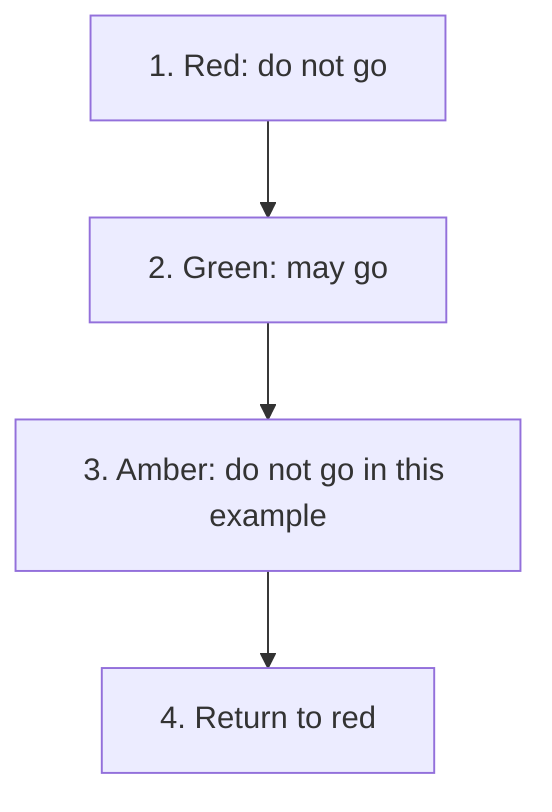

# State

## 1. Definition

**State puts the behavior for each mode of an object into a separate state object.**
The main object uses its current state to decide how to respond.

For example, a traffic signal gives different answers to "may we go?" when it is red
or green. Changing the current state changes the answer without the caller changing its question.

## 2. The Problem It Solves

A program can repeat "if red ... else if green ..." in every operation. As modes
and operations grow, their rules spread across many functions. One function may
forget a mode or allow a change that should not happen.

Group each mode's behavior in one place and make allowed changes between modes clear.

## 3. Understand the Idea Step by Step

1. Give each mode the same relevant operations, such as asking its name or next mode.
2. Let the main object keep one current state object.
3. Send mode-dependent questions to that current object.
4. Replace it when a permitted event causes a mode change.

A **transition** is a change from one state to another. The main object holding
the state is often called the **context**. A **state interface** is the common list
of questions all state objects can answer.

### Picture: Follow the Signal's Modes

Read arrows as "advance to the next mode." The last box returns to the starting mode.

**Read it as a sentence:** red changes to green, then amber, then red again. Only
one state is current at a time. This simplified cycle is not a real traffic-safety design.

For other problems, an event may be rejected rather than causing a transition.
List those rules too. Several unrelated true/false flags can permit impossible
combinations; named states can make valid combinations clearer.

## 4. Real-World Scenario

A network client can be disconnected, connecting, or connected. Asking it to send
data may fail while disconnected, wait while connecting, and transmit while connected.
The caller uses the same send operation in each case.

Real networking also needs time limits, cancellation, and rules for events arriving
together. State classes organize behavior but do not automatically solve those timing problems.

## 5. Understand the C++ Example

Open [state.cpp](../../../patterns/behavioral/state.cpp).

`TrafficSignal` holds the current state. `SignalState` describes `name()`, `can_go()`,
and `next()`. Red, green, and amber supply their own answers.

1. The signal starts red and reports that movement is not allowed.
2. `advance()` asks the current state to create its successor.
3. After that function returns, the signal replaces its old state.
4. Green permits movement; advancing again gives amber, which does not.
5. The next advance returns to red.
6. Checks verify the complete cycle and the answer in each mode.

The signal owns the state, meaning it is responsible for destroying it. Waiting
until `next()` returns avoids destroying an object while its own function is still
running. This is a C++ lifetime detail; the broader idea is still choosing behavior by mode.

## 6. Benefits, Drawbacks, and Alternatives

**Benefits:** keeps each mode's rules together, makes allowed changes visible, and
reduces repeated mode checks.

**Drawbacks:** many classes for a tiny problem; changes can become hard to trace if
transition decisions are scattered; this example creates objects during transitions.

**Use it when:** modes have enough behavior to justify separate objects. A small
enumeration and a table or switch may be clearer for a few fixed states. Strategy
selects a way to do a job; State models the changing mode of the object itself.

## 7. Check Your Understanding

**Question:** Does using State prevent two simultaneous events from conflicting?

**Answer:** No. The application must coordinate those events, for example by handling
them one at a time. State objects do not automatically protect shared data.

Optional detail: [behavioral technical notes](../../../patterns/behavioral/README.md).