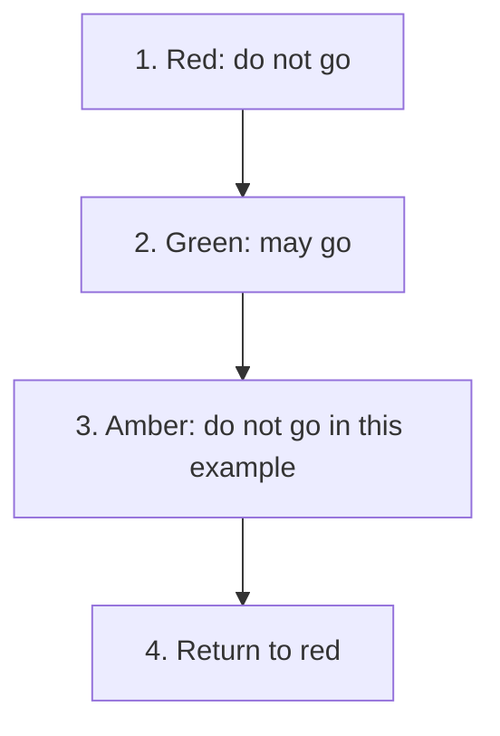
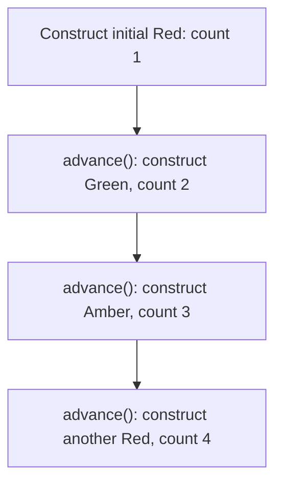
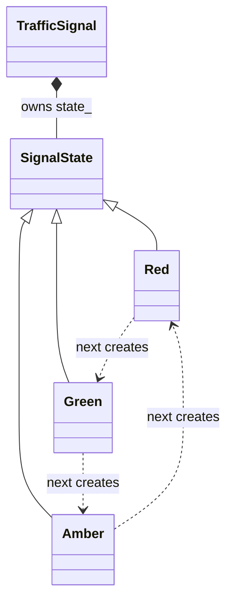
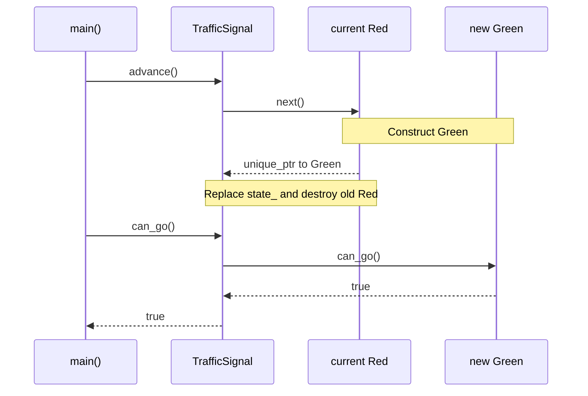

# State

## 1. Definition

**State lets an object change its behavior by changing the state object it uses.**

For example, a traffic signal gives different answers to "may we go?" when it is red
or green. Changing the current state changes the answer without the caller changing its question.

## 2. The Problem It Solves

Suppose the signal has methods for its name, whether movement is allowed, and what
comes next. Each could contain its own "if red ... else if green ..." checks. Adding
amber means finding and updating every one of those branches.

Put red's answers in a `Red` object, green's in `Green`, and amber's in `Amber`.
The signal keeps one current state and forwards questions to it. Advancing replaces
that state, so the same `can_go()` call can now produce a different answer.

## 3. Understand the Idea Step by Step

1. Give each mode the same relevant operations, such as asking its name or next mode.
2. Let the main object keep one current state object.
3. Send mode-dependent questions to that current object.
4. Replace it when a permitted event causes a mode change.

A change from red to green is a **transition**. The signal holding the state is
called the **context**. Every state supports the same questions, its shared
**interface**, but gives answers appropriate to that mode.

### Picture: Follow the Signal's Modes

Read arrows as "advance to the next mode." The last box returns to the starting mode.

**Read it as a sentence:** red changes to green, then amber, then red again. Only
one state is current at a time. This simplified cycle is not a real traffic-safety design.

Only the current state answers. We do not need separate flags that might
accidentally say the signal is both red and green. Each state's `next()` also makes
the next allowed step visible.

## 4. Real-World Scenario

A network client can be disconnected, connecting, or connected. Asking it to send
data may fail while disconnected, wait while connecting, and transmit while connected.
The caller uses the same send operation in each case.

The disconnected state can reject a send request, while the connected state sends
it. The caller still asks the client to send. Connection events choose when the
client changes state; handling simultaneous events remains the client's responsibility.

## 5. Understand the C++ Example

Open [state.cpp](../../../patterns/behavioral/state.cpp).

`TrafficSignal` holds the current state. `SignalState` describes `name()`, `can_go()`,
and `next()`. Red, green, and amber supply their own answers.

1. The signal starts red and reports that movement is not allowed.
2. `advance()` asks the current state to create its successor.
3. After that function returns, the signal replaces its old state.
4. Green permits movement; advancing again gives amber, which does not.
5. The next advance returns to red.
6. Checks verify the complete cycle and the answer in each mode.

The signal owns the state, meaning it is responsible for destroying it. Waiting
until `next()` returns avoids destroying an object while its own function is still
running. This is a C++ lifetime detail; the broader idea is still choosing behavior by mode.

### C++ Flow Diagram

Arrows show the three calls to `advance()` in the drawback function. Each box is
a newly constructed object, even when the name returns to red.

The check compares a before-and-after counter, so earlier tests do not affect it.
Four constructions do not mean four objects remain alive: replacements destroy old states.

### C++ Class Diagram

Triangles point to the common state interface. The diamond means the signal owns
its current state. Dotted arrows show which next state each implementation creates.

`name()` and `can_go()` delegate to the current object. This implementation uses
heap allocation, but the State idea does not require that storage choice.

### C++ Sequence Diagram

Read downward through one transition. Solid arrows call; dashed arrows return.
The old object stays alive until its `next()` method has finished.

Replacing the state after the return avoids destroying an object while its own
method is still executing. This is a teaching cycle, not a real traffic controller.

## 6. Benefits, Drawbacks, and Alternatives

**Benefits:** red's behavior is together in one class instead of spread across
several switches. The signal asks its current state for answers, and each state
makes its next step clear.

**Drawbacks:** three tiny modes may not justify several classes. This implementation
also allocates a new state on each transition: the drawback example counts four
constructions for an initial red followed by green, amber, and red again. Other
storage choices are possible, but a simple switch may be easier for a small fixed cycle.

**Use it when:** modes have enough behavior to justify separate objects. A small
enumeration and a table or switch may be clearer for a few fixed states. Strategy
selects a way to do a job; State models the changing mode of the object itself.

## 7. Check Your Understanding

**Question:** Does using State prevent two simultaneous events from conflicting?

**Answer:** No. The application must coordinate those events, for example by handling
them one at a time. State objects do not automatically protect shared data.

Optional detail: [behavioral technical notes](../../../patterns/behavioral/README.md).