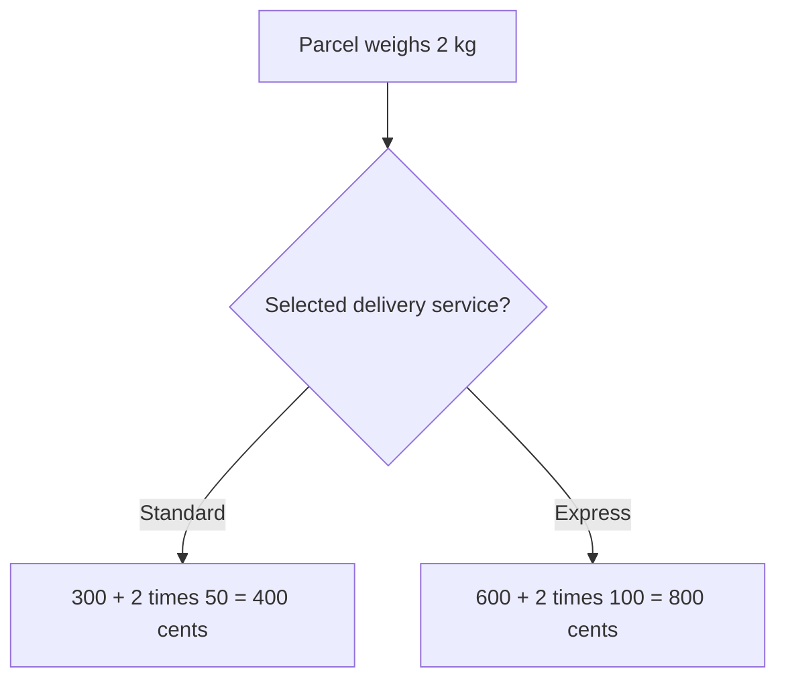

# Strategy

## 1. Definition

**Strategy lets an object use one of several ways to perform the same job.** Each
way is kept separately and follows the same input and result rules.

For example, a checkout can calculate standard or express shipping. The checkout
still checks the order and asks for a price; the selected shipping rule supplies the formula.

## 2. The Problem It Solves

Putting every formula inside checkout mixes changing shipping rules with work that
does not change. Creating a whole new checkout class for each formula repeats too
much unrelated code.

Keep the changing calculation separate and give checkout the one it should use.

## 3. Understand the Idea Step by Step

1. Define the job and its rules: receive a weight and return a shipping cost in cents.
2. Provide different calculations that honor those rules.
3. Choose one calculation and supply it to checkout.
4. Checkout calls the selected calculation without inspecting which kind it is.

An **algorithm** is a procedure for solving a problem, here a price calculation.
A **policy** is a chosen rule, such as express pricing. The shared **contract** is
the agreement about valid inputs, results, units, and failures.

### Picture: Same Parcel, Different Chosen Rule

Read downward and take one branch. Both branches price the same 2 kg parcel.

**Read it as a sentence:** choosing standard gives 400 cents; choosing express gives
800 cents. The checkout steps remain the same while the chosen formula changes.

All strategies must agree on what their result means. If one returns cents and
another returns whole currency units, they are not safe replacements merely because
both C++ functions return an integer.

## 4. Real-World Scenario

A route planner offers fastest, shortest, and accessible routes. It keeps the same
start and destination controls while passing route calculation to the selected rule.

An accessible route needs information such as steps and ramps. If that information
is missing, the shared input must be improved; hiding required data in a global
variable only makes the rule harder to understand and test.

## 5. Understand the C++ Example

Open [strategy.cpp](../../../patterns/behavioral/strategy.cpp).

`ShippingPolicy` describes the calculation. Standard and express classes supply the
formulas. `Checkout` keeps access to whichever policy was selected.

1. Start with the standard policy.
2. A 2 kg parcel costs `300 + 2 * 50`, or 400 cents.
3. `use(express)` selects the other policy on the same checkout.
4. The same parcel now costs `600 + 2 * 100`, or 800 cents.
5. Checkout rejects zero weight before asking either policy to calculate.
6. Checks verify both prices and the invalid-input behavior.

The checkout borrows the policy objects rather than owning them. They must remain
alive while it uses them. The formulas are used within checkout's supported weight
range of 1 through 1000; they are not promises for arbitrary inputs.

## 6. Benefits, Drawbacks, and Alternatives

**Benefits:** formulas can be checked separately, replaced while the program runs,
and added without duplicating checkout's common work.

**Drawbacks:** someone must choose the right policy. Some calculations may need
different information, making the common interface harder to design. Tiny formulas
may not need separate classes.

**Use it when:** interchangeable calculations are a real requirement. A function
passed into checkout can also be a strategy; C++ inheritance is not required.
A small fixed switch can be appropriate when choices are few and stable.

## 7. Check Your Understanding

**Question:** Must every Strategy example contain a virtual base class?

**Answer:** No. The idea is a replaceable way to do the same job under agreed rules.
A function, a callable object, or a class with virtual functions can express that idea.

Optional detail: [behavioral technical notes](../../../patterns/behavioral/README.md).