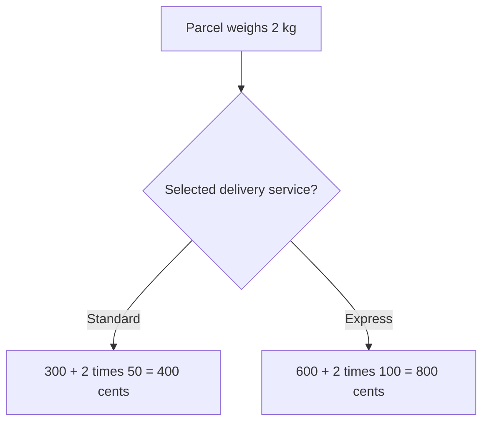
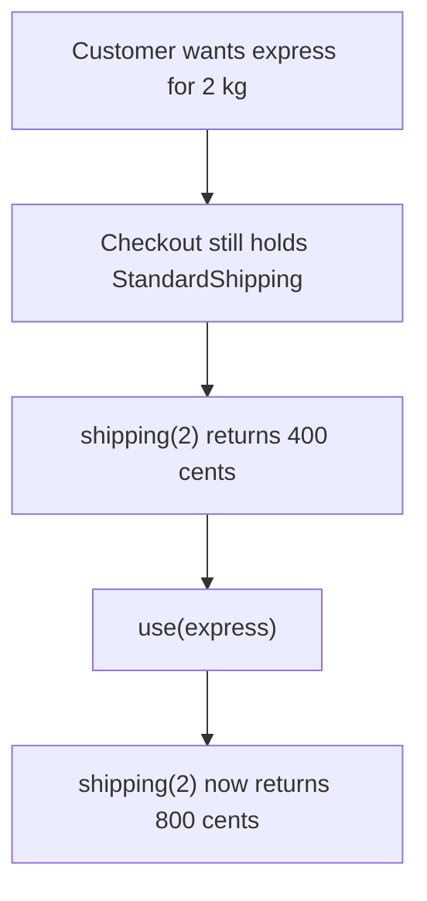
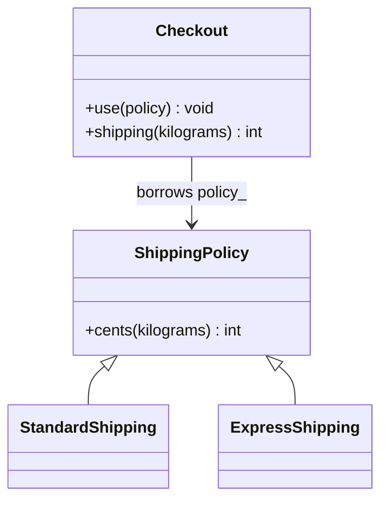
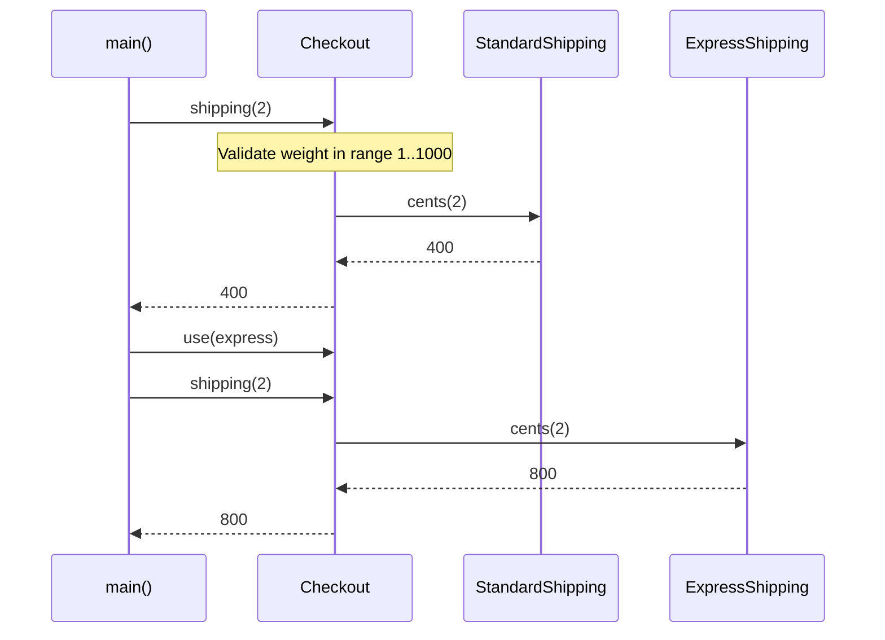

# Strategy

## 1. Definition

**Strategy lets you choose how a job is done without changing the code that asks
for the job.** Each choice is a separate calculation or procedure.

For example, a checkout can calculate standard or express shipping. The checkout
still checks the order and asks for a price; the selected shipping rule supplies the formula.

## 2. The Problem It Solves

Suppose checkout calculates standard shipping. We add express, then another service.
If checkout contains every formula, each pricing change sends us back into checkout
code. Creating separate checkouts would instead copy the checks they all share.

Only the pricing rule needs to vary. Put standard and express formulas in separate
objects, then give checkout the selected one. Checkout checks the weight and asks
that object for the price. Changing delivery service changes the selected formula,
not the checkout process.

## 3. Understand the Idea Step by Step

1. Define the job and its rules: receive a weight and return a shipping cost in cents.
2. Provide different calculations that honor those rules.
3. Choose one calculation and supply it to checkout.
4. Checkout calls the selected calculation without inspecting which kind it is.

The formula is the **algorithm**, meaning the procedure used to find an answer.
Here it is also called a shipping **policy**, or rule. Both policies take kilograms
and return cents. That shared agreement lets checkout use either one in the same way.

### Picture: Same Parcel, Different Chosen Rule

Read downward and take one branch. Both branches price the same 2 kg parcel.

**Read it as a sentence:** choosing standard gives 400 cents; choosing express gives
800 cents. The checkout steps remain the same while the chosen formula changes.

All strategies must agree on what their result means. If one returns cents and
another returns whole currency units, they are not safe replacements merely because
both C++ functions return an integer.

## 4. Real-World Scenario

A route planner offers fastest, shortest, and accessible routes. It keeps the same
start and destination controls while passing route calculation to the selected rule.

Choosing "accessible" changes the route calculation, not the start and destination
controls. That calculation must receive the information it needs, such as steps
and ramps; a different rule cannot work without the relevant data.

## 5. Understand the C++ Example

Open [strategy.cpp](../../../patterns/behavioral/strategy.cpp).

`ShippingPolicy` describes the calculation. Standard and express classes supply the
formulas. `Checkout` keeps access to whichever policy was selected.

1. Start with the standard policy.
2. A 2 kg parcel costs `300 + 2 * 50`, or 400 cents.
3. `use(express)` selects the other policy on the same checkout.
4. The same parcel now costs `600 + 2 * 100`, or 800 cents.
5. Checkout rejects zero weight before asking either policy to calculate.
6. Checks verify both prices and the invalid-input behavior.

The checkout borrows the policy objects rather than owning them. They must remain
alive while it uses them. The formulas are used within checkout's supported weight
range of 1 through 1000; they are not promises for arbitrary inputs.

### C++ Flow Diagram

Arrows show the selected policy and its result in the drawback demonstration.

Both answers follow their policy's formula. Input validation cannot discover
that setup selected the wrong policy for the customer's request.

### C++ Class Diagram

Triangles point to the common interface. The ordinary arrow is a borrowed
pointer; changing it does not transfer ownership or copy the policy.

The policy objects are declared before the checkout and outlive it. Calling
`use()` changes future calculations, not prices already returned to a caller.

### C++ Sequence Diagram

Time runs downward. Solid arrows call methods; dashed arrows return cents.

The second call performs the same validation, omitted from the drawing for space.
Only the selected calculation changes; `Checkout` itself is not replaced.

## 6. Benefits, Drawbacks, and Alternatives

**Benefits:** test each shipping formula on its own and switch the same checkout
from standard to express. A new formula does not need another copy of the weight checks.

**Drawbacks:** Strategy does not choose the correct option for the user. In the
drawback example, the customer wants express but checkout still uses standard,
so it returns 400 instead of 800 cents. Setup must select the right rule. Separate
classes also add work for tiny formulas, and a new policy may need more inputs
than the current shared operation provides.

**Use it when:** interchangeable calculations are a real requirement. A function
passed into checkout can also be a strategy; C++ inheritance is not required.
A small fixed switch can be appropriate when choices are few and stable.

## 7. Check Your Understanding

**Question:** Must every Strategy example contain a virtual base class?

**Answer:** No. A function passed to checkout can supply the calculation too.
What matters is that checkout can use a different calculation without rewriting
its common steps, and that the calculations agree on their inputs and results.

Optional detail: [behavioral technical notes](../../../patterns/behavioral/README.md).