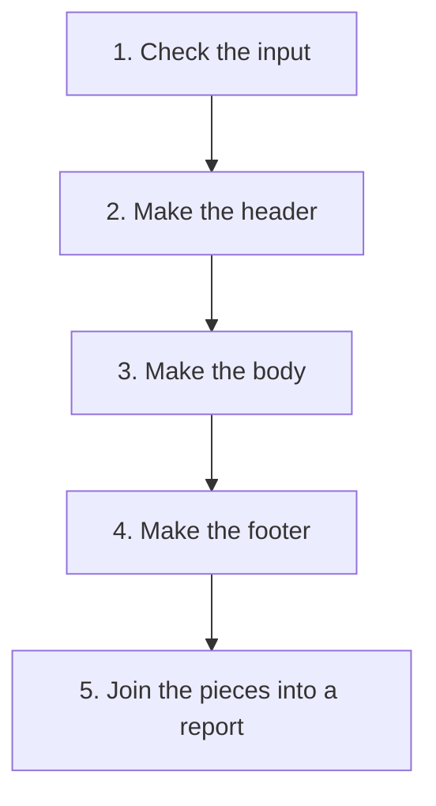
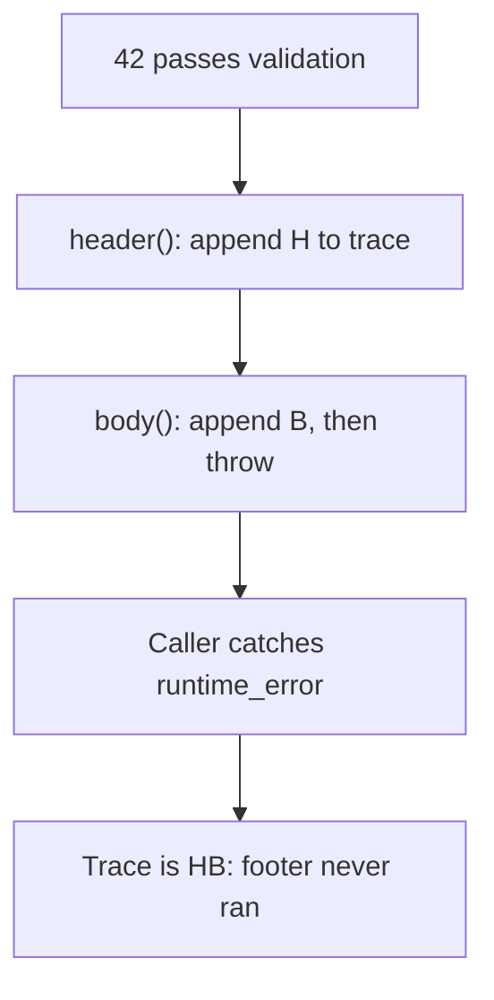
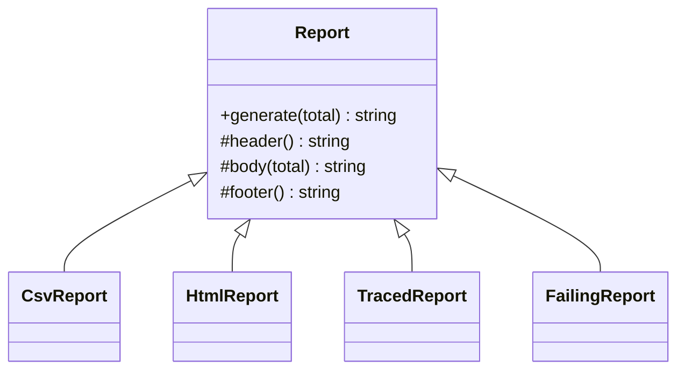
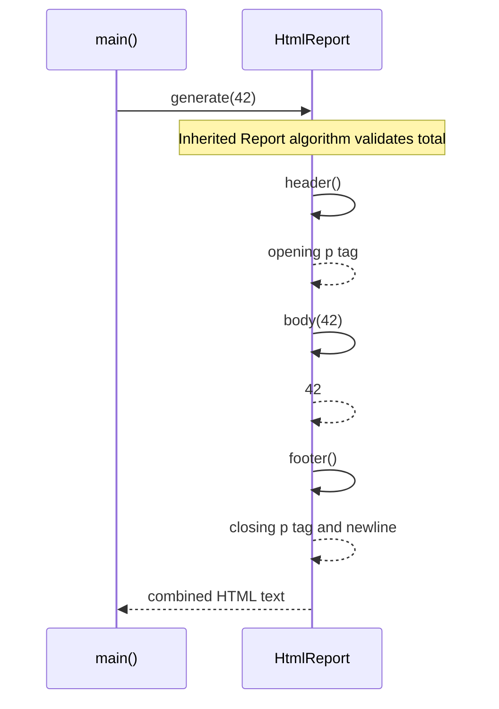

# Template Method

## 1. Definition

**Template Method keeps a process in one parent class and lets child classes
fill in selected steps.** The order stays the same; the details can differ.

For example, report generation checks the input, creates a header, creates the body,
and creates a footer. A text report and a web report need different content but can
follow the same sequence.

The word "template" means a reusable outline here. It does not require the C++
`template` language feature used for generic types and functions.

## 2. The Problem It Solves

Suppose the text report and web report each implement the whole generation
process. Both must remember to check the input before formatting. If we add a
common check, we must find and update both versions, and every later report too.

Write the process once in `Report::generate()`: check, header, body, footer, combine.
Let each report supply its own formatting functions. The shared method calls them
in order. The parent is called the **base class**, and the child reports are
**derived classes**.

## 3. Understand the Idea Step by Step

1. Write one top-level function containing the required order.
2. Make it call separate functions for the customizable steps.
3. Let derived classes supply those functions.
4. Make callers use the shared top-level function.

The shared process calls **virtual functions**, so C++ can use the child report's
version, called an **override**. Header and body must be supplied here. Footer has
a default newline that a child may keep or replace. An optional step like that
is often called a **hook**.

### Picture: Change the Content, Keep the Order

Read downward. Every report follows this order; the chosen report class supplies
the content of the three middle formatting steps.

**Read it as a sentence:** check first, then header, body, footer, and combine.
Invalid input stops at the first step; formatting does not begin.

This is the order when the steps succeed. If making the body throws an error, the
function stops before the footer. A footer is another formatting step, not a
guarantee that cleanup will happen.

## 4. Real-World Scenario

A data-import tool validates a source, reads records, normalizes them, then stores
them. Text and binary importers can provide different reading steps while reusing
the overall process.

Adding another file format can reuse the same order by supplying a different
reading step. If users instead need to mix any reader with any writer, separate
helper objects may fit better than a new child class for every combination.

## 5. Understand the C++ Example

Open [template_method.cpp](../../../patterns/behavioral/template_method.cpp).

`Report::generate()` holds the sequence. `header()` and `body()` must be supplied
by a derived report. `footer()` has a default newline.

1. `generate(42)` checks that 42 is not negative.
2. It calls header, body, and footer in three separate statements.
3. The CSV report produces `total\n42\n`; `\n` means a line break.
4. The HTML report produces `
42
\n` with its own footer.
5. A test report records `HBF`, proving header ran before body and body before footer.
6. A negative value is rejected before any formatting hook runs.

The separate statements are important in C++17. Combining all three function calls
in one addition expression would not guarantee their evaluation in that same order.
The shared `generate()` is nonvirtual, meaning derived classes do not override that sequence.

### C++ Flow Diagram

Follow `FailingReport::generate(42)` through the inherited algorithm. The failure
arrow means an exception leaves the normal sequence of steps.

A footer hook is a normal operation, not guaranteed cleanup. Resource-owning
objects and destructors are needed for cleanup when an earlier hook throws.

### C++ Class Diagram

Triangles mean inheritance. `+` is public, `#` is protected: callers use
`generate()`, while derived reports customize the internal steps.

`generate()` is not virtual; its order stays fixed. Header and body require an
override, while footer has a default newline implementation.

### C++ Sequence Diagram

Read downward; self-arrows are calls on the same object, not new report objects.
Dashed arrows return strings from the selected overrides.

Validation occurs before any hook. Negative input therefore produces neither a
partial report nor additions to the trace in the tested implementation.

## 6. Benefits, Drawbacks, and Alternatives

**Benefits:** every report goes through the same validation and order. A formatting
class focuses on its own header, body, and footer instead of copying the process.

**Drawbacks:** changing the parent's process affects all its child reports. Too
many replaceable steps make it harder to see what a report will do. The failure
example also shows that a throwing body skips the footer, so resource cleanup
must use a separate reliable mechanism. The fixed outline is a poor fit when
callers need to rearrange steps freely.

**Use it when:** the order is genuinely stable and derived classes are a natural fit.
Strategy instead supplies a separate replaceable object or function to do a job.

## 7. Check Your Understanding

**Question:** Can the footer hook reliably release a resource if making the body fails?

**Answer:** No. Execution may never reach the footer. Use a resource-owning object
whose destructor releases the resource during normal exit and exception cleanup.

Optional detail: [behavioral technical notes](../../../patterns/behavioral/README.md).