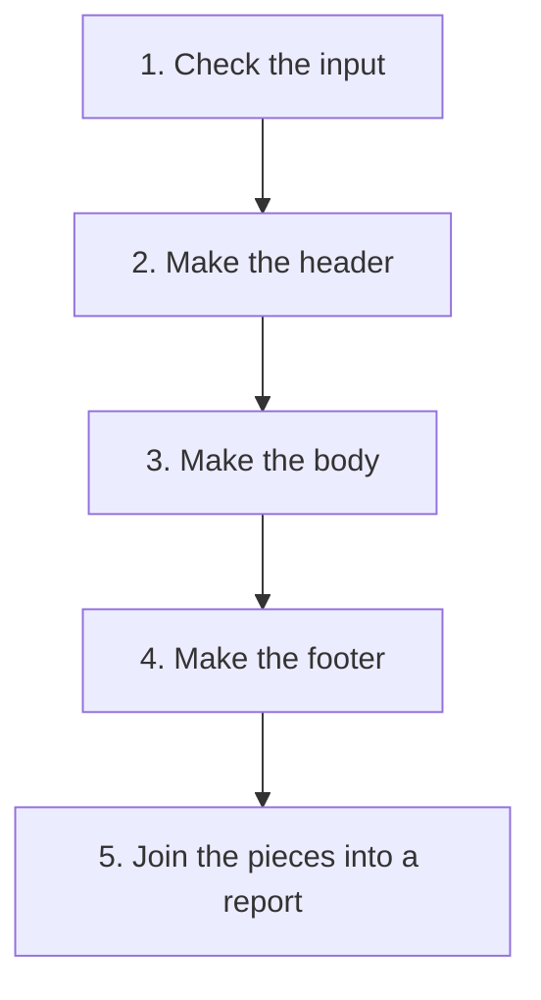

# Template Method

## 1. Definition

**Template Method writes a fixed sequence of steps once and lets more specific
classes supply selected steps.** The order remains shared; some details vary.

For example, report generation checks the input, creates a header, creates the body,
and creates a footer. A text report and a web report need different content but can
follow the same sequence.

The word "template" means a reusable outline here. It does not require the C++
`template` language feature used for generic types and functions.

## 2. The Problem It Solves

If each report copies the entire sequence, one may forget validation or call steps
in a different order. Fixing the common process would require fixing every copy.

Keep the sequence in one base class and expose only the steps intended to vary.
A **base class** is a class extended by other classes; those extensions are **derived classes**.

## 3. Understand the Idea Step by Step

1. Write one top-level function containing the required order.
2. Make it call separate functions for the customizable steps.
3. Let derived classes supply those functions.
4. Make callers use the shared top-level function.

A **virtual function** allows a derived class to supply its own version, called an
**override**. A **hook** is a step intended for customization. Some hooks are required;
others provide a default that a derived class may keep.

### Picture: Change the Content, Keep the Order

Read downward. Every report follows this order; the chosen report class supplies
the content of the three middle formatting steps.

**Read it as a sentence:** check first, then header, body, footer, and combine.
Invalid input stops at the first step; formatting does not begin.

A fixed sequence does not guarantee its last step runs after an error. If making
the body throws an exception, execution skips the ordinary footer call. Required
cleanup must be handled separately, usually by C++ objects that clean up on destruction.

## 4. Real-World Scenario

A data-import tool validates a source, reads records, normalizes them, then stores
them. Text and binary importers can provide different reading steps while reusing
the overall process.

If users need to mix independent readers, normalizers, and writers freely, supplying
separate helper objects may be simpler than a derived class for each combination.

## 5. Understand the C++ Example

Open [template_method.cpp](../../../patterns/behavioral/template_method.cpp).

`Report::generate()` holds the sequence. `header()` and `body()` must be supplied
by a derived report. `footer()` has a default newline.

1. `generate(42)` checks that 42 is not negative.
2. It calls header, body, and footer in three separate statements.
3. The CSV report produces `total\n42\n`; `\n` means a line break.
4. The HTML report produces `
42
\n` with its own footer.
5. A test report records `HBF`, proving header ran before body and body before footer.
6. A negative value is rejected before any formatting hook runs.

The separate statements are important in C++17. Combining all three function calls
in one addition expression would not guarantee their evaluation in that same order.
The shared `generate()` is nonvirtual, meaning derived classes do not override that sequence.

## 6. Benefits, Drawbacks, and Alternatives

**Benefits:** common order and checks are written once; derived classes focus on
their differences; sequence fixes have one main home.

**Drawbacks:** changes to the base can affect every derived class. Too many hooks
make behavior difficult to predict. Independent pieces are harder to recombine while running.

**Use it when:** the order is genuinely stable and derived classes are a natural fit.
Strategy instead supplies a separate replaceable object or function to do a job.

## 7. Check Your Understanding

**Question:** Can the footer hook reliably release a resource if making the body fails?

**Answer:** No. Execution may never reach the footer. Use a resource-owning object
whose destructor releases the resource during normal exit and exception cleanup.

Optional detail: [behavioral technical notes](../../../patterns/behavioral/README.md).