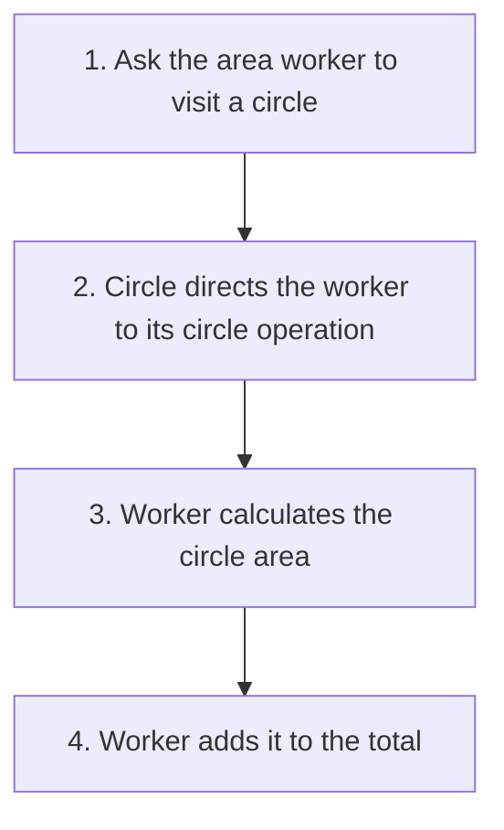
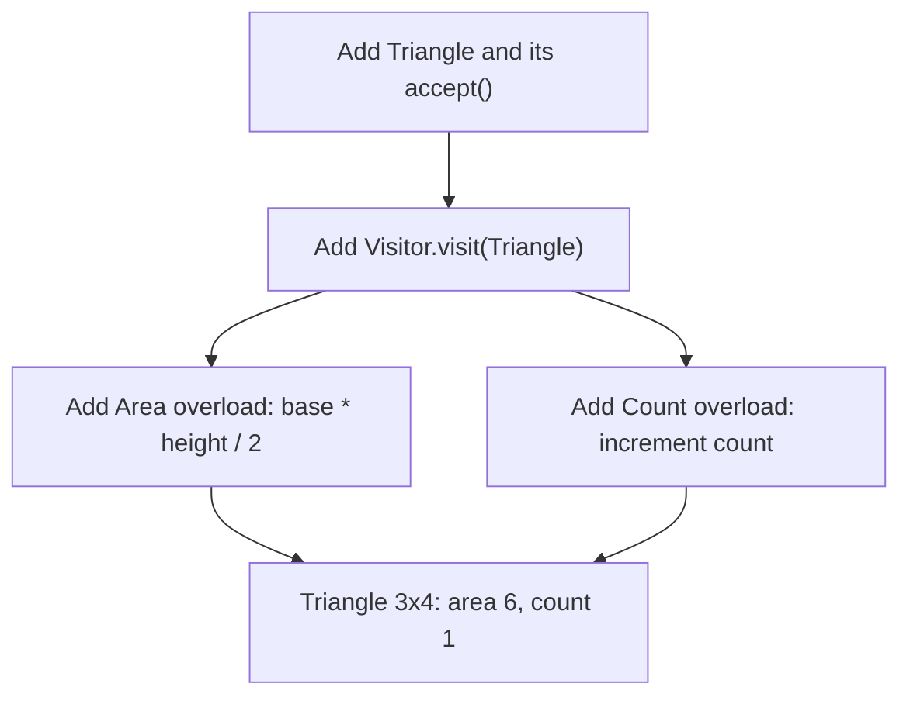
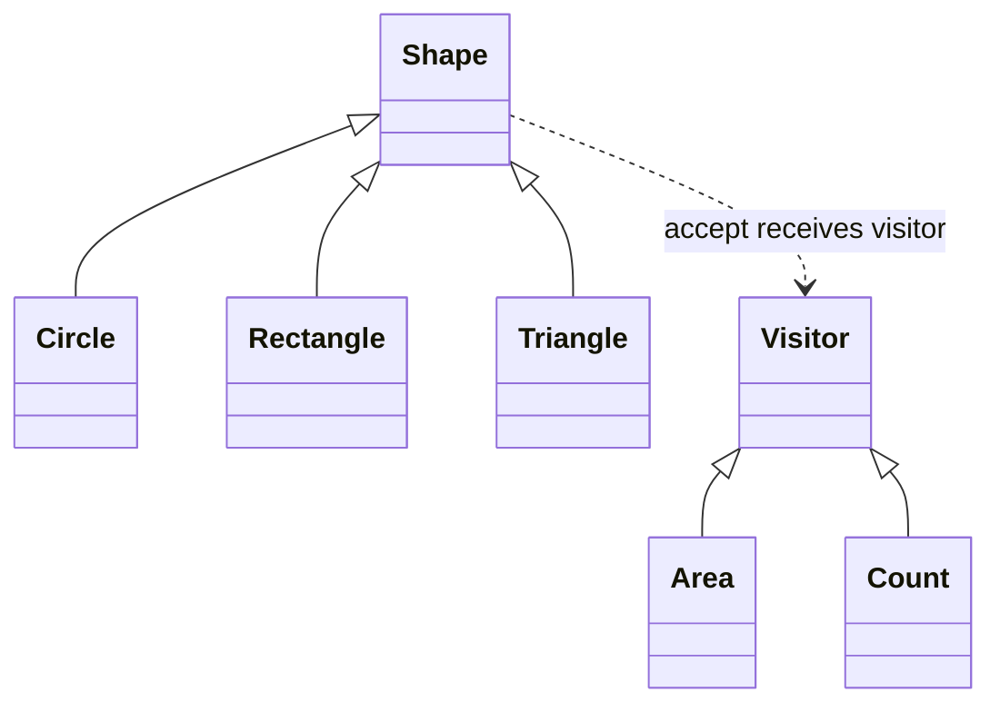
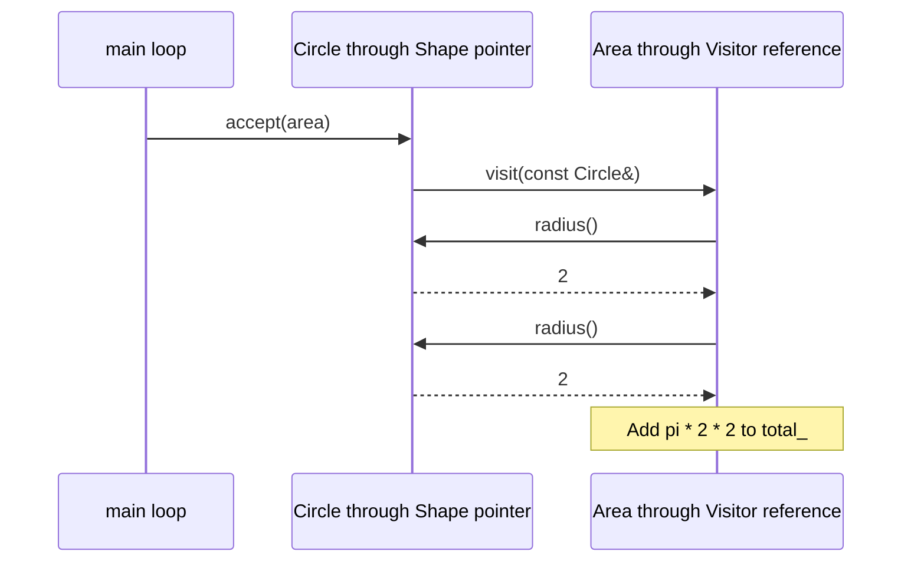

# Visitor

## 1. Definition

**Visitor puts a job in a separate object that knows how to handle each supported
type.** The objects being visited do not need a new method for every new job.

Imagine circles and rectangles. An area worker calculates their areas. A counting
worker counts them. Both can visit the same shapes, but perform different work.

## 2. The Problem It Solves

Suppose circles and rectangles already work, but we keep adding jobs: calculate
area, count shapes, export them, print a report. Putting each job inside every shape
means reopening all the shape classes whenever another job arrives.

Instead, put the area job in an `Area` visitor. It has one function for circles and
another for rectangles. A `Count` visitor has the same entry points but does a
different job. Each shape only needs to accept a visitor and direct it to the
right function for that shape.

## 3. Understand the Idea Step by Step

1. Each shape accepts a visitor through an `accept()` function.
2. A visitor provides one `visit()` function for circles and another for rectangles.
3. The shape calls the visitor's function for its own kind.
4. The selected visitor performs its work using that shape's information.

In pattern terminology, the job is an **operation**, its worker is the **visitor**,
and the shape is an **element**. The visitor knows the job; the shape knows which
kind of shape it is.

### Picture: Follow One Area Calculation

Read downward. This picture shows one worker visiting one shape, not every possible combination.

**Read it as a sentence:** the circle identifies the kind of shape; the area worker
provides the work. A counting worker would count that circle instead of calculating area.

### Why C++ Uses Two Calls

The loop holds a general `Shape` pointer. C++ will not choose the circle version
of `visit()` just by looking through that pointer. Functions with the same name
but different parameter types are **overloads**, and that choice uses the type
known where the call is written.

So we take two steps:

1. Call `shape.accept(visitor)`. Because `accept()` is virtual, a circle runs
    `Circle::accept()`.
2. Inside that function, `*this` is known to be a circle. Calling `visitor.visit(*this)`
    selects the circle operation. Its virtual call runs the chosen visitor's version,
    such as area calculation or counting.

The result depends on both the shape type and visitor type. That is called
**double dispatch**. The circle selects the right entry point; the visitor does the work.

## 4. Real-World Scenario

A compiler stores different kinds of expressions, such as numbers and additions.
Separate workers can print them, check their types, or produce machine instructions.
Each worker keeps the parts of its own job together.

A new printing style can be another visitor instead of another method on every
expression. Adding a new expression kind has the opposite cost: every visitor must
learn how to handle it. The compiler must also decide how to walk the expression
tree; Visitor alone does not choose the visiting order.

## 5. Understand the C++ Example

Open [visitor.cpp](../../../patterns/behavioral/visitor.cpp).

`Shape` describes `accept()`. `Circle` and `Rectangle` implement it. `Area` and
`Count` are the two workers.

1. The collection contains a circle of radius 2 and a rectangle of width 3 and height 4.
2. Call `accept(area)` for the circle; its own function calls the circle visit operation.
3. The area worker adds pi times 2 times 2, approximately 12.57.
4. The rectangle visit adds 3 times 4, or 12.
5. The total is approximately 24.57; a separate count worker obtains 2.
6. Checks allow a small numerical tolerance for area and require an exact count of 2.

The collection owns the shapes. Visitors use them during each call but do not own
their cleanup. Workers accumulate results: visiting the same collection again with
the same worker adds again unless its stored result is reset.

### C++ Flow Diagram

These arrows show the code changes behind the triangle drawback example.

A new shape affects all existing visitors. Adding a new operation is easier:
another visitor can handle the already known shape types without changing them.

### C++ Class Diagram

Triangles point to base classes. The dotted arrow means a shape calls the visitor.
Method details are omitted here to keep the two families visible.

Every shape implements `accept(Visitor&)`. Every concrete visitor implements all
three `visit()` overloads. The caller owns the shapes and the two visitors separately.

### C++ Sequence Diagram

Solid arrows call; dashed arrows return data. This zooms in on the circle's area
visit in `main()`; the loop separately calls `accept(count)` afterward.

The first virtual call selects `Circle::accept`. Inside that function, `*this`
is known as a circle, so overload selection chooses `visit(const Circle&)`; virtual
dispatch then selects `Area`'s version. These two selections are double dispatch.

## 6. Benefits, Drawbacks, and Alternatives

**Benefits:** add a perimeter or export job in a new visitor without inserting that
job into every existing shape. Code for one job stays together, and a visitor can
collect a total while visiting different shapes.

**Drawbacks:** adding a shape is more work. The triangle example needs a new
`visit(Triangle)` operation and implementations in both `Area` and `Count`.
Visitors also need access to the measurements they use. The two calls make sense
when jobs keep growing, but may be unnecessary complexity for a few simple operations.

**Use it when:** object types are fairly stable but operations grow. If shapes change
often and operations are few, putting suitable virtual functions on shapes may be simpler.

## 7. Check Your Understanding

**Question:** Which addition is easier here: a perimeter worker or a triangle shape?

**Answer:** Adding another worker is easier: it implements visits for the types
already supported. Adding a shape needs a new visit operation and updates to the
existing workers. Visitor makes adding jobs convenient, not adding types.

Optional detail: [behavioral technical notes](../../../patterns/behavioral/README.md).