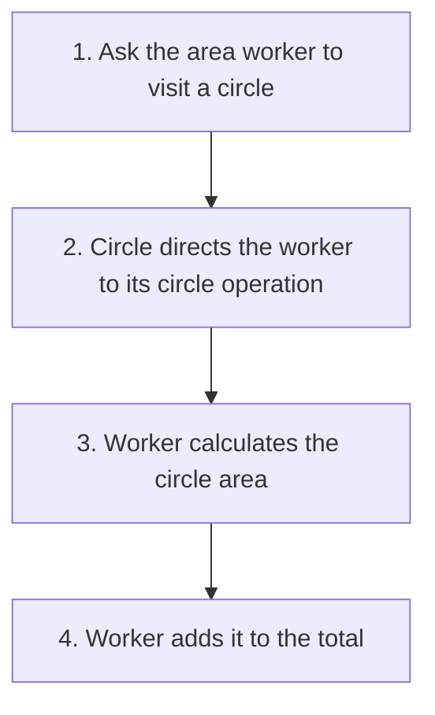

# Visitor

## 1. Definition

**Visitor puts an operation in a separate worker object that knows how to work
with each supported kind of object.** The visited objects do not need to contain
every new operation themselves.

Imagine circles and rectangles. An area worker calculates their areas. A counting
worker counts them. Both can visit the same shapes, but perform different work.

## 2. The Problem It Solves

Putting area, export, printing, checking, and every future operation inside every
shape class can make those classes large. Adding one operation means editing many shapes.

Visitor groups the code for one operation in one worker. It is most helpful when
the supported shape types change less often than the operations performed on them.

## 3. Understand the Idea Step by Step

1. Each shape accepts a visitor through an `accept()` function.
2. A visitor provides one `visit()` function for circles and another for rectangles.
3. The shape calls the visitor's function for its own kind.
4. The selected visitor performs its work using that shape's information.

An **operation** is a job, such as calculating area. The **visitor** is the worker
doing that job. An **element** is the visited object, here a shape.

### Picture: Follow One Area Calculation

Read downward. This picture shows one worker visiting one shape, not every possible combination.

**Read it as a sentence:** the circle identifies the kind of shape; the area worker
provides the work. A counting worker would count that circle instead of calculating area.

### Why C++ Uses Two Calls

Two functions can share a name but accept different argument types. This is
**overloading**, such as `visit(Circle)` and `visit(Rectangle)`. C++ chooses an overload
using the type known at that point in the code, not by looking through a generic
shape pointer and guessing its real kind.

First, a **virtual call** reaches the real shape's `accept()` function. Inside a
circle's own function, `*this` is known to be a circle, so the circle `visit()` is
selected. That visit is also virtual, allowing the chosen worker to supply its
implementation. Using both the shape kind and worker kind is called **double dispatch**.

## 4. Real-World Scenario

A compiler stores different kinds of expressions, such as numbers and additions.
Separate workers can print them, check their types, or produce machine instructions.
Each worker keeps the parts of its own job together.

If new expression kinds are added frequently, updating every worker becomes costly.
Also, Visitor does not automatically decide how to walk a whole tree; the program
still needs to choose which objects to visit and in what order.

## 5. Understand the C++ Example

Open [visitor.cpp](../../../patterns/behavioral/visitor.cpp).

`Shape` describes `accept()`. `Circle` and `Rectangle` implement it. `Area` and
`Count` are the two workers.

1. The collection contains a circle of radius 2 and a rectangle of width 3 and height 4.
2. Call `accept(area)` for the circle; its own function calls the circle visit operation.
3. The area worker adds pi times 2 times 2, approximately 12.57.
4. The rectangle visit adds 3 times 4, or 12.
5. The total is approximately 24.57; a separate count worker obtains 2.
6. Checks allow a small numerical tolerance for area and require an exact count of 2.

The collection owns the shapes. Visitors use them during each call but do not own
their cleanup. Workers accumulate results: visiting the same collection again with
the same worker adds again unless its stored result is reset.

## 6. Benefits, Drawbacks, and Alternatives

**Benefits:** add another job without adding it to every shape; keep one job's code
together; collect totals or reports across different shape types.

**Drawbacks:** adding a new shape requires updating the visitor interface and existing
workers. Workers need access to enough shape information. The two-call mechanism
takes more explanation than an ordinary function.

**Use it when:** object types are fairly stable but operations grow. If shapes change
often and operations are few, putting suitable virtual functions on shapes may be simpler.

## 7. Check Your Understanding

**Question:** Which addition is easier here: a perimeter worker or a triangle shape?

**Answer:** The perimeter worker implements the already known circle and rectangle
visits. A triangle adds a new visit operation, so existing workers must learn what
to do with triangles. Visitor favors new operations over new object types.

Optional detail: [behavioral technical notes](../../../patterns/behavioral/README.md).