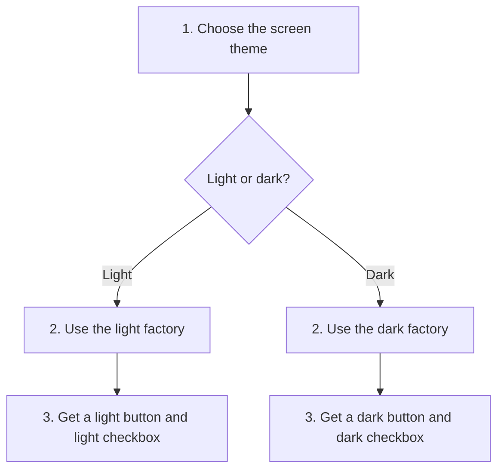

# Abstract Factory

## 1. Definition

**Abstract Factory creates a set of objects that are meant to work together. You
choose the set once, then ask the same factory for its different parts.**

Imagine choosing a light theme for a screen. You want a light button and a light
checkbox, not a light button mixed with a dark checkbox. A factory is simply an
object whose job is to create other objects. Here, it creates matching controls.

## 2. The Problem It Solves

Without this arrangement, every screen might separately decide which button and
checkbox classes to create. One screen could forget a check and mix two themes.
Adding another theme would also mean finding these decisions throughout the program.

Instead, let one selected factory know how to create all the parts of a theme.
The screen asks for a button and checkbox without repeating theme decisions.

## 3. Understand the Idea Step by Step

1. List the different parts needed: a button and a checkbox.
2. Define the operations that create those parts.
3. Provide a light factory and a dark factory. Each creates its matching parts.
4. Give one factory to the screen. Ask that factory for everything the screen needs.

An **interface** is a list of operations the caller can rely on. Here it promises
"make a button" and "make a checkbox." **Abstract** means that this common description
does not choose the theme itself. A specific factory supplies that choice.

### Picture: Keep Each Set Together

Read from top to bottom. Take one theme branch, not both. Each bottom box lists
the two objects created by that theme's factory.

**Read it as a sentence:** choosing the light factory gives both light controls;
choosing the dark factory gives both dark controls.

A **product** is a created object. A **product category** is a kind of part, such as
button or checkbox. A **family** is a matching set, such as all the light controls.
Adding a theme adds a family. Adding sliders adds a category and needs work in
every factory so every theme can supply a slider.

## 4. Real-World Scenario

Imagine an application that supports two database systems. Each system supplies
its own connection and command objects. A selected database factory creates both,
so the application does not accidentally send one system's command to the other.

Real database objects may also need to belong to the same active connection.
Choosing the right system is not enough by itself; the factory must preserve
that relationship too. This is an example design, not a complete database library.

## 5. Understand the C++ Example

Open [abstract_factory.cpp](../../../patterns/creational/abstract_factory.cpp).

`WidgetFactory` describes the two creation functions, `button()` and `checkbox()`.
`LightFactory` and `DarkFactory` supply different versions. `draw_form()` is the
function using the objects. In pattern books, that using code is called the **client**.

1. Pass a `DarkFactory` to `draw_form()`.
2. The form asks it for a button and checkbox.
3. It receives a `DarkButton` and `DarkCheckbox`.
4. Each object's `draw()` returns a description.
5. The combined result is `dark button + dark checkbox`.
6. The light factory produces the corresponding light result with the same form code.

The checks verify both results. Each created object is kept in a `unique_ptr`, a
pointer that owns the object and cleans it up automatically. The example prevents
mixing by consistently using one factory; it does not forbid someone from manually
creating and mixing controls elsewhere.

## 6. Benefits, Drawbacks, and Alternatives

**Benefits:** matching parts are created together; theme choices do not spread
through every screen; another theme can use the same screen code.

**Drawbacks:** there are more classes. A new kind of control must be added to every
factory. All themes must genuinely support the operations promised to the screen.

**Use it when:** you need several related kinds of objects. If you only need one
object, a simple creation function may be enough. Builder addresses a different
problem: preparing one object through several steps.

## 7. Check Your Understanding

**Question:** Why is adding a blue theme easier than adding sliders?

**Answer:** A blue factory can implement the existing button and checkbox operations.
A slider needs a new operation, and light, dark, and blue factories must all provide
it. The pattern makes adding matching sets convenient, not every possible change.

Optional detail: [creational technical notes](../../../patterns/creational/README.md).