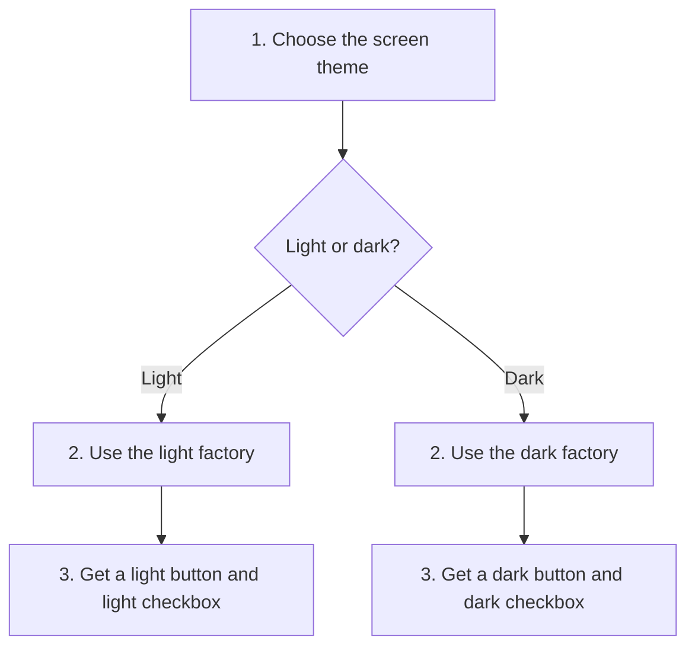
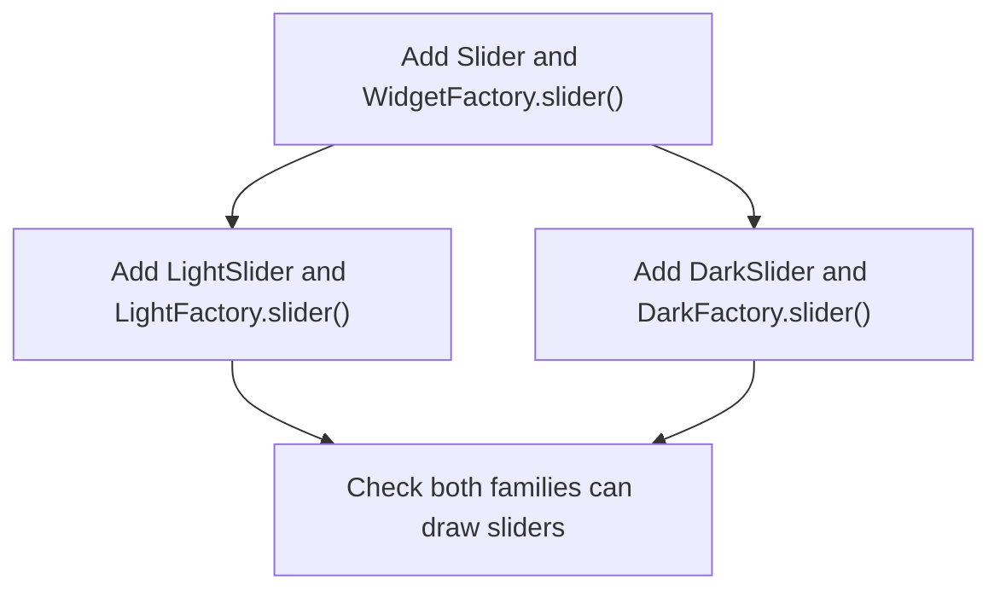
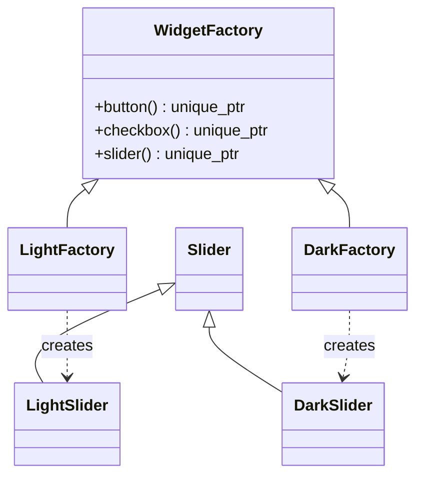
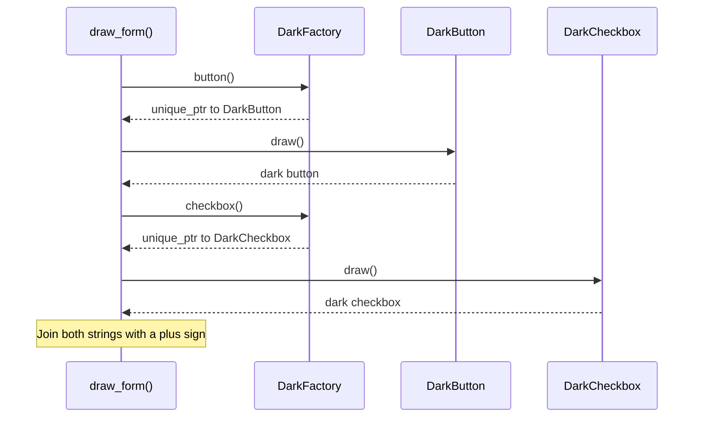

# Abstract Factory

## 1. Definition

**Abstract Factory gives you a matching set of objects from one chosen factory.**

Imagine choosing a light theme for a screen. You want a light button and a light
checkbox, not a light button mixed with a dark checkbox. A factory is simply an
object whose job is to create other objects. Here, it creates matching controls.

## 2. The Problem It Solves

Suppose each screen chooses its button and checkbox separately. A developer changes
the button to dark but forgets the checkbox. Now the same screen has two themes.
Adding a blue theme means finding and updating all those creation choices again.

We want to make the theme choice once. Choose a dark factory, then ask it for both
controls. It supplies a dark button and a dark checkbox, so the screen does not
have to make the same decision twice.

## 3. Understand the Idea Step by Step

1. List the different parts needed: a button and a checkbox.
2. Define the operations that create those parts.
3. Provide a light factory and a dark factory. Each creates its matching parts.
4. Give one factory to the screen. Ask that factory for everything the screen needs.

The screen only needs two operations: "make a button" and "make a checkbox."
Together they form the factory's **interface**, the operations callers can use.
The common, abstract factory describes them; the light and dark factories decide
which actual controls to create.

### Picture: Keep Each Set Together

Read from top to bottom. Take one theme branch, not both. Each bottom box lists
the two objects created by that theme's factory.

**Read it as a sentence:** choosing the light factory gives both light controls;
choosing the dark factory gives both dark controls.

A button is a **product**. Light controls are a **family**, meaning a matching set.
There are two different changes to consider: another theme needs another factory;
another kind of control, such as a slider, needs support in every factory.

## 4. Real-World Scenario

Imagine an application that supports two database systems. Each system supplies
its own connection and command objects. A selected database factory creates both,
so the application does not accidentally send one system's command to the other.

The factory must also create commands for the correct connection. The useful idea
is the same as the theme example: ask one place for parts that belong together.

## 5. Understand the C++ Example

Open [abstract_factory.cpp](../../../patterns/creational/abstract_factory.cpp).

`WidgetFactory` describes the two creation functions, `button()` and `checkbox()`.
`LightFactory` and `DarkFactory` supply different versions. `draw_form()` is the
function using the objects. In pattern books, that using code is called the **client**.

1. Pass a `DarkFactory` to `draw_form()`.
2. The form asks it for a button and checkbox.
3. It receives a `DarkButton` and `DarkCheckbox`.
4. Each object's `draw()` returns a description.
5. The combined result is `dark button + dark checkbox`.
6. The light factory produces the corresponding light result with the same form code.

The checks verify both results. Each created object is kept in a `unique_ptr`, a
pointer that owns the object and cleans it up automatically. The example prevents
mixing by consistently using one factory; it does not forbid someone from manually
creating and mixing controls elsewhere.

### C++ Flow Diagram

These arrows show required code changes when adding the `Slider` category,
followed by the checks in `demonstrate_drawback()`.

A new product category affects every factory. A separate check mixes a light
button with a dark checkbox: using factories does not make such mixing impossible.

### C++ Class Diagram

Hollow triangles mean inheritance; dotted arrows mean creation. This view focuses
on the added slider category. Buttons and checkboxes have corresponding pairs.

The factory returns owned products; it does not retain them in a collection.
That is why the arrows are not ownership diamonds.

### C++ Sequence Diagram

Solid arrows call methods; dashed arrows return values. This shows one possible
evaluation order inside `draw_form(DarkFactory{})`.

Both products match because the same factory supplies them. The C++ expression
does not require the button side to run before the checkbox side; either order
produces the same combined text here.

## 6. Benefits, Drawbacks, and Alternatives

**Benefits:** the screen asks for controls without choosing each concrete class.
A blue factory can supply blue controls to the same screen code. Theme choices
stay with the factories instead of being repeated throughout the screens.

**Drawbacks:** adding sliders is more work than adding a theme. The example must
add a slider operation and implement it for both light and dark factories. As the
number of themes and control types grows, so does the number of classes to maintain.

**Use it when:** you need several related kinds of objects. If you only need one
object, a simple creation function may be enough. Builder addresses a different
problem: preparing one object through several steps.

## 7. Check Your Understanding

**Question:** Why is adding a blue theme easier than adding sliders?

**Answer:** A blue factory can implement the existing button and checkbox operations.
A slider needs a new operation, and light, dark, and blue factories must all provide
it. The pattern makes adding matching sets convenient, not every possible change.

Optional detail: [creational technical notes](../../../patterns/creational/README.md).