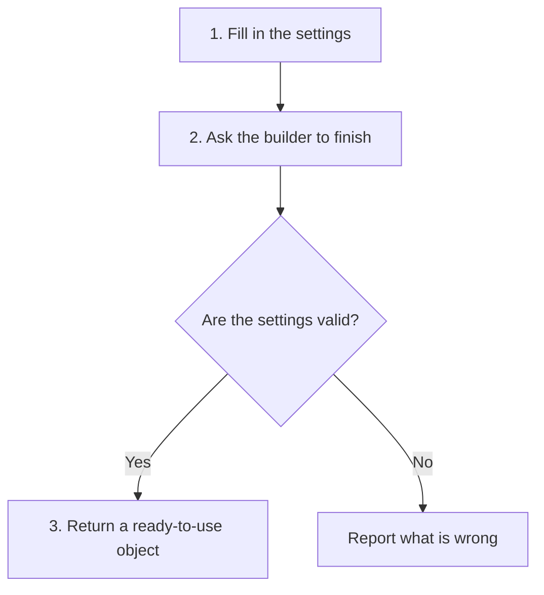
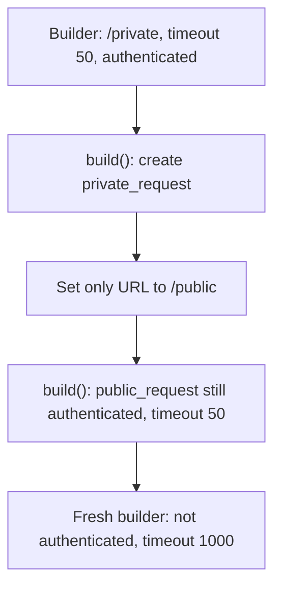
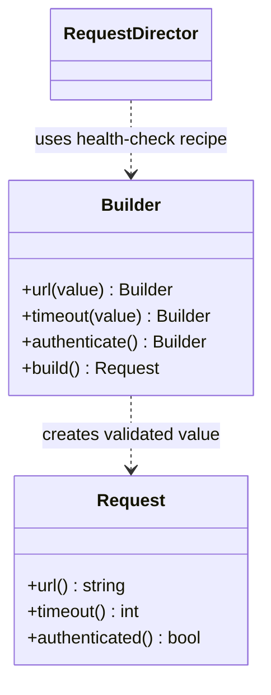
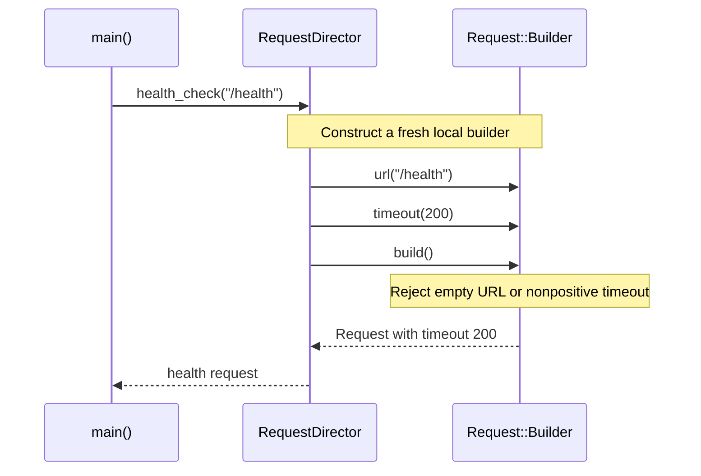

# Builder

## 1. Definition

**Builder lets you choose an object's settings one step at a time, then ask for
the finished object.**

Think of filling out an order form. You may choose the address, delivery speed, and
optional extras in separate steps. An unfinished form is acceptable while filling
it out, but it should not become a usable order without its required information.

## 2. The Problem It Solves

A call such as `Request("/orders", 500, true)` makes you stop and look up the
arguments. Is `500` a timeout? What does `true` turn on? More options make the call
harder to understand, especially when most callers only want to change a few.

With a builder, the choices have names: set the URL, set the timeout, enable
authentication. Then call `build()`. In this example, that final step checks the
settings before returning a request anyone can use.

## 3. Understand the Idea Step by Step

1. Create a builder with sensible starting values.
2. Set the required information and any optional choices.
3. Call `build()` when ready.
4. Check the complete configuration. Return a finished object only if it is valid.

A **constructor** is the function that initializes a new C++ object. In this example,
the finished object's constructor is private, meaning outside code cannot call it
directly. The builder calls it after checking the values.

### Picture: Unfinished Choices Become a Finished Object

Read downward. The diamond is a yes/no question. Only the yes path produces an object.

**Read it as a sentence:** choose settings, check them together, then either receive
a complete object or an error.

If the same settings are needed often, a helper can apply that recipe for us.
Pattern books call this helper a **director**. The health-check example below uses one.

Calls such as `.url(...).timeout(...)` can be chained because each returns the same
builder. This is called a **fluent interface**. The important part is still the
finished request, not how many calls fit on one line.

## 4. Real-World Scenario

A travel planner collects destinations, dates, and accommodation choices. Before
producing a bookable itinerary, it checks that the return date follows departure.
A business-trip recipe could fill in common defaults while still allowing changes.

The result is a complete travel plan. Booking it is a later job: a valid plan does
not guarantee that the chosen hotel still has rooms.

## 5. Understand the C++ Example

Open [builder.cpp](../../../patterns/creational/builder.cpp).

`Request` is the finished object. `Request::Builder` collects a URL, a timeout, and
whether authentication is requested. A timeout limits how long a request may wait.

1. A new builder starts with no URL, timeout 1000, and authentication disabled.
2. `url("/orders")` supplies the URL.
3. `timeout(500)` changes the timeout; `authenticate()` enables authentication.
4. `build()` rejects an empty URL or a timeout of zero or less.
5. Valid settings produce a `Request`; the example prints `/orders timeout=500`.
6. Further checks cover invalid settings and the director's 200 ms health-check recipe.

`build() const` means building does not change the builder's settings; they are copied
into the result. Reusing the builder therefore keeps previous options. Do not keep
a reference to a temporary builder after the statement that created it has ended:
that builder no longer exists.

### C++ Flow Diagram

Arrows show the reuse path in `demonstrate_drawback()`. A built request and the
builder's saved settings are different objects.

`build()` is `const`: it reads the settings without resetting them. Reusing the
builder does not change the previously built request, but can carry old choices forward.

### C++ Class Diagram

Dotted arrows mean temporary use or creation. `Builder` is the nested
`Request::Builder` class; nesting does not mean each request contains a builder.

Setter methods actually return `Builder&`, allowing chained calls to the same
builder. The diagram omits private fields and the private `Request` constructor.

### C++ Sequence Diagram

Read downward through `health_check()`. Solid arrows are calls; dashed arrows are
returns. The director supplies a recipe rather than storing a permanent builder.

The final request owns its settings. An invalid builder throws instead of handing
out a partly valid request.

## 6. Benefits, Drawbacks, and Alternatives

**Benefits:** callers can see what each setting means and leave defaults alone.
The final check keeps an empty URL or invalid timeout out of the finished request.
A recipe saves repeating the same setup for every health check.

**Drawbacks:** the builder adds another class and keeps its own copy of the settings.
In the drawback example, changing a private request's URL to `/public` does not
clear authentication or the old timeout. Use a fresh builder when you want fresh
defaults. Missing settings are caught at `build()`, not while compiling.

**Use it when:** construction has enough options or combined rules to be confusing.
For an object with two obvious values, a normal constructor is usually simpler.

## 7. Check Your Understanding

**Question:** Why not check everything as soon as each setting is entered?

**Answer:** Individual checks help, but some rules need several settings together.
You cannot check that a return date follows departure until both dates are known.
The final build step must make sure all required rules hold.

Optional detail: [creational technical notes](../../../patterns/creational/README.md).