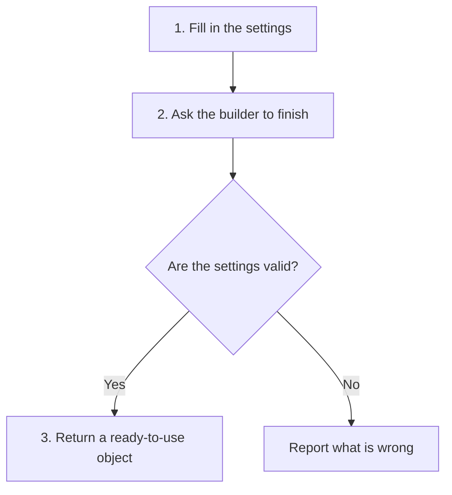

# Builder

## 1. Definition

**Builder prepares an object step by step and returns the finished object when its
required information is ready.** The builder holds unfinished choices; the finished
object is what the rest of the program uses.

Think of filling out an order form. You may choose the address, delivery speed, and
optional extras in separate steps. An unfinished form is acceptable while filling
it out, but it should not become a usable order without its required information.

## 2. The Problem It Solves

A long creation call such as `Request("/orders", 500, true)` can be hard to read.
What do `500` and `true` mean? Several optional settings create many combinations.
Allowing everyone to modify an already usable object can also leave it half configured.

A builder gives each choice a name and provides a final place to check the complete
set of choices before returning an object.

## 3. Understand the Idea Step by Step

1. Create a builder with sensible starting values.
2. Set the required information and any optional choices.
3. Call `build()` when ready.
4. Check the complete configuration. Return a finished object only if it is valid.

A **constructor** is the function that initializes a new C++ object. In this example,
the finished object's constructor is private, meaning outside code cannot call it
directly. The builder calls it after checking the values.

### Picture: Unfinished Choices Become a Finished Object

Read downward. The diamond is a yes/no question. Only the yes path produces an object.

**Read it as a sentence:** choose settings, check them together, then either receive
a complete object or an error.

A **director** is an optional helper that follows a reusable building recipe.
A **fluent interface** allows calls such as `.url(...).timeout(...)` because each
setting function returns the builder again. Chained function calls alone are not
the key idea; keeping unfinished choices separate from the finished object is.

## 4. Real-World Scenario

A travel planner collects destinations, dates, and accommodation choices. Before
producing a bookable itinerary, it checks that the return date follows departure.
A business-trip recipe could fill in common defaults while still allowing changes.

The builder checks the plan's settings. It cannot promise that a hotel still has
rooms when booking happens later; checking outside availability is separate work.

## 5. Understand the C++ Example

Open [builder.cpp](../../../patterns/creational/builder.cpp).

`Request` is the finished object. `Request::Builder` collects a URL, a timeout, and
whether authentication is requested. A timeout limits how long a request may wait.

1. A new builder starts with no URL, timeout 1000, and authentication disabled.
2. `url("/orders")` supplies the URL.
3. `timeout(500)` changes the timeout; `authenticate()` enables authentication.
4. `build()` rejects an empty URL or a timeout of zero or less.
5. Valid settings produce a `Request`; the example prints `/orders timeout=500`.
6. Further checks cover invalid settings and the director's 200 ms health-check recipe.

`build() const` means building does not change the builder's settings; they are copied
into the result. Reusing the builder therefore keeps previous options. Do not keep
a reference to a temporary builder after the statement that created it has ended:
that builder no longer exists.

## 6. Benefits, Drawbacks, and Alternatives

**Benefits:** readable setting names, one final validation point, reusable recipes,
and no usable object with missing required settings.

**Drawbacks:** another class and some duplicated fields to maintain. Forgotten
settings may only be detected when the program runs. A reused builder may keep an
option the caller meant to clear.

**Use it when:** construction has enough options or combined rules to be confusing.
For an object with two obvious values, a normal constructor is usually simpler.

## 7. Check Your Understanding

**Question:** Why not check everything as soon as each setting is entered?

**Answer:** Individual checks help, but some rules need several settings together.
You cannot check that a return date follows departure until both dates are known.
The final build step must make sure all required rules hold.

Optional detail: [creational technical notes](../../../patterns/creational/README.md).