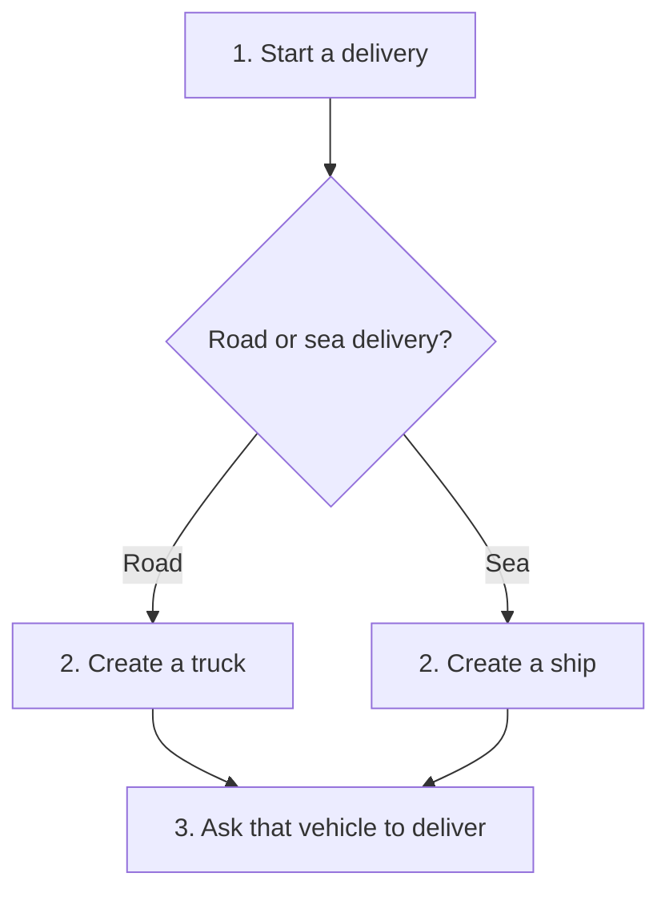
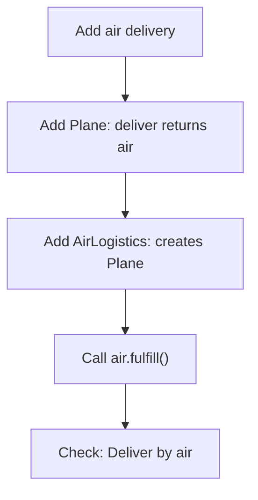
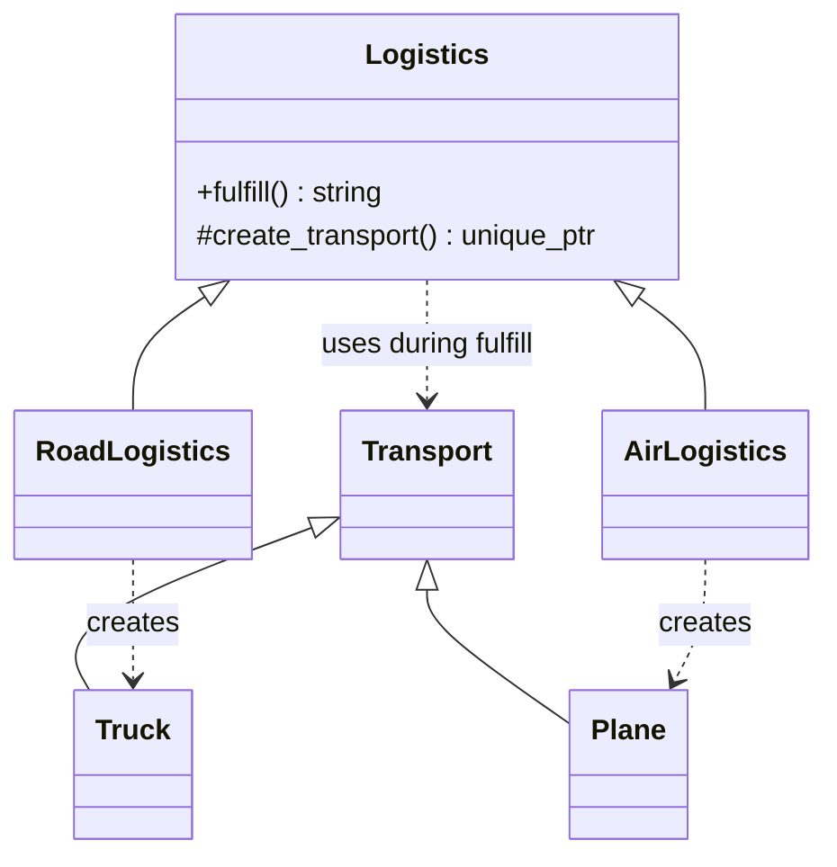
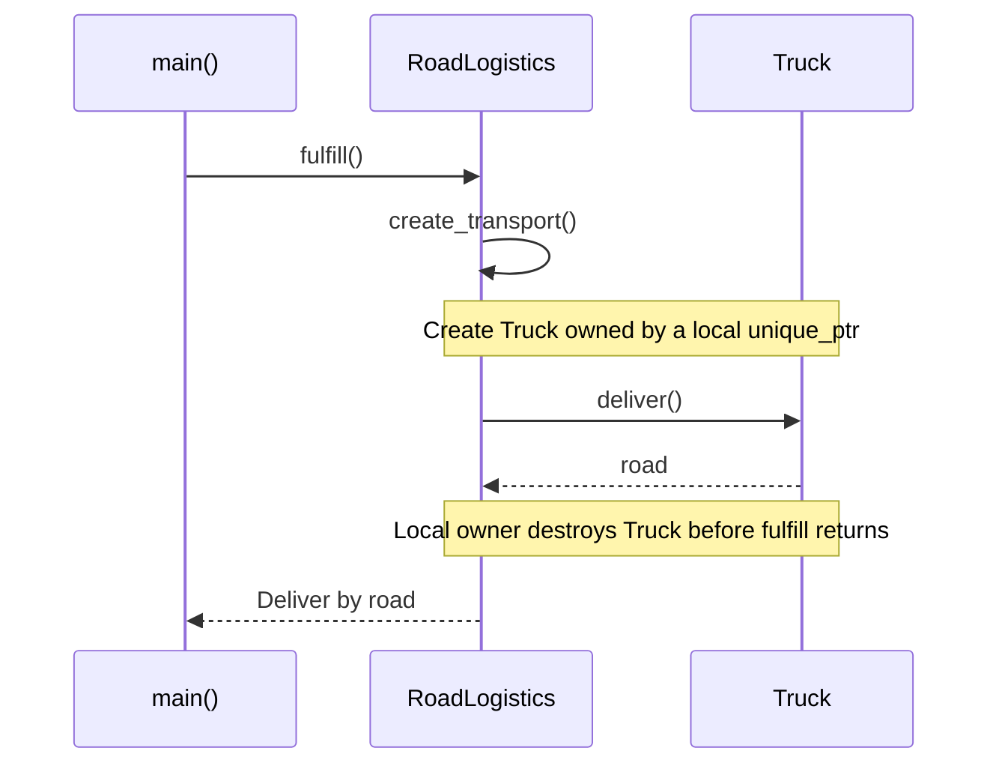

# Factory Method

## 1. Definition

**Factory Method lets a child class choose what to create while the parent class
keeps the steps that use it.**

Imagine a delivery program. A road delivery needs a truck. A sea delivery needs a
ship. Both follow the same steps: get a vehicle, then ask it to deliver. We want
to write those common steps once, without forcing every delivery to use a truck.

The delivery steps say, "Give me a vehicle." Road logistics supplies a truck;
sea logistics supplies a ship. The function that supplies it is the **factory method**.

## 2. The Problem It Solves

Suppose the delivery function creates a truck directly. It works for road deliveries.
When sea deliveries are added, we could copy the function and replace the truck with
a ship. But now we have two copies of the delivery steps to maintain.

Now suppose every delivery must also produce a receipt. We have to change both
copies. If we forget one, road and sea deliveries behave differently.

We need to share the delivery steps without fixing the vehicle type inside them.
Only the choice of vehicle should differ.

## 3. Understand the Idea Step by Step

1. Put the common delivery steps in a class called `Logistics`.
2. Make those steps call a separate function to create a vehicle.
3. Let a road version of `Logistics` provide a function that creates a truck.
4. Let a sea version provide a function that creates a ship.
5. Both versions reuse the common delivery steps.

`Logistics` is the parent, or **base class**. Road and sea logistics are its child,
or **derived classes**. They inherit the delivery steps and supply their own
`create_transport()` function. C++ uses `virtual` and `override` to make the shared
steps call the child's version.

### Picture: Follow One Delivery

Read from top to bottom. Each box is a step. Choose just one branch for a delivery;
the branches join because both vehicles can do the same job.

**Read it as a sentence:** road delivery gets a truck; sea delivery gets a ship;
both then ask their vehicle to deliver. The diamond explains the choice to us.
The code makes that choice through the derived class, not an `if` inside the shared steps.

### Names You Will See in Other Explanations

| Pattern word | What it means here |
| --- | --- |
| Product | The object being created: a truck or ship |
| Product interface | The common promise that either vehicle can `deliver()` |
| Creator | The class containing the common steps: `Logistics` |
| Concrete creator | A specific version: road logistics or sea logistics |
| Factory method | The replaceable creation function: `create_transport()` |

The important split is simple: `Logistics` runs the delivery; its child class
chooses the vehicle.

## 4. Real-World Scenario

Imagine an editor that can open different kinds of documents. Its shared steps are
create a document object, open it, then display it. A PDF edition creates a PDF
document object. A spreadsheet edition creates a spreadsheet object.

The editor's opening steps call a document-creation function. Each edition supplies
its own version of that function. Adding a presentation edition means supplying
a presentation document, not copying all the opening steps.

## 5. Understand the C++ Example

Open [factory_method.cpp](../../../patterns/creational/factory_method.cpp).

| Code name | Plain meaning |
| --- | --- |
| `Transport` | Common vehicle type that promises a `deliver()` function |
| `Truck`, `Ship` | The two vehicle types |
| `Logistics::fulfill()` | The common delivery steps |
| `create_transport()` | The vehicle-creation step that can be replaced |
| `RoadLogistics`, `SeaLogistics` | The classes that choose truck or ship |

Trace a road delivery:

1. `main()` creates a `RoadLogistics` object.
2. Calling `fulfill()` runs the steps written in `Logistics`.
3. Those steps call `create_transport()`. C++ uses the road version of this function.
4. That function creates a `Truck`.
5. `fulfill()` calls the truck's `deliver()` function through `Transport`.
6. The result is `Deliver by road`.

For sea delivery, the same steps create a `Ship` and produce `Deliver by sea`.
The checks in the program confirm both results.

`unique_ptr<Transport>` keeps the vehicle alive and deletes it automatically when
the delivery finishes. The **virtual destructor** makes sure the actual truck or
ship is cleaned up correctly even though the pointer uses the name `Transport`.

### C++ Flow Diagram

Read downward through `demonstrate_drawback()`. Arrows mean the next design or
execution step; the first two boxes describe the extension already in the source.

The cost is two new classes for one delivery choice. If only `deliver()` is needed,
the function also shows that a direct `Plane` avoids the extra creator class.

### C++ Class Diagram

Hollow triangles point to base classes. Dotted arrows mean "creates or uses,"
not permanent ownership. The sea pair is omitted to keep this view readable.

`fulfill()` is shared. Each derived logistics class supplies only the creation
step. Its returned `unique_ptr` is local to `fulfill()`, not a logistics field.

### C++ Sequence Diagram

Time runs downward. Solid arrows are calls, dashed arrows are results. `Road`
is one object executing both inherited `fulfill()` and its own creation override.

Choosing `RoadLogistics` happens in setup. The factory method does not decide
whether the customer wants road, sea, or air delivery.

## 6. Benefits, Drawbacks, and Alternatives

**Benefits:** fix the delivery steps in one place and both road and sea deliveries
get the fix. Add a new vehicle by supplying its creation function, without copying
the delivery process.

**Drawbacks:** a new vehicle can mean two new classes. The example adds both `Plane`
and `AirLogistics` for air delivery. That is extra work if all you needed was to
create a plane and call `deliver()`. Setup still has to choose the logistics type.

**Use it when:** several versions of a class need the same steps but must create
different objects during those steps.

**Keep it simpler when:** there is only one choice, or a small creation function is
enough. A function containing `if road, create truck; otherwise, create ship` is often
called a simple factory. It is useful, but it is not this subclass-based pattern.

## 7. Check Your Understanding

**Question:** If I move `new Truck` into a function named `make_truck()`, have I used
Factory Method?

**Answer:** No, not by itself. The important part is that shared delivery steps call
a creation function that a child class can replace. Here, `fulfill()` stays the same
while road and sea logistics choose different vehicles.

For optional advanced comparisons, see the
[creational technical notes](../../../patterns/creational/README.md#1-factory-method).