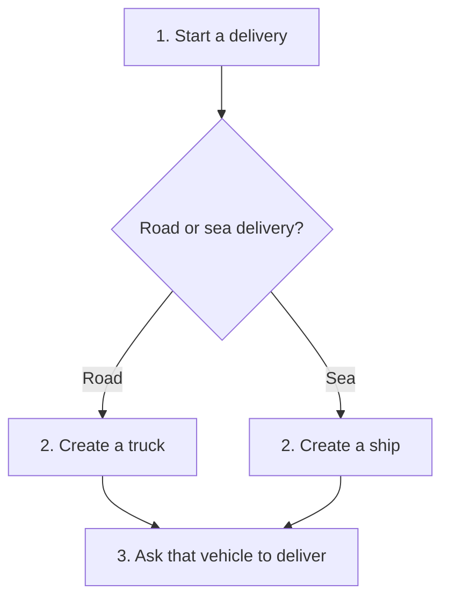

# Factory Method

## 1. Definition

**Factory Method lets different versions of a program choose which object to create,
while keeping the steps that use that object in one place.**

Imagine a delivery program. A road delivery needs a truck. A sea delivery needs a
ship. Both follow the same steps: get a vehicle, then ask it to deliver. We want
to write those common steps once, without forcing every delivery to use a truck.

A **class** describes a kind of thing in C++, such as `Truck`. An **object** is an
actual instance created from that class. A **method** is a function belonging to a
class. Here, the factory method is the function that creates the vehicle.

## 2. The Problem It Solves

Suppose the delivery function creates a truck directly. It works for road deliveries.
When sea deliveries are added, we could copy the function and replace the truck with
a ship. But now we have two copies of the delivery steps to maintain.

If those steps later change, we might fix one copy and forget the other. Factory
Method separates the part that changes, choosing the vehicle, from the steps that
stay the same, getting the vehicle and using it.

## 3. Understand the Idea Step by Step

1. Put the common delivery steps in a class called `Logistics`.
2. Make those steps call a separate function to create a vehicle.
3. Let a road version of `Logistics` provide a function that creates a truck.
4. Let a sea version provide a function that creates a ship.
5. Both versions reuse the common delivery steps.

In C++, a **derived class** is a class built from another class, called its **base
class**. The road and sea classes are derived from `Logistics`. A **virtual function**
allows a derived class to supply its own version. An **override** is that supplied
version. Those features let the shared steps call the correct creation function.

### Picture: Follow One Delivery

Read from top to bottom. Each box is a step. Choose just one branch for a delivery;
the branches join because both vehicles can do the same job.

**Read it as a sentence:** road delivery gets a truck; sea delivery gets a ship;
both then ask their vehicle to deliver. The diamond explains the choice to us.
The code makes that choice through the derived class, not an `if` inside the shared steps.

### Names You Will See in Other Explanations

| Pattern word | What it means here |
| --- | --- |
| Product | The object being created: a truck or ship |
| Product interface | The common promise that either vehicle can `deliver()` |
| Creator | The class containing the common steps: `Logistics` |
| Concrete creator | A specific version: road logistics or sea logistics |
| Factory method | The replaceable creation function: `create_transport()` |

Understand who creates the vehicle and who runs the common steps before trying to
memorize these names.

## 4. Real-World Scenario

Imagine an editor that can open different kinds of documents. Its shared steps are
create a document object, open it, then display it. A PDF edition creates a PDF
document object. A spreadsheet edition creates a spreadsheet object.

The opening steps can stay in one place while each edition supplies its creation
function. This is useful when editions already reuse a common editor class. For a
small program, a regular function that chooses a document may be enough; adding
extra classes is not automatically an improvement.

## 5. Understand the C++ Example

Open [factory_method.cpp](../../../patterns/creational/factory_method.cpp).

| Code name | Plain meaning |
| --- | --- |
| `Transport` | Common vehicle type that promises a `deliver()` function |
| `Truck`, `Ship` | The two vehicle types |
| `Logistics::fulfill()` | The common delivery steps |
| `create_transport()` | The vehicle-creation step that can be replaced |
| `RoadLogistics`, `SeaLogistics` | The classes that choose truck or ship |

Trace a road delivery:

1. `main()` creates a `RoadLogistics` object.
2. Calling `fulfill()` runs the steps written in `Logistics`.
3. Those steps call `create_transport()`. C++ uses the road version of this function.
4. That function creates a `Truck`.
5. `fulfill()` calls the truck's `deliver()` function through `Transport`.
6. The result is `Deliver by road`.

For sea delivery, the same steps create a `Ship` and produce `Deliver by sea`.
The checks in the program confirm both results.

`unique_ptr<Transport>` is an owning pointer: it remembers the vehicle and destroys
it automatically when the pointer is finished with it. `Transport` has a **virtual
destructor**, allowing cleanup through the common vehicle type to run the actual
truck or ship cleanup correctly. These are C++ memory-management details, not the
definition of Factory Method.

## 6. Benefits, Drawbacks, and Alternatives

**Benefits:** write the common steps once; add another vehicle choice without
copying those steps; keep vehicle-creation code in an obvious place.

**Drawbacks:** more classes to read and maintain. Adding a vehicle may also require
adding a corresponding logistics class. All vehicles must support what the shared
steps need. Some setup code must still choose road or sea logistics.

**Use it when:** several versions of a class need the same steps but must create
different objects during those steps.

**Keep it simpler when:** there is only one choice, or a small creation function is
enough. A function containing `if road, create truck; otherwise, create ship` is often
called a simple factory. It is useful, but it is not this subclass-based pattern.

## 7. Check Your Understanding

**Question:** If I move `new Truck` into a function named `make_truck()`, have I used
Factory Method?

**Answer:** Not necessarily. You have given creation a name. This pattern also has
shared steps that call a creation function whose version is supplied by a derived
class. In this example, `fulfill()` stays the same while road and sea classes replace
the creation step.

For optional advanced comparisons, see the
[creational technical notes](../../../patterns/creational/README.md#1-factory-method).