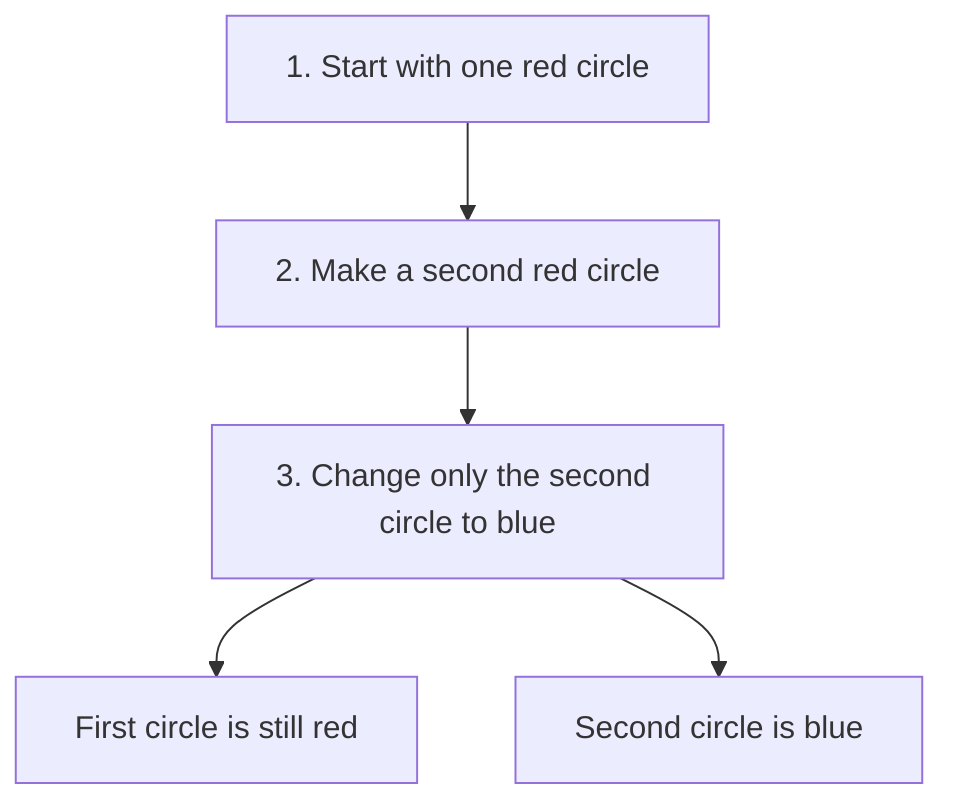

# Prototype

## 1. Definition

**Prototype creates a new object by copying an existing object that already has
the settings you want.** The existing object is the example to copy, called the
prototype. The copying operation is often named `clone()`.

Imagine duplicating a styled text box in an editor. The new box starts with the
same font, size, and color. You can then change its text without editing the first box.

## 2. The Problem It Solves

Creating a new object from scratch may require repeating many settings. Worse, the
code requesting the copy may only know that it has a shape, not whether it is a
circle or rectangle. It does not know which exact shape constructor to call.

Let the existing shape create its own copy. A circle knows how to copy a circle;
a rectangle knows how to copy a rectangle.

## 3. Understand the Idea Step by Step

1. Give each supported kind of object a `clone()` operation.
2. Ask an existing object to clone itself.
3. Receive a new object with the same relevant settings.
4. Change the new object without changing the original where independence is required.

A **pointer** stores how to reach an object. Copying a pointer merely gives another
way to reach the same object. A clone creates another object. These are not the same.

### Picture: Two Objects After the Copy

Read downward. The final boxes describe the two objects after editing the copy.

**Read it as a sentence:** copy the red circle, edit the copy, and keep the original red.

Decide what a copy should share. Text that users edit usually needs a separate value.
A large read-only font resource might be shared. **Read-only** means callers cannot
change it. Open files and unique identifiers may need special treatment rather than
blind copying. Copying a network of objects is more complicated than copying one circle.

## 4. Real-World Scenario

A diagram editor lets users save a styled process box and duplicate it many times.
Each copy keeps the style but gets its own position and editable caption. It should
usually get a new identifier too, so selecting one box does not select another.

Copying the box saves repeated setup. The application must still decide which
document-specific properties, such as the identifier, should not be copied unchanged.

## 5. Understand the C++ Example

Open [prototype.cpp](../../../patterns/creational/prototype.cpp).

`Shape` provides the common operations. `Circle` supplies its own `clone()` function.
This function creates a new `Circle` from `*this`, which means the current circle.

1. The original circle has radius 5 and color red.
2. `clone()` makes a new circle with those values.
3. A check confirms that the descriptions initially match.
4. Changing the clone's color to blue changes only its own string.
5. The final descriptions are `red circle r=5` and `blue circle r=5`.

The **copy constructor** is the C++ operation that initializes an object from another
object of its type. Here, the generated copy constructor copies the number and the
string correctly. `unique_ptr<Shape>` owns the new circle and automatically destroys
it later. If a field were a pointer to shared editable data, simply copying that
pointer would not make the data independent.

## 6. Benefits, Drawbacks, and Alternatives

**Benefits:** reuse an existing configuration; keep the actual shape type; avoid
making the requesting code understand every shape's construction details.

**Drawbacks:** deciding what to copy can be difficult. Large copies cost time and
memory. Files, locks, and linked objects often need extra rules. Cloning is not
automatically faster than normal construction.

**Use it when:** copying an already configured object is the natural starting point.
If its exact type is already known, ordinary C++ value copying may be enough.

## 7. Check Your Understanding

**Question:** Does copying a `shared_ptr` give me an independent copy of its object?

**Answer:** No. `shared_ptr` is a pointer that shares responsibility for keeping one
object alive. Copying it gives two pointers to that same object. To edit a separate
object, create an actual copy of the object's relevant data.

Optional detail: [creational technical notes](../../../patterns/creational/README.md).