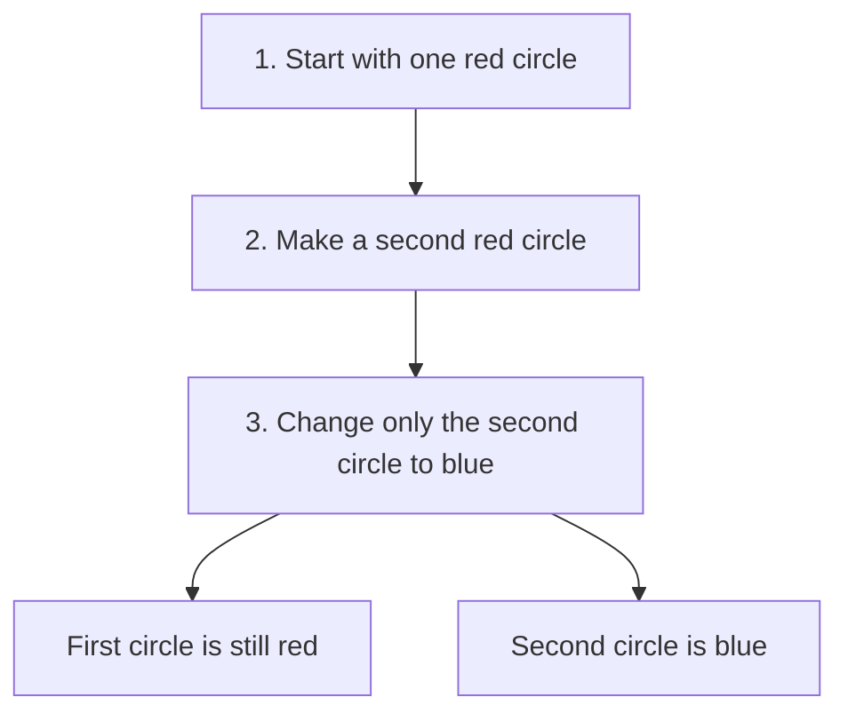
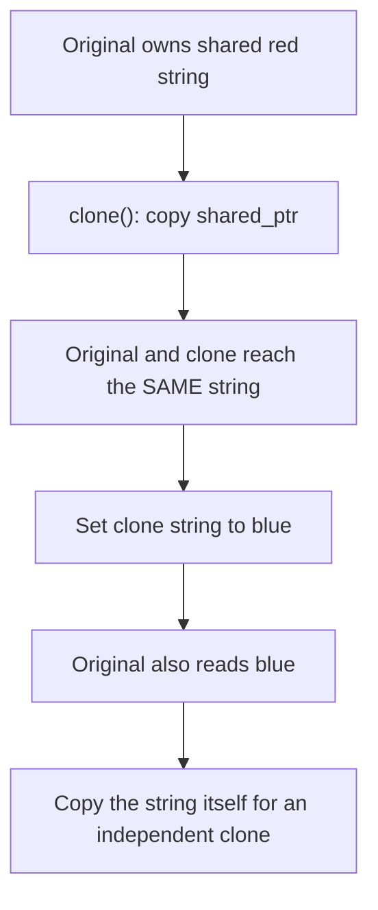
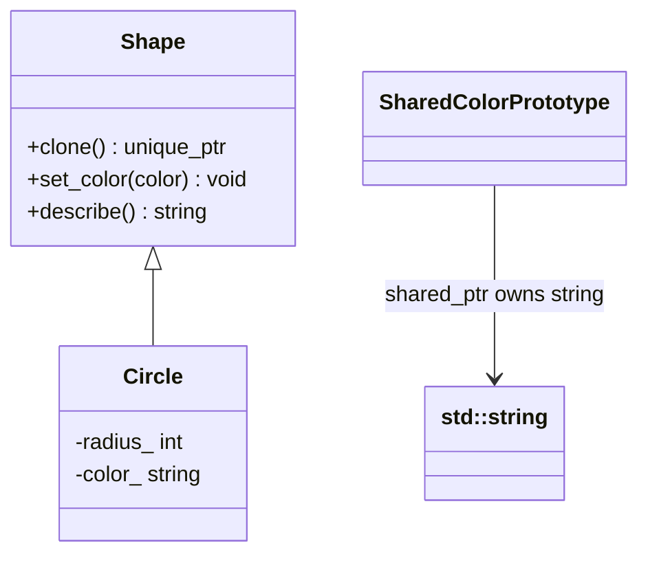
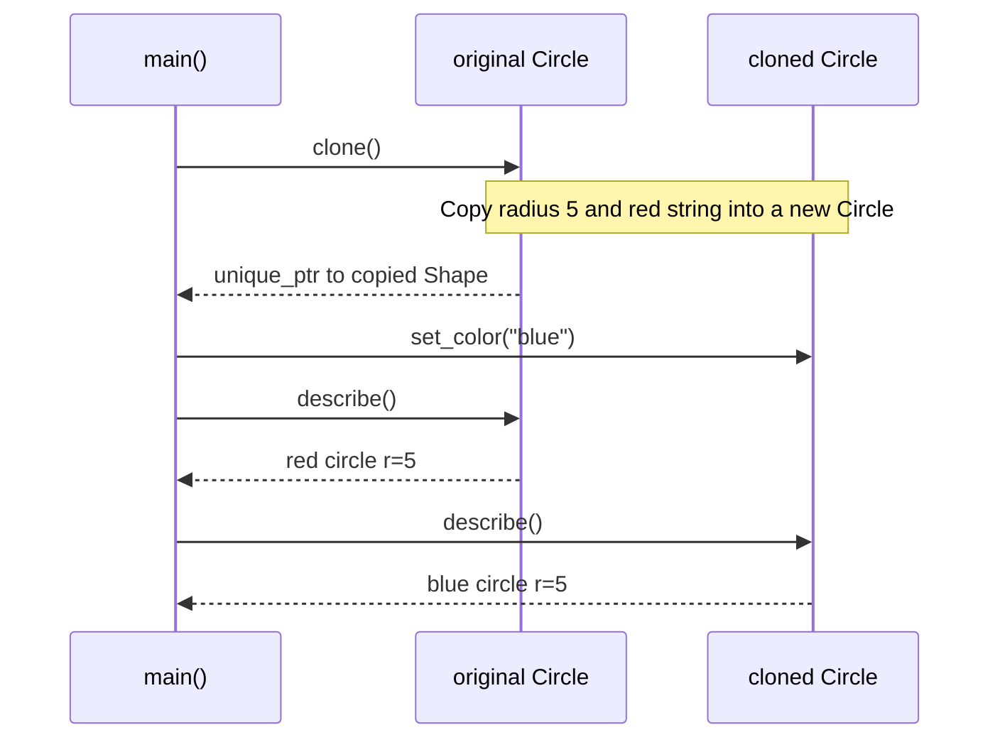

# Prototype

## 1. Definition

**Prototype makes a new object by copying one you already have.** The original is
the prototype, and the copying operation is often called `clone()`.

Imagine duplicating a styled text box in an editor. The new box starts with the
same font, size, and color. You can then change its text without editing the first box.

## 2. The Problem It Solves

Suppose the user selects a shape and clicks **Duplicate**. Creating it from scratch
would mean working out its type and copying its radius, color, and other settings.
Each new shape type would give the duplicate command more details to handle.

Instead, the command asks the selected shape to `clone()` itself. A circle makes
a circle; a rectangle makes a rectangle. The command does not need to know how
each kind is constructed.

## 3. Understand the Idea Step by Step

1. Give each supported kind of object a `clone()` operation.
2. Ask an existing object to clone itself.
3. Receive a new object with the same relevant settings.
4. Give the copy its own editable values, so changing it does not change the original.

A **pointer** stores how to reach an object. Copying a pointer merely gives another
way to reach the same object. A clone creates another object. These are not the same.

### Picture: Two Objects After the Copy

Read downward. The final boxes describe the two objects after editing the copy.

**Read it as a sentence:** copy the red circle, edit the copy, and keep the original red.

Not everything must be duplicated. Each box needs its own editable text, but both
can use the same font data if nobody can change that data. Decide what should be
separate and what can safely be shared before writing `clone()`.

## 4. Real-World Scenario

A diagram editor lets users save a styled process box and duplicate it many times.
Each copy keeps the style but gets its own position and editable caption. It should
usually get a new identifier too, so selecting one box does not select another.

Copying the box saves repeated setup. The application must still decide which
document-specific properties, such as the identifier, should not be copied unchanged.

## 5. Understand the C++ Example

Open [prototype.cpp](../../../patterns/creational/prototype.cpp).

`Shape` provides the common operations. `Circle` supplies its own `clone()` function.
This function creates a new `Circle` from `*this`, which means the current circle.

1. The original circle has radius 5 and color red.
2. `clone()` makes a new circle with those values.
3. A check confirms that the descriptions initially match.
4. Changing the clone's color to blue changes only its own string.
5. The final descriptions are `red circle r=5` and `blue circle r=5`.

The **copy constructor** is the C++ operation that initializes an object from another
object of its type. Here, the generated copy constructor copies the number and the
string correctly. `unique_ptr<Shape>` owns the new circle and automatically destroys
it later. If a field were a pointer to shared editable data, simply copying that
pointer would not make the data independent.

### C++ Flow Diagram

Arrows show changes in the intentionally shallow-copy drawback example.

Copying a smart pointer and copying its pointed-to data are different operations.
The final check changes a deep copy to green while the original stays blue.

### C++ Class Diagram

The triangle points to a base class. The ordinary association arrow means access
to data; shared ownership is stated explicitly rather than drawn as exclusive ownership.

`SharedColorPrototype` is a separate teaching example, not a derived `Shape`.
`Circle` stores a string value, so its copied color is independent already.

### C++ Sequence Diagram

Solid arrows are calls; dashed arrows are returned results. Original and Copy are
two different `Circle` objects, even though the copy is reached through `Shape`.

The successful example keeps values independent. The drawback example explains
why that promise needs extra care when a class contains shared mutable data.

## 6. Benefits, Drawbacks, and Alternatives

**Benefits:** the duplicate command works with a shape without knowing its exact
type. The copy starts with the user's chosen settings instead of rebuilding them
one by one.

**Drawbacks:** a copy can accidentally share data that should be independent. In
the drawback example, changing the copied color also changes the original because
both point to the same string. Copying all the data avoids that problem but can
cost more memory and time. Cloning is not automatically faster than starting fresh.

**Use it when:** copying an already configured object is the natural starting point.
If its exact type is already known, ordinary C++ value copying may be enough.

## 7. Check Your Understanding

**Question:** Does copying a `shared_ptr` give me an independent copy of its object?

**Answer:** No. You get two pointers to the same object, not two objects. If the
copy needs its own editable color, copy the color string itself.

Optional detail: [creational technical notes](../../../patterns/creational/README.md).