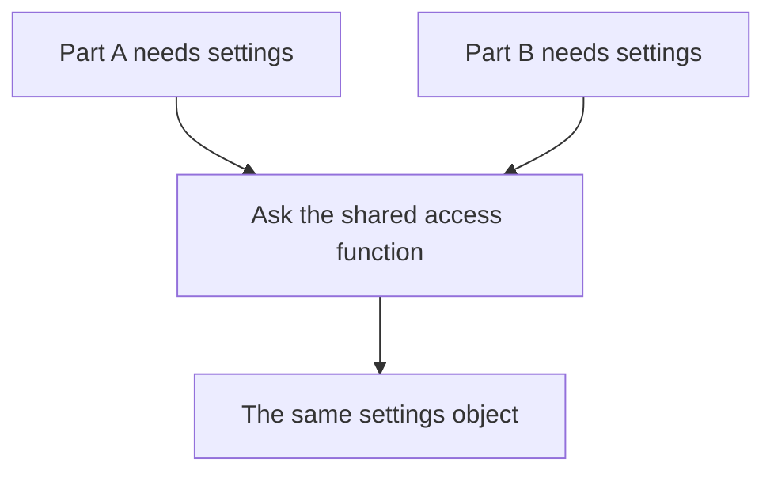
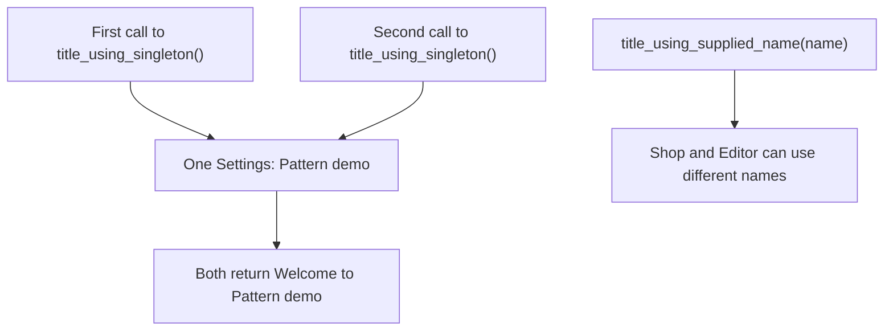
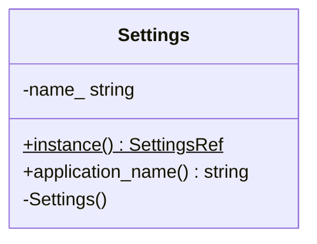
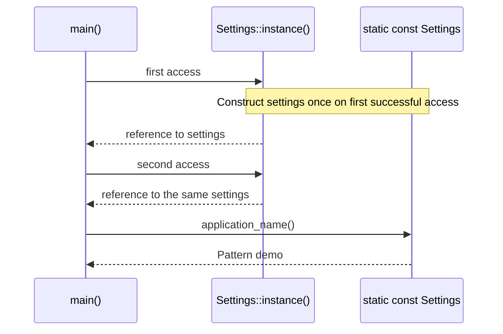

# Singleton

## 1. Definition

**Singleton gives different parts of a program access to the same object and
prevents ordinary callers from making another one.** Here, "one" means one in
this running program. An **instance** is another word for an object.

Imagine several parts of a program reading one fixed set of application settings.
They all ask for the same settings object instead of creating their own copies.

## 2. The Problem It Solves

Suppose the title bar and a report both need the application settings. If each
creates its own settings object, there are two separate places to hold information
that was meant to be shared.

One solution is to create a settings object in `main()` and pass it to both users.
Singleton takes a different route: both call `Settings::instance()`, and that
function returns the same object every time. This is convenient, but it also means
the callers cannot easily choose different settings.

## 3. Understand the Idea Step by Step

1. Stop ordinary callers from constructing the class directly.
2. Provide a function that returns the one object.
3. Create the object on first use, then return the same object on later calls.
4. Prevent copying from accidentally creating a second instance.

The **constructor** initializes a new object. Making it **private** allows the class
to control who calls it. A **static member function** can be called without first
creating an object. Those features support the access function in this example.

### Picture: Different Readers Reach the Same Settings

Read the arrows as "asks for." There is only one settings box at the bottom.

**Read it as a sentence:** A and B ask the same function and receive access to the
same object, not two equal-looking copies.

Sharing one object does not make every use of it safe. Two **threads**, meaning two
sequences of work running in the program, can still try to change it at the same
time. The example avoids that problem by making the settings read-only.

## 4. Real-World Scenario

A small command-line tool might expose fixed build information: its version and
enabled features. Every part reads the same values, and no part changes them.
A shared read-only object may be suitable, though ordinary constants may be simpler.

Settings that differ for each signed-in user are a poor fit. One shared setting
could accidentally apply one user's preferences to everyone else.

## 5. Understand the C++ Example

Open [singleton.cpp](../../../patterns/creational/singleton.cpp).

`Settings::instance()` is the access function. It returns a `const` reference:
another name for the existing object, with no permission to modify it through that reference.

1. The first call creates `static const Settings settings` inside the function.
2. Here, `static` makes the local object persist after the function returns.
3. Later calls return the same settings object.
4. Comparing addresses proves the calls reached one object, not copies.
5. Reading the application name gives `Pattern demo`.

The constructor is private and copying is disabled. C++11 and later protect this
first initialization when threads arrive together. That does not protect later
changes to an ordinary field. At shutdown, other objects must not use these settings
after the settings object has already been destroyed.

### C++ Flow Diagram

Follow the two access paths. Arrows mean "uses this configuration," not threads.

The drawback is fixed global configuration, not a race in this immutable sample.
Supplying a value makes the dependency visible and independently configurable.

### C++ Class Diagram

There is one application class. `$` marks a static method: callers do not need an
existing `Settings` object to call `instance()`. Plus means public; minus means private.

`SettingsRef` is diagram shorthand for `const Settings&`, not a source type.
The private constructor and deleted copy operations prevent ordinary client copies.

### C++ Sequence Diagram

Time runs downward. Solid arrows call; dashed arrows return a reference or value.

The accessor and stored object are separate lanes to explain the operation, not
two `Settings` instances. The program checks that both references have the same address.

## 6. Benefits, Drawbacks, and Alternatives

**Benefits:** callers know where to get the settings, they all reach the same
object, and the object is not created until the first request.

**Drawbacks:** every caller gets the same choice, even when a test needs another
one. The example cannot give one caller the name `Shop` and another `Editor` through
the Singleton; passing the name can. A function can also use the Singleton without
showing that need in its parameters. If shared values can change, one test may leave
them changed for the next. Callers must also stop using the object before it is destroyed.

**Use it carefully:** prefer a read-only shared object when global access is truly
needed. Often, creating one object in `main()` and passing it to users is clearer.

## 7. Check Your Understanding

**Question:** If first creation is safe across threads, can all threads freely
increment a normal counter stored in the Singleton?

**Answer:** No. Safe creation only protects creation. Updating the counter still
needs a lock or an appropriate atomic counter, which is a type designed for certain
indivisible updates. Having one counter does not prevent two threads from conflicting.

Optional detail: [creational technical notes](../../../patterns/creational/README.md).