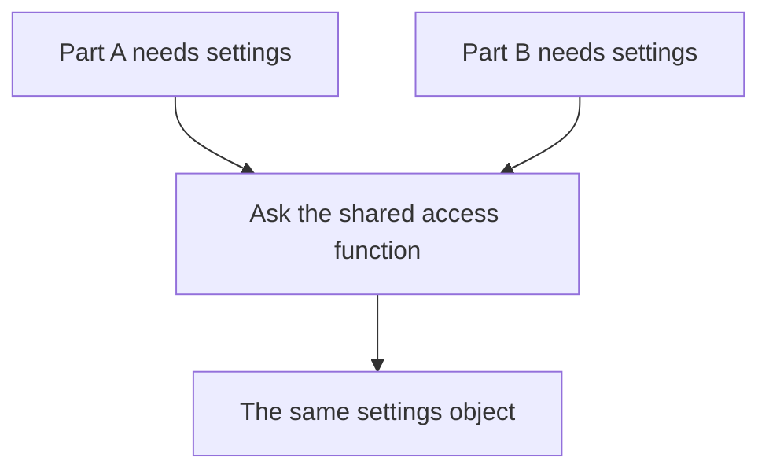

# Singleton

## 1. Definition

**Singleton limits a class to one shared object within a chosen scope and provides
one known way to access it.** In this example, that scope is the running program.
An **instance** means an actual object created from a class, not the class itself.

Imagine several parts of a program reading one fixed set of application settings.
They all ask for the same settings object instead of creating their own copies.

## 2. The Problem It Solves

Sometimes several independently created objects would disagree about information
that should be shared. Limiting creation can prevent those competing copies.

However, needing one object does not always require Singleton. You can create one
object in `main()` and pass it to the code that needs it. Singleton additionally
makes that object reachable through a common access function throughout the program.

## 3. Understand the Idea Step by Step

1. Stop ordinary callers from constructing the class directly.
2. Provide a function that returns the one object.
3. Create the object on first use, then return the same object on later calls.
4. Prevent copying from accidentally creating a second instance.

The **constructor** initializes a new object. Making it **private** allows the class
to control who calls it. A **static member function** can be called without first
creating an object. Those features support the access function in this example.

### Picture: Different Readers Reach the Same Settings

Read the arrows as "asks for." There is only one settings box at the bottom.

**Read it as a sentence:** A and B ask the same function and receive access to the
same object, not two equal-looking copies.

Creating the object safely is different from changing it safely. If several threads
change shared data, they still need rules that prevent conflicting updates. A
**thread** is a separately running sequence of work within the program. One object
in one program also does not mean one object across several programs or machines.

## 4. Real-World Scenario

A small command-line tool might expose fixed build information: its version and
enabled features. Every part reads the same values, and no part changes them.
A shared read-only object may be suitable, though ordinary constants may be simpler.

Settings that differ for each signed-in user are a poor fit. One shared setting
could accidentally apply one user's preferences to everyone else.

## 5. Understand the C++ Example

Open [singleton.cpp](../../../patterns/creational/singleton.cpp).

`Settings::instance()` is the access function. It returns a `const` reference:
another name for the existing object, with no permission to modify it through that reference.

1. The first call creates `static const Settings settings` inside the function.
2. Here, `static` makes the local object persist after the function returns.
3. Later calls return the same settings object.
4. Comparing addresses proves the calls reached one object, not copies.
5. Reading the application name gives `Pattern demo`.

The constructor is private and copying is disabled. C++11 and later protect this
first initialization when threads arrive together. That does not protect later
changes to an ordinary field. At shutdown, other objects must not use these settings
after the settings object has already been destroyed.

## 6. Benefits, Drawbacks, and Alternatives

**Benefits:** controlled creation, one convenient access point, and creation delayed
until the first request.

**Drawbacks:** shared state can make tests affect one another. Code may quietly
depend on the global object. Different configurations and shutdown cleanup become
harder. Libraries and plug-ins can also complicate whether there really is one copy.

**Use it carefully:** prefer a read-only shared object when global access is truly
needed. Often, creating one object in `main()` and passing it to users is clearer.

## 7. Check Your Understanding

**Question:** If first creation is safe across threads, can all threads freely
increment a normal counter stored in the Singleton?

**Answer:** No. Safe creation only protects creation. Updating the counter still
needs a lock or an appropriate atomic counter, which is a type designed for certain
indivisible updates. Having one counter does not prevent two threads from conflicting.

Optional detail: [creational technical notes](../../../patterns/creational/README.md).