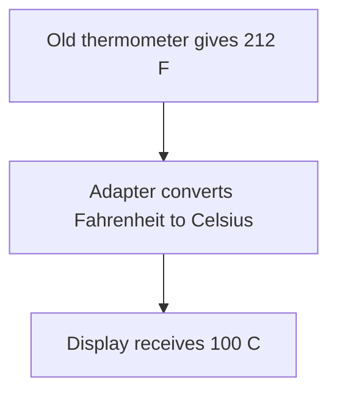
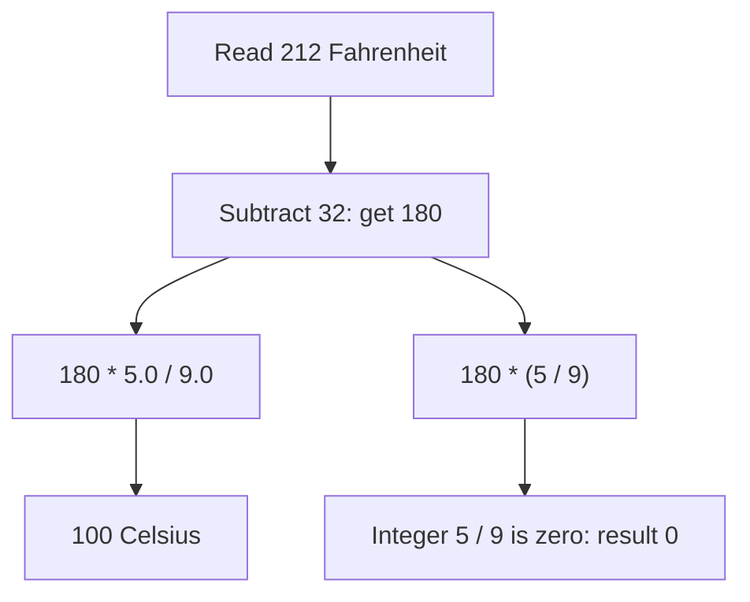
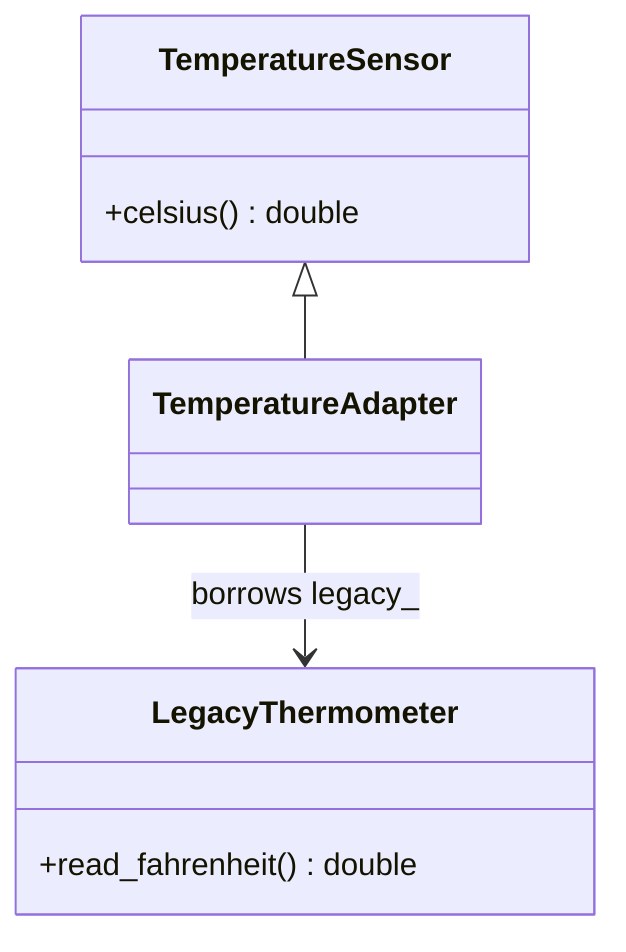
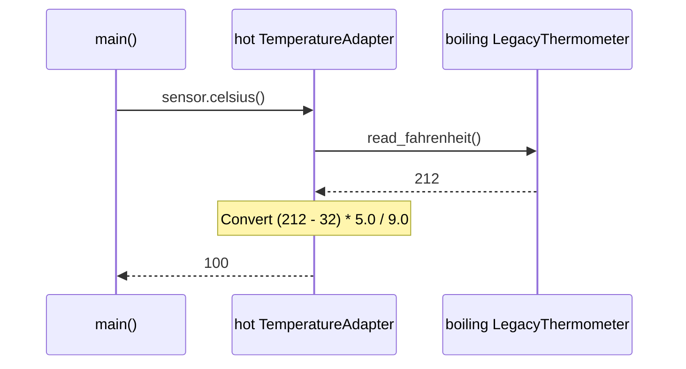

# Adapter

## 1. Definition

**Adapter lets two pieces of code work together by translating between them.**

Imagine a temperature display that expects Celsius, while an old thermometer gives
Fahrenheit. An adapter reads the old value, converts it, and gives the display Celsius.

## 2. The Problem It Solves

The display asks for Celsius, but the thermometer only offers Fahrenheit. Connecting
them directly gives the wrong meaning: boiling water could appear as 212 Celsius.
We could add a conversion to every display, but each new caller must remember it.

Changing the old thermometer may not be possible, and we do not want every display
to understand it. Put an adapter between them. The display asks the adapter for
Celsius; the adapter reads Fahrenheit and converts the answer. Neither side needs
to change how it works.

## 3. Understand the Idea Step by Step

1. Decide what the new caller needs: a Celsius reading.
2. Let the adapter hold access to the old thermometer.
3. When asked for Celsius, read Fahrenheit and convert it.
4. Return the converted answer, not merely the original value under a new name.

The display expects a `celsius()` operation. That expected way of asking is the
**target interface**. The old Fahrenheit thermometer is called the **adaptee**.
The adapter implements the expected operation using the old thermometer.

### Picture: Follow the Temperature Value

Read downward. Each arrow carries the value to the next step; this picture shows
the answer's journey rather than the order of function calls.

**Read it as a sentence:** the old reading goes through a conversion before the
new display uses it. Renaming Fahrenheit as Celsius would not be a conversion.

The translation must preserve meaning. Changing a function name is not enough if
its units, values, or error reports still mean something different.

## 4. Real-World Scenario

A shop integrates a bank library that uses numeric result codes. The shop prefers
clear results such as approved, declined, or outcome unknown. An adapter translates
the codes so every checkout does not repeat that bank-specific knowledge.

A timeout must not automatically become "declined": the payment may have happened
even though the reply was lost. Translation must preserve the meaning of an answer.

## 5. Understand the C++ Example

Open [adapter.cpp](../../../patterns/structural/adapter.cpp).

`TemperatureSensor` describes the Celsius operation. `LegacyThermometer` is the old
Fahrenheit source. `TemperatureAdapter` connects them.

1. Create old thermometers with readings 32 and 212.
2. Give each adapter access to one thermometer.
3. Calling `celsius()` reads the old value.
4. Calculate `(fahrenheit - 32) * 5 / 9` using decimal-capable numbers.
5. Checks confirm results of 0 and 100; the program prints `100 C`.

The adapter stores a **reference**, meaning access to the existing thermometer,
not a copy. It does not own or destroy the thermometer. The thermometer must keep
existing for as long as the adapter uses it. A real sensor also needs rules for
failed readings and readings that are too old to trust.

### C++ Flow Diagram

Follow either arithmetic path. This compares the correct adapter with the
deliberately wrong expression in `demonstrate_drawback()`.

Returning `double` does not repair integer division that already produced zero.
The problem is a faulty translation, not a limitation of converting these units.

### C++ Class Diagram

The hollow triangle means inheritance. The ordinary arrow means a borrowed
reference: the adapter does not destroy the thermometer.

The thermometer must outlive the adapter. `main()` declares the thermometers first
and reaches the adapter through a `TemperatureSensor` reference.

### C++ Sequence Diagram

Solid arrows call functions; dashed arrows return values. Time runs downward.

Only the adapter understands the old units. The caller receives the Celsius
result promised by the new interface.

## 6. Benefits, Drawbacks, and Alternatives

**Benefits:** the old thermometer remains useful, and every display gets the same
conversion. A caller can ask for Celsius without knowing which thermometer supplies it.

**Drawbacks:** a mistake in the adapter reaches every caller. The drawback example
uses integer `5 / 9`, which becomes zero and produces a wrong reading. We need to
test the translation, not just whether the call compiles. An adapter also cannot
supply a measurement the old thermometer never provided.

**Use it when:** there is an actual mismatch. Decorator adds behavior while keeping
the expected operations; Adapter changes how an existing component is used.

## 7. Check Your Understanding

**Question:** Is returning 212 from a function named `celsius()` correct for a
thermometer reading 212 Fahrenheit?

**Answer:** No. The function name promises Celsius, so the answer must be 100.
Code can compile and still give a meaningfully wrong answer.

Optional detail: [structural technical notes](../../../patterns/structural/README.md).