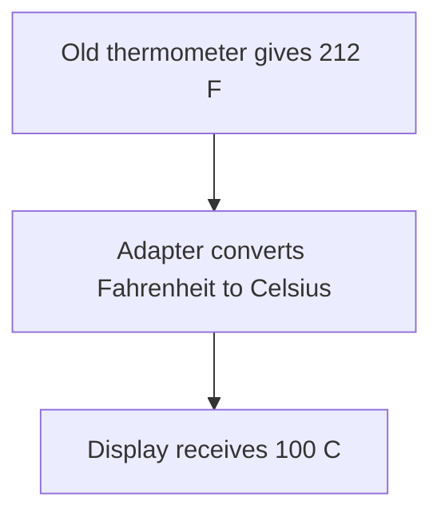

# Adapter

## 1. Definition

**Adapter translates between what existing code provides and what other code expects.**
It lets the two work together without rewriting either side.

Imagine a temperature display that expects Celsius, while an old thermometer gives
Fahrenheit. An adapter reads the old value, converts it, and gives the display Celsius.

## 2. The Problem It Solves

Without an adapter, every display using that thermometer must remember the conversion.
One may forget and show 212 as if it meant Celsius. Changing the thermometer library
may be impossible if another company provides it.

Put the translation in one place. The old thermometer stays unchanged, and the
display keeps asking for the unit it understands.

## 3. Understand the Idea Step by Step

1. Decide what the new caller needs: a Celsius reading.
2. Let the adapter hold access to the old thermometer.
3. When asked for Celsius, read Fahrenheit and convert it.
4. Return the converted answer, not merely the original value under a new name.

An **interface** describes the operations callers can use. The **target interface**
is the expected one: read Celsius. The **adaptee** is the existing thing being adapted:
the Fahrenheit thermometer. These names describe the roles, not extra work you must add.

### Picture: Follow the Temperature Value

Read downward. Each arrow carries the value to the next step; this picture shows
the answer's journey rather than the order of function calls.

**Read it as a sentence:** the old reading goes through a conversion before the
new display uses it. Renaming Fahrenheit as Celsius would not be a conversion.

An adapter must also handle differences in errors or data formats when they matter.
It cannot promise abilities the old system does not have simply by changing a name.

## 4. Real-World Scenario

A shop integrates a bank library that uses numeric result codes. The shop prefers
clear results such as approved, declined, or outcome unknown. An adapter translates
the codes so every checkout does not repeat that bank-specific knowledge.

A timeout must not automatically become "declined": the payment may have happened
even though the reply was lost. Translation must preserve the meaning of an answer.

## 5. Understand the C++ Example

Open [adapter.cpp](../../../patterns/structural/adapter.cpp).

`TemperatureSensor` describes the Celsius operation. `LegacyThermometer` is the old
Fahrenheit source. `TemperatureAdapter` connects them.

1. Create old thermometers with readings 32 and 212.
2. Give each adapter access to one thermometer.
3. Calling `celsius()` reads the old value.
4. Calculate `(fahrenheit - 32) * 5 / 9` using decimal-capable numbers.
5. Checks confirm results of 0 and 100; the program prints `100 C`.

The adapter stores a **reference**, meaning access to the existing thermometer,
not a copy. It does not own or destroy the thermometer. The thermometer must keep
existing for as long as the adapter uses it. A real sensor also needs rules for
failed readings and readings that are too old to trust.

## 6. Benefits, Drawbacks, and Alternatives

**Benefits:** reuse existing code; keep conversions in one place; give callers
consistent operations and units.

**Drawbacks:** another layer to understand, and incorrect translation can quietly
produce wrong results. Missing features still need real implementation work.

**Use it when:** there is an actual mismatch. Decorator adds behavior while keeping
the expected operations; Adapter changes how an existing component is used.

## 7. Check Your Understanding

**Question:** Is returning 212 from a function named `celsius()` correct for a
thermometer reading 212 Fahrenheit?

**Answer:** No. The function name promises Celsius, so the answer must be 100.
Code can compile and still give a meaningfully wrong answer.

Optional detail: [structural technical notes](../../../patterns/structural/README.md).