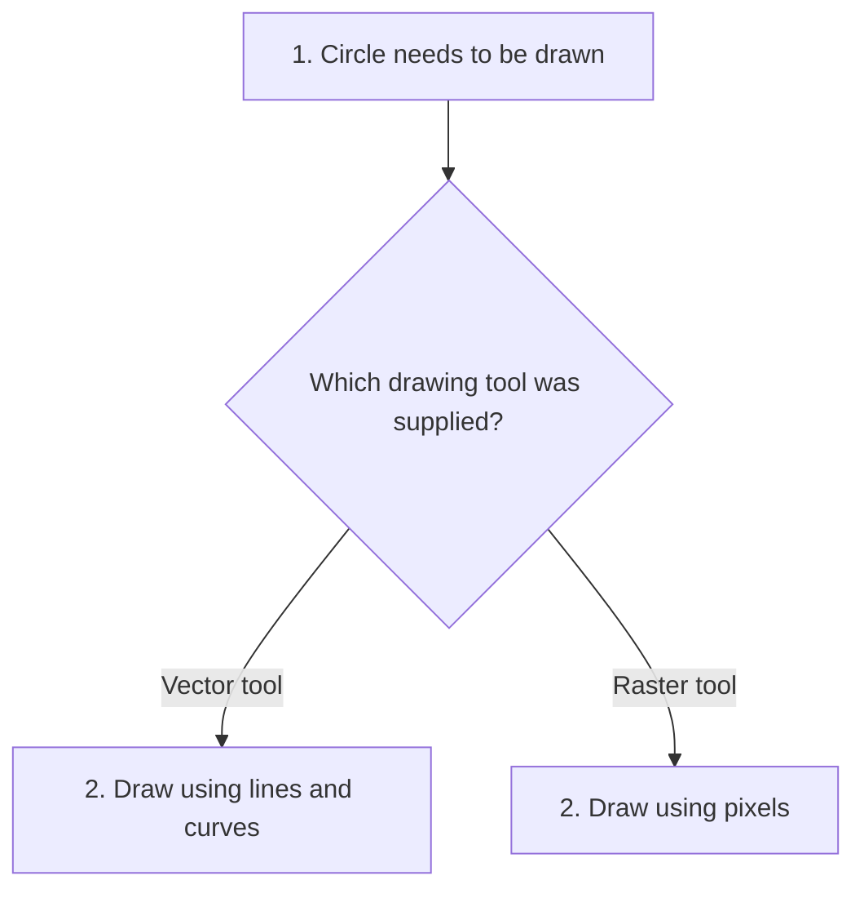

# Bridge

## 1. Definition

**Bridge separates two choices that should be able to change independently, then
connects them through an object that does the supporting work.**

For example, "which shape?" and "which drawing tool?" are different choices. A circle
should not need a separate class for every drawing technology it can use.

## 2. The Problem It Solves

Imagine creating `VectorCircle`, `RasterCircle`, `VectorSquare`, and `RasterSquare`.
Every new shape needs versions for each drawing tool, and every new tool needs
versions for each shape. The combinations grow quickly.

Keep shape logic in shape classes and drawing-tool logic in drawing classes. Give
each shape the tool it should use instead of making a class for every pair.

## 3. Understand the Idea Step by Step

1. Decide which operations a shape needs from a drawing tool.
2. Describe those operations in a common drawing interface.
3. Supply different drawing tools that support those operations.
4. Give a shape one tool and let it ask that tool to draw.

A **renderer** is a drawing tool. **Vector** drawing describes shapes with lines and
curves; **raster** drawing works with pixels. The example only returns descriptions,
but uses those names to represent two drawing approaches.

### Picture: A Shape Uses One Chosen Tool

Read downward. The branches show alternative tools, not two tools used at once.

**Read it as a sentence:** the circle stays a circle while the selected tool controls
how drawing happens. The diagram's question is explanatory; the code calls the
supplied tool through its common interface.

Books call the shape side the **abstraction**, meaning the operation the caller cares
about, and the tool side the **implementation**, meaning the supporting work. Both
sides can grow separately only while the agreed tool operations remain sufficient.

## 4. Real-World Scenario

A remote-control product supports televisions and radios. The remote's buttons
describe user actions; each device supplies its own way to change volume or power.
An advanced remote can add a mute button using the existing device operations.

A device with no volume control cannot honestly support a promise to change volume.
The shared operations must fit all the devices they claim to support.

## 5. Understand the C++ Example

Open [bridge.cpp](../../../patterns/structural/bridge.cpp).

`Circle` is a kind of `Shape`. `Renderer` describes drawing operations.
`VectorRenderer` and `RasterRenderer` provide the two versions.

1. Create both renderer objects.
2. Create circles of radius 4, giving each a renderer.
3. `Circle::draw()` asks its renderer to run `circle(radius_)`.
4. The results are `vector circle 4` and `raster circle 4`.
5. Checks confirm the same circle logic works with either renderer.

The circles **borrow** the renderers: they use them but are not responsible for
destroying them. Renderers must outlive the circles. In this small interface, adding
a rectangle would also require adding renderer support; the pattern does not make
every future change independent automatically.

## 6. Benefits, Drawbacks, and Alternatives

**Benefits:** fewer classes for combinations; separate shape and drawing code;
different tools can be tested or selected independently.

**Drawbacks:** another interface and extra calls. If the tool interface is too
narrow, new features still force changes on both sides.

**Use it when:** there really are two changing choices. Adapter is more often used
to connect existing incompatible code; Bridge deliberately separates the choices.
With one shape and one tool, a direct implementation may be simpler.

## 7. Check Your Understanding

**Question:** Does simply adding a renderer pointer prove this is a useful design?

**Answer:** No. Identify the two choices and explain how they vary. If neither is
likely to vary, the extra structure may only make the program harder to read.

Optional detail: [structural technical notes](../../../patterns/structural/README.md).