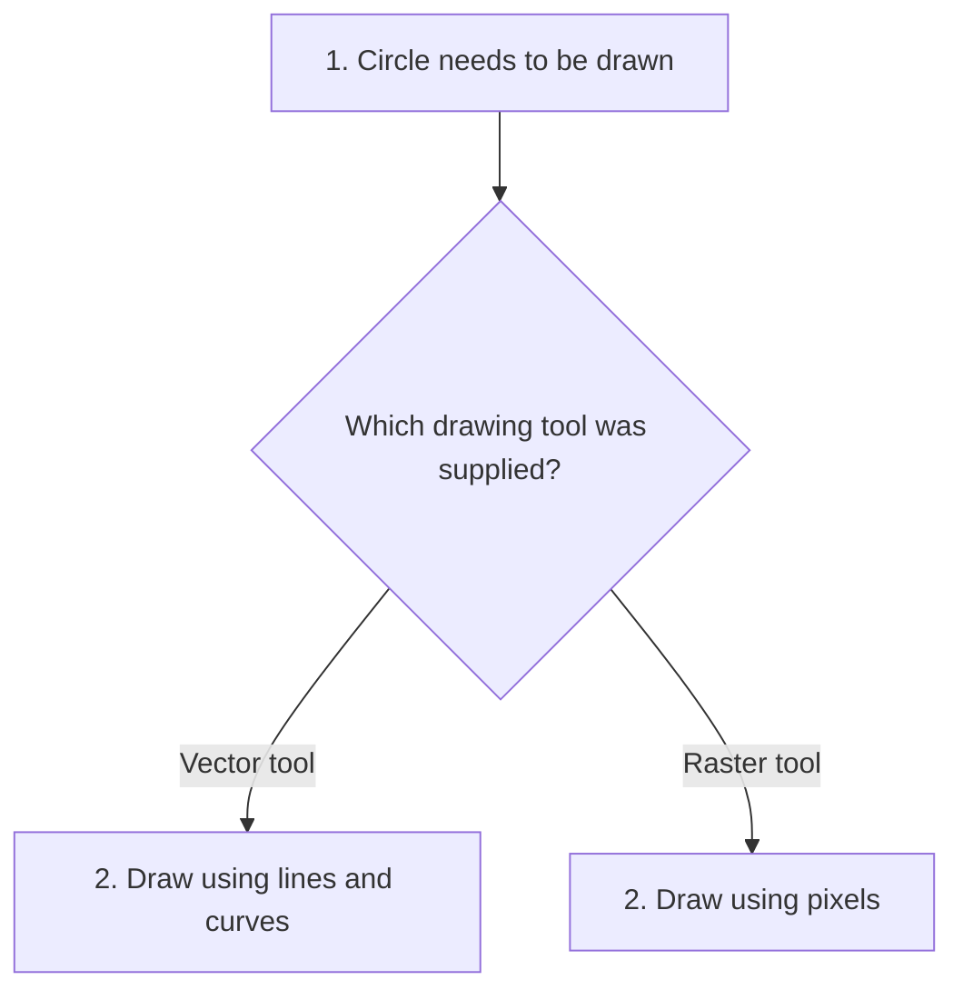
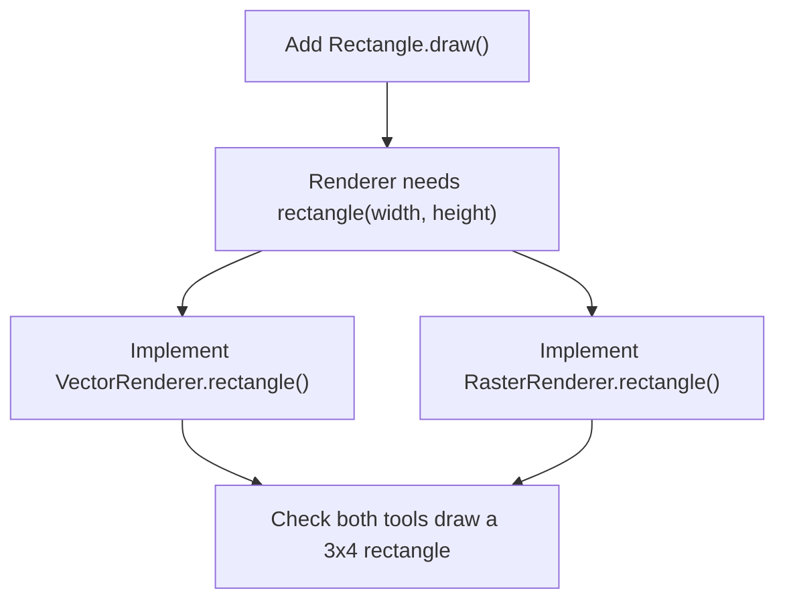
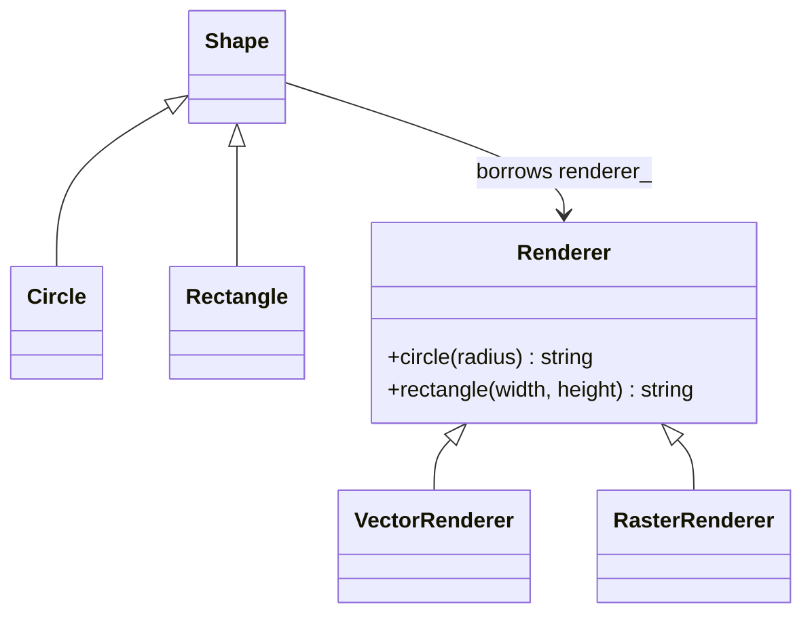
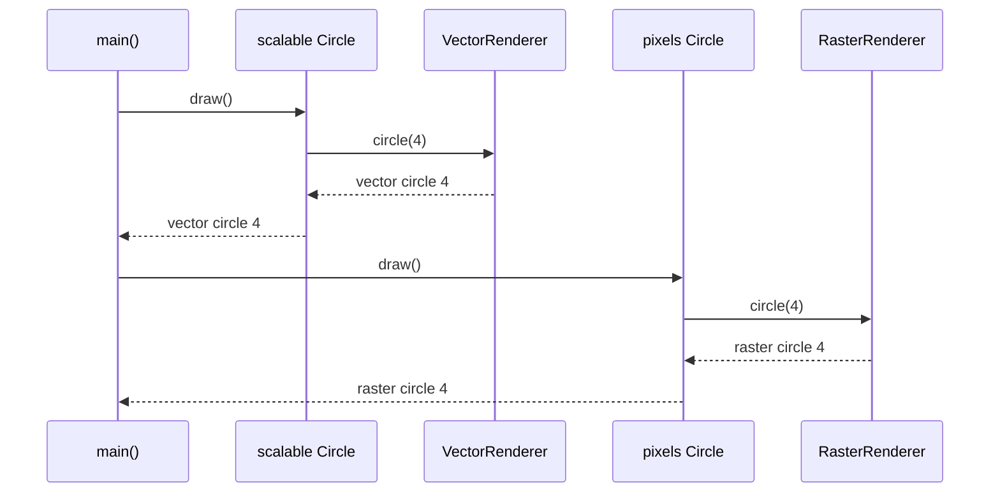

# Bridge

## 1. Definition

**Bridge keeps two changing parts separate and lets one use the other.**

For example, "which shape?" and "which drawing tool?" are different choices. A circle
should not need a separate class for every drawing technology it can use.

## 2. The Problem It Solves

Start with a circle drawn by a vector tool. Then add a pixel-based tool. We could
create `VectorCircle` and `RasterCircle`. Now add a square: we also need
`VectorSquare` and `RasterSquare`. Each new shape repeats the same split.

There are really two choices here: what to draw and how to draw it. Put them in
separate objects. A `Circle` holds its radius and asks a supplied drawing tool to
draw it. We can use the same circle code with either tool, without a class for
every shape-and-tool pair.

## 3. Understand the Idea Step by Step

1. Decide which operations a shape needs from a drawing tool.
2. Describe those operations in a common drawing interface.
3. Supply different drawing tools that support those operations.
4. Give a shape one tool and let it ask that tool to draw.

A **renderer** is a drawing tool. **Vector** drawing describes shapes with lines and
curves; **raster** drawing works with pixels. The example only returns descriptions,
but uses those names to represent two drawing approaches.

### Picture: A Shape Uses One Chosen Tool

Read downward. The branches show alternative tools, not two tools used at once.

**Read it as a sentence:** the circle stays a circle while the selected tool controls
how drawing happens. The diagram's question is explanatory; the code calls the
supplied tool through its common interface.

Pattern books call the shape side the **abstraction** and the drawing-tool side the
**implementation**. In this example, think "what shape?" and "which tool?" The link
between those two objects is the bridge.

## 4. Real-World Scenario

A remote-control product supports televisions and radios. The remote's buttons
describe user actions; each device supplies its own way to change volume or power.
An advanced remote can add a mute button using the existing device operations.

Adding an advanced remote does not mean writing one version for the TV and another
for the radio. It can use either device's existing volume operations. A device
without volume control would need a different set of supported actions.

## 5. Understand the C++ Example

Open [bridge.cpp](../../../patterns/structural/bridge.cpp).

`Circle` is a kind of `Shape`. `Renderer` describes drawing operations.
`VectorRenderer` and `RasterRenderer` provide the two versions.

1. Create both renderer objects.
2. Create circles of radius 4, giving each a renderer.
3. `Circle::draw()` asks its renderer to run `circle(radius_)`.
4. The results are `vector circle 4` and `raster circle 4`.
5. Checks confirm the same circle logic works with either renderer.

The circles **borrow** the renderers: they use them but are not responsible for
destroying them. Renderers must outlive the circles. In this small interface, adding
a rectangle would also require adding renderer support; the pattern does not make
every future change independent automatically.

### C++ Flow Diagram

These arrows mean required development steps for the rectangle drawback example.

Shape choice and tool choice are separate, but their agreed operations still
connect them. A new operation requires changes on both sides of that agreement.

### C++ Class Diagram

Triangles point to base classes. The ordinary arrow is a borrowed renderer,
not ownership. Each shape uses one selected tool.

There is no `VectorCircle` class. A `Circle` works with either renderer supplied
to its constructor, and the renderer must remain alive while that circle uses it.

### C++ Sequence Diagram

Read downward; solid arrows call, dashed arrows return. These are the two normal
circle objects in `main()`, each already connected to a different renderer.

The sample returns text instead of drawing an image. The calls show the important
part: the circle asks its selected tool to do the drawing work.

## 6. Benefits, Drawbacks, and Alternatives

**Benefits:** we do not need separate `VectorCircle` and `RasterCircle` classes.
Shape code stays with shapes, and drawing code stays with tools. We can choose
either renderer when creating a circle.

**Drawbacks:** the parts still need to agree on the drawing operations. In the
drawback example, adding a rectangle requires a new renderer method and changes
to both renderers. Bridge avoids a class for every combination; it does not make
every feature change affect only one class.

**Use it when:** there really are two changing choices. Adapter is more often used
to connect existing incompatible code; Bridge deliberately separates the choices.
With one shape and one tool, a direct implementation may be simpler.

## 7. Check Your Understanding

**Question:** Does simply adding a renderer pointer prove this is a useful design?

**Answer:** No. Identify the two choices and explain how they vary. If neither is
likely to vary, the extra structure may only make the program harder to read.

Optional detail: [structural technical notes](../../../patterns/structural/README.md).