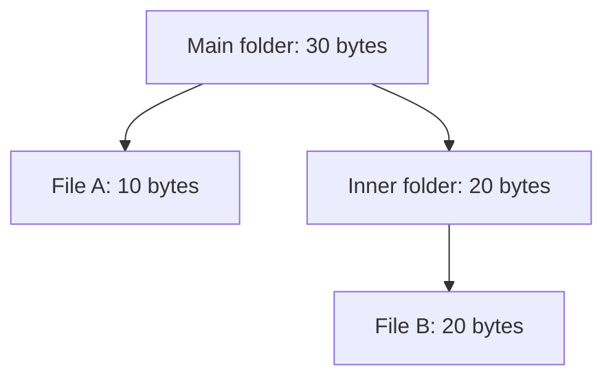
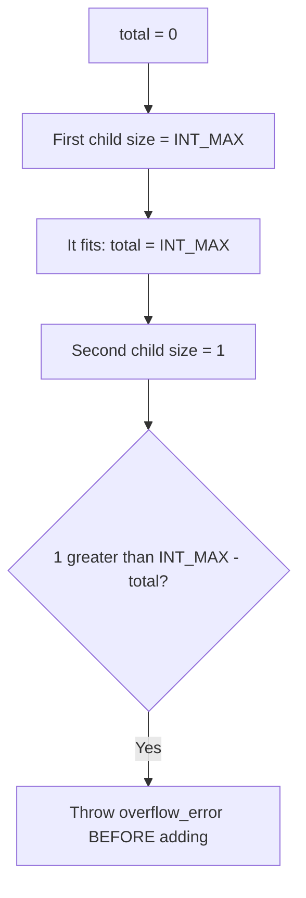
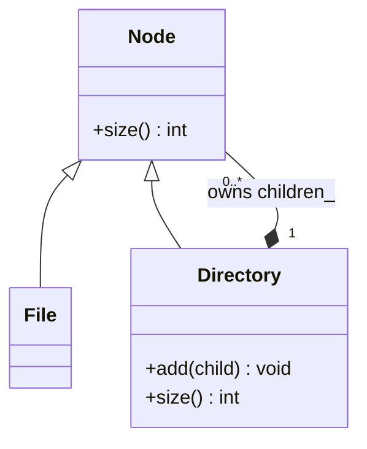
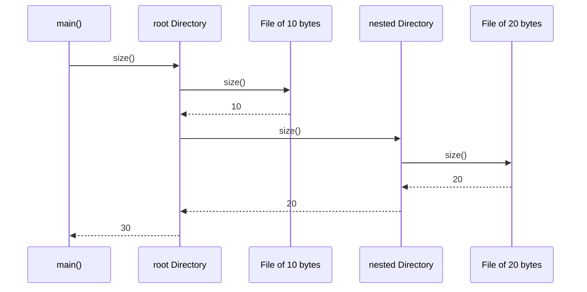

# Composite

## 1. Definition

**Composite lets you use the same operation on a single item and on a group of items.**
A group can contain other groups, so the same rule works at every level.

Think about asking for size. A file reports its own size. A folder asks its contents
for their sizes and adds them. You can ask either one the same question.

## 2. The Problem It Solves

Suppose a storage display needs the size of a selected item. For a file, it reads
one number. For a folder, it must visit the contents. But a child can also be a
folder, so it must keep repeating that decision further down.

If a report needs the same total, should it repeat all that work? Instead, give
files and folders the same `size()` operation. A file returns its number. A folder
asks its children for their sizes and adds them. Both callers can now simply ask
the selected item for its size.

## 3. Understand the Idea Step by Step

1. Define an operation meaningful for both single items and groups.
2. Make a single item perform it directly.
3. Make a group apply it to each child and combine the answers.
4. Let children be either single items or other groups.

Folders inside folders form a **tree**. A file is a **leaf** because it has no
children; a directory is a **composite** because it groups other items. When a
directory asks a subdirectory to follow the same size rule, that is **recursion**.

### Picture: A Folder Adds the Sizes Below It

Read each arrow as "contains." The number in a folder is the sum of its children.

**Read it as a sentence:** the inner folder totals 20; the main folder adds its
10-byte file to that 20 and reports 30.

Only folders need an "add child" operation. Do not force a file to offer a meaningless
operation just to make every class look identical.

## 4. Real-World Scenario

A slide editor groups a title, chart, and legend. Moving the group moves every
contained item. The legend may itself be a group of labels. Each group passes the
move request to its children using the same rule.

The move command can treat the whole group like one item. Each group handles its
own children, so the command does not need a special loop for every nesting level.

## 5. Understand the C++ Example

Open [composite.cpp](../../../patterns/structural/composite.cpp).

`Node` describes `size()`. `File` returns a stored size. `Directory` owns a collection
of child nodes and adds the answers from their `size()` functions.

1. An empty directory reports zero.
2. Put a 20-byte file inside the inner directory.
3. Put a 10-byte file and that inner directory inside the main directory.
4. The main directory asks for 10 and 20, then returns 30.
5. Checks verify the total and reject adding a missing, or null, child.

Children are stored in `unique_ptr`, pointers that own and automatically destroy
their objects. Destroying a directory therefore cleans up its children too. A child
has one owner here. If items were shared between groups or linked back to their
parents as children, repeated counting and endless traversal would need extra rules.

### C++ Flow Diagram

Arrows trace `Directory::size()` for the large directory in the drawback example.
`INT_MAX` below means `std::numeric_limits<int>::max()`.

Both files are valid individually, but their sum does not fit. The guard avoids
undefined signed overflow; a common tree interface does not remove numeric limits.

### C++ Class Diagram

Triangles point to the base interface. The filled diamond means exclusive
ownership through the directory's `vector` of `unique_ptr` children.

A child can be another directory, so the same relationship repeats at each level.
An empty directory owns zero children and reports size zero.

### C++ Sequence Diagram

Solid arrows call `size()`; dashed arrows return byte counts. Read downward to
see the recursive call finish before its parent continues.

Each directory adds child results after checking that they fit. This diagram
omits repeated checks in `main()` and shows one complete traversal.

## 6. Benefits, Drawbacks, and Alternatives

**Benefits:** a caller asks `size()` once whether it has a file or a whole directory.
New nested groups follow the same rule without changes to that caller.

**Drawbacks:** a simple call can still visit a large tree. Very deep nesting can
use too much space for unfinished function calls. Totals can also become too large:
the drawback example rejects a sum that will not fit in an `int`. Keep the shared
operations meaningful too; a file should not need a useless "add child" method.

**Use it when:** nested groups are a real part of the problem. A flat list is simpler
when there is no nesting to represent.

## 7. Check Your Understanding

**Question:** Must a caller know whether a node is a file or folder before asking its size?

**Answer:** No. Both promise `size()`. Only folder-specific work, such as inserting
a child, requires knowing that the node supports that extra operation.

Optional detail: [structural technical notes](../../../patterns/structural/README.md).