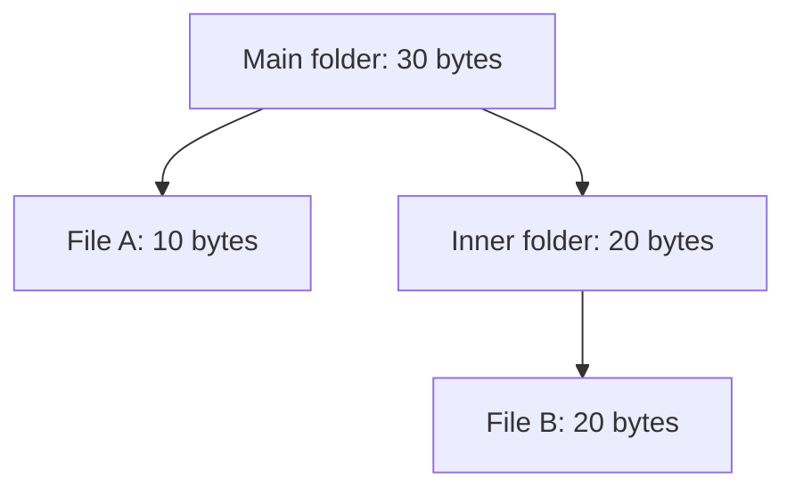

# Composite

## 1. Definition

**Composite lets you use the same operation on a single item and on a group of items.**
A group can contain other groups, so the same rule works at every level.

Think about asking for size. A file reports its own size. A folder asks its contents
for their sizes and adds them. You can ask either one the same question.

## 2. The Problem It Solves

Without a common operation, callers may need code saying "if this is a file, do this;
if it is a folder, examine its children." Every caller repeats the nesting logic.

Instead, let each item know how to answer. A file answers directly, while a folder
gets answers from its children. The caller does not need to inspect every level itself.

## 3. Understand the Idea Step by Step

1. Define an operation meaningful for both single items and groups.
2. Make a single item perform it directly.
3. Make a group apply it to each child and combine the answers.
4. Let children be either single items or other groups.

This arrangement is a **tree**: one starting item has children, which can have more
children. A **leaf** is an item without children. The group is the **composite**.
**Recursion** means applying the same rule again to a smaller part, such as a subfolder.

### Picture: A Folder Adds the Sizes Below It

Read each arrow as "contains." The number in a folder is the sum of its children.

**Read it as a sentence:** the inner folder totals 20; the main folder adds its
10-byte file to that 20 and reports 30.

Only folders need an "add child" operation. Do not force a file to offer a meaningless
operation just to make every class look identical.

## 4. Real-World Scenario

A slide editor groups a title, chart, and legend. Moving the group moves every
contained item. The legend may itself be a group of labels. Each group passes the
move request to its children using the same rule.

The editor still must decide how positions work. Composite describes the grouping;
it does not choose whether positions are relative to the slide or to a parent group.

## 5. Understand the C++ Example

Open [composite.cpp](../../../patterns/structural/composite.cpp).

`Node` describes `size()`. `File` returns a stored size. `Directory` owns a collection
of child nodes and adds the answers from their `size()` functions.

1. An empty directory reports zero.
2. Put a 20-byte file inside the inner directory.
3. Put a 10-byte file and that inner directory inside the main directory.
4. The main directory asks for 10 and 20, then returns 30.
5. Checks verify the total and reject adding a missing, or null, child.

Children are stored in `unique_ptr`, pointers that own and automatically destroy
their objects. Destroying a directory therefore cleans up its children too. A child
has one owner here. If items were shared between groups or linked back to their
parents as children, repeated counting and endless traversal would need extra rules.

## 6. Benefits, Drawbacks, and Alternatives

**Benefits:** simple callers, one rule for nested groups, and a natural way to model
folders, menus, and grouped drawings.

**Drawbacks:** very deep nesting can use too much function-call memory. Huge totals
can exceed the number type's range. A poorly chosen common interface can force
meaningless operations onto some items.

**Use it when:** nested groups are a real part of the problem. A flat list is simpler
when there is no nesting to represent.

## 7. Check Your Understanding

**Question:** Must a caller know whether a node is a file or folder before asking its size?

**Answer:** No. Both promise `size()`. Only folder-specific work, such as inserting
a child, requires knowing that the node supports that extra operation.

Optional detail: [structural technical notes](../../../patterns/structural/README.md).