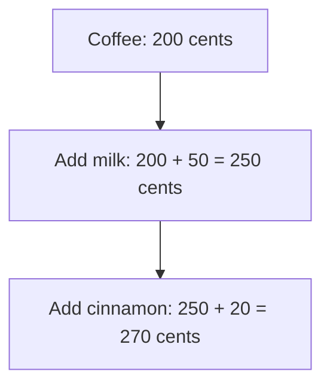

# Decorator

## 1. Definition

**Decorator adds behavior to an object by placing another object around it.** The
outer object accepts the same requests, asks the inner object to work, and adds its part.

Think of a coffee order: start with coffee, add milk, then add cinnamon. Each extra
adds its price without requiring a separate class for every possible drink combination.

## 2. The Problem It Solves

If every combination needs its own class, we soon have coffee with milk, coffee with
cinnamon, coffee with both, and many more. Putting all choices in one large class
can instead produce a confusing collection of switches.

Make each extra a small object that can surround any beverage. A **wrapper** means
this outer object that holds and uses another object.

## 3. Understand the Idea Step by Step

1. Give the basic coffee a cost operation.
2. Give the milk wrapper that same operation. It asks the inner drink for its cost
   and adds the milk charge.
3. A cinnamon wrapper does the same with its own charge.
4. Wrap the coffee with milk, then wrap that result with cinnamon.

The shared **interface** is the set of operations every layer supports. Because a
wrapped drink still supports those operations, it can be wrapped again.

### Picture: Watch the Price Grow

Read downward. Arrows mean "add the next feature." This is the price calculation,
not a drawing of the function-call direction.

**Read it as a sentence:** start at 200, add 50 for milk, then add 20 for cinnamon.

Order matters for many kinds of wrappers. Compressing data before encrypting it is
different from compressing already encrypted data. The coffee arithmetic happens
to be simple; do not assume every decoration can be reordered freely.

## 4. Real-World Scenario

A backup program might wrap a file writer with encryption and compression. Each
layer performs one job before passing data onward. Different supported combinations
can be assembled without duplicating the basic file writer.

Every layer must also handle finishing and errors correctly. Forwarding ordinary
writes but forgetting to finish buffered output could produce a damaged backup.

## 5. Understand the C++ Example

Open [decorator.cpp](../../../patterns/structural/decorator.cpp).

`Beverage` promises `cost()` and `description()`. `Coffee` is the starting drink.
`Milk` and `Cinnamon` are wrappers that each own an inner beverage.

1. Start with coffee costing 200.
2. Put the coffee inside `Milk`, adding 50.
3. Put that milk-wrapped drink inside `Cinnamon`, adding 20.
4. Asking the outer cinnamon object for cost calls inward: cinnamon, milk, coffee.
5. Answers return outward: 200, then 250, then 270.
6. The description becomes `coffee, milk, cinnamon`; checks verify price and order.

`unique_ptr` gives each layer responsibility for destroying its inner object.
Moving that pointer transfers this responsibility without copying the drink.
Destroying the outer layer cleans up the whole chain. A missing inner drink is rejected.

## 6. Benefits, Drawbacks, and Alternatives

**Benefits:** reuse individual extras, choose combinations while the program runs,
and avoid one class for every combination.

**Drawbacks:** many small objects and calls; wrapper order can be confusing; removing
an inner layer may be awkward. Repeated or incompatible features need explicit checks.

**Use it when:** there are meaningful layers of behavior. A simple list of price
options may be enough for a small billing calculation. Proxy mainly controls access;
Decorator mainly adds work around an existing operation.

## 7. Check Your Understanding

**Question:** Does wrapping a coffee in milk twice automatically prevent a double charge?

**Answer:** No. Each milk wrapper adds its charge. If two milk additions are not
allowed, the application must check that rule when it assembles the drink.

Optional detail: [structural technical notes](../../../patterns/structural/README.md).