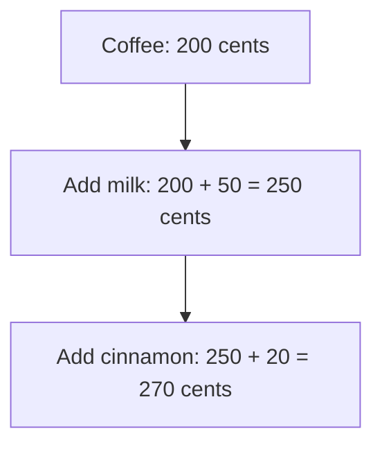
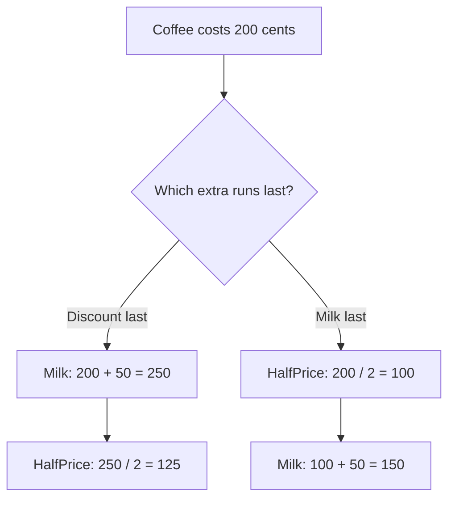
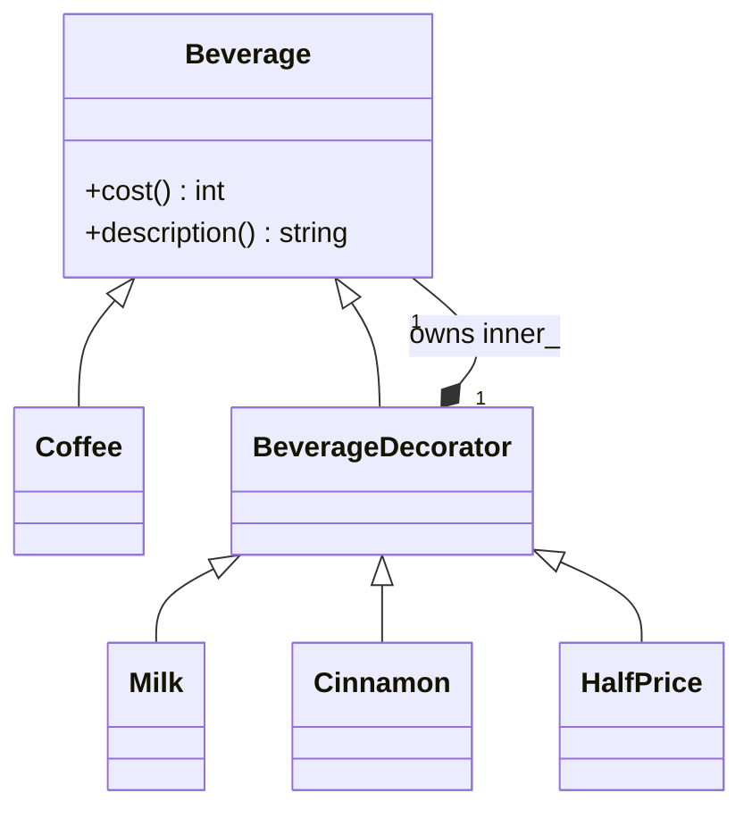
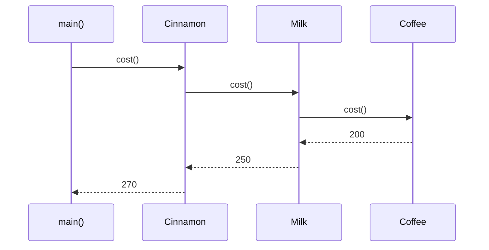

# Decorator

## 1. Definition

**Decorator adds an extra feature by wrapping an existing object.** The wrapper
supports the same requests, lets the inner object do its work, and adds its own part.

Think of a coffee order: start with coffee, add milk, then add cinnamon. Each extra
adds its price without requiring a separate class for every possible drink combination.

## 2. The Problem It Solves

Start with plain coffee. Customers then ask for milk, cinnamon, or both. If we
write a class for every drink, each new extra creates more combinations to support.
The milk-price rule could end up repeated in several of those classes.

Instead, write milk once as an object that holds another beverage. When asked for
the cost, it asks that beverage for its cost and adds 50 cents. Cinnamon works the
same way. This outer object is a **wrapper**. It can wrap coffee or an already
decorated coffee, so extras can be combined without a class for every combination.

## 3. Understand the Idea Step by Step

1. Give the basic coffee a cost operation.
2. Give the milk wrapper that same operation. It asks the inner drink for its cost
   and adds the milk charge.
3. A cinnamon wrapper does the same with its own charge.
4. Wrap the coffee with milk, then wrap that result with cinnamon.

Every layer supports `cost()` and `description()`. These shared operations are the
**interface**. To the next wrapper, coffee with milk is still just a beverage it
can ask for a cost.

### Picture: Watch the Price Grow

Read downward. Arrows mean "add the next feature." This is the price calculation,
not a drawing of the function-call direction.

**Read it as a sentence:** start at 200, add 50 for milk, then add 20 for cinnamon.

Adding milk and cinnamon gives the same price in either order. That will not be
true for every extra: applying a discount before adding milk can differ from
discounting the whole drink. The C++ drawback example shows both results.

## 4. Real-World Scenario

A backup program might wrap a file writer with encryption and compression. Each
layer performs one job before passing data onward. Different supported combinations
can be assembled without duplicating the basic file writer.

Every layer must also handle finishing and errors correctly. Forwarding ordinary
writes but forgetting to finish buffered output could produce a damaged backup.

## 5. Understand the C++ Example

Open [decorator.cpp](../../../patterns/structural/decorator.cpp).

`Beverage` promises `cost()` and `description()`. `Coffee` is the starting drink.
`Milk` and `Cinnamon` are wrappers that each own an inner beverage.

1. Start with coffee costing 200.
2. Put the coffee inside `Milk`, adding 50.
3. Put that milk-wrapped drink inside `Cinnamon`, adding 20.
4. Asking the outer cinnamon object for cost calls inward: cinnamon, milk, coffee.
5. Answers return outward: 200, then 250, then 270.
6. The description becomes `coffee, milk, cinnamon`; checks verify price and order.

`unique_ptr` gives each layer responsibility for destroying its inner object.
Moving that pointer transfers this responsibility without copying the drink.
Destroying the outer layer cleans up the whole chain. A missing inner drink is rejected.

### C++ Flow Diagram

Follow each branch downward. These are the two calculations in
`demonstrate_drawback()`, not the order of constructor calls.

The same features give different answers. The code also checks that two `Milk`
wrappers charge twice: the pattern does not reject repeated extras for you.

### C++ Class Diagram

The hollow triangle points toward the base class. The filled diamond means
ownership: each decorator owns one inner `Beverage` through `unique_ptr`.

`Beverage` is an abstract promise, not a second drink stored alongside `Coffee`.
The inner drink may itself be a wrapper, which is how layers are combined.

### C++ Sequence Diagram

Read from top to bottom. Solid arrows call functions; dashed arrows return values.
This traces the normal `main()` example after its objects have been constructed.

Calls go toward the coffee; prices return toward `main()`. Each wrapper adds its
part on the return path. This is why the outermost wrapper changes the price last.

## 6. Benefits, Drawbacks, and Alternatives

**Benefits:** milk has one implementation that works around any beverage. Callers
can assemble the requested extras while the program runs, without adding another
class for each new combination.

**Drawbacks:** the order and repeated layers need care. Half-price after milk costs
125 cents; milk after half-price costs 150. Two milk wrappers charge twice. A long
chain also takes more work to follow, and removing an inner layer can be awkward.

**Use it when:** there are meaningful layers of behavior. A simple list of price
options may be enough for a small billing calculation. Proxy mainly controls access;
Decorator mainly adds work around an existing operation.

## 7. Check Your Understanding

**Question:** Does wrapping a coffee in milk twice automatically prevent a double charge?

**Answer:** No. Each milk wrapper adds its charge. If two milk additions are not
allowed, the application must check that rule when it assembles the drink.

Optional detail: [structural technical notes](../../../patterns/structural/README.md).