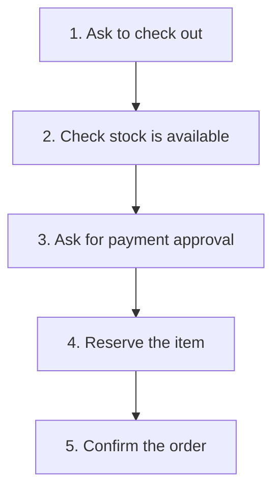

# Facade

## 1. Definition

**Facade gives callers one simple operation for a job that needs several parts
working together.** The facade knows which parts to call and in what order.

For example, a caller asks to check out an order. It should not have to repeat all
the stock-check and payment steps each time. The facade provides that convenient entry point.

## 2. The Problem It Solves

If several screens each call stock and payment code themselves, their sequences
can drift apart. One might reduce stock even when payment fails. A change to the
checkout sequence then needs to be copied into several places.

Put the common sequence in a checkout function that coordinates the smaller parts.
Those parts still keep their own jobs; the facade does not need to absorb all their code.

## 3. Understand the Idea Step by Step

1. Identify a complete task callers repeatedly need.
2. Put its sequence of calls behind one meaningful operation.
3. Use the existing specialized parts to perform each step.
4. Return a clear result, including failures callers need to understand.

A **subsystem** simply means the group of parts doing the underlying work. Here,
stock management and payment form part of the checkout subsystem. An **interface**
is how callers ask for work; the facade offers a simpler interface to that group.

### Picture: One Request, Several Steps

Read downward. This is the successful path. A failed check stops before the next step.

**Read it as a sentence:** one checkout request causes the facade to check stock,
check payment, reserve the item, and return the result.

One function call is not automatically an all-or-nothing operation. If payment
succeeds but reservation later fails, the real application needs a recovery rule,
such as releasing a payment hold. The facade organizes the steps; it does not make
external failures disappear.

## 4. Real-World Scenario

A video editor offers one "export video" action. Inside, it reads frames, converts
audio, encodes video, and writes an output file. The screen calls one export service
instead of knowing how every media library works.

The service still needs to report unsupported formats, cancellation, and partially
written files. A simple entry point should not hide important failures.

## 5. Understand the C++ Example

Open [facade.cpp](../../../patterns/structural/facade.cpp).

`Inventory` keeps the stock count. `Payment` simulates approval or rejection.
`CheckoutFacade` uses both through its `checkout()` function.

1. Start with one unit in stock.
2. A declined payment gives `payment declined`; stock stays at one.
3. An approved payment allows reservation and gives `order confirmed`.
4. Stock is now zero, so another call gives `out of stock`.
5. The checks verify these results and that rejection does not consume stock.

The facade **borrows** its helpers: it uses existing objects without owning their
cleanup. They must remain alive while it uses them. Payment is only a yes/no simulation,
and the example assumes calls are not competing at the same time.

## 6. Benefits, Drawbacks, and Alternatives

**Benefits:** simpler callers, one place for the shared sequence, and fewer callers
affected by changes inside the underlying parts.

**Drawbacks:** the facade can grow too large; it can hide useful choices or meaningful
errors; recovery after partial completion still needs design work.

**Use it when:** callers need a common task spanning several parts. A function that
merely forwards an already simple operation may not add value. Adapter translates
an incompatible operation; Facade simplifies a larger job.

## 7. Check Your Understanding

**Question:** Does putting checkout into one function stop two buyers claiming the last item?

**Answer:** No. Both could check before either reserves it. The stock system needs
a reservation operation that checks and updates as one protected action. This
example does not implement that protection.

Optional detail: [structural technical notes](../../../patterns/structural/README.md).