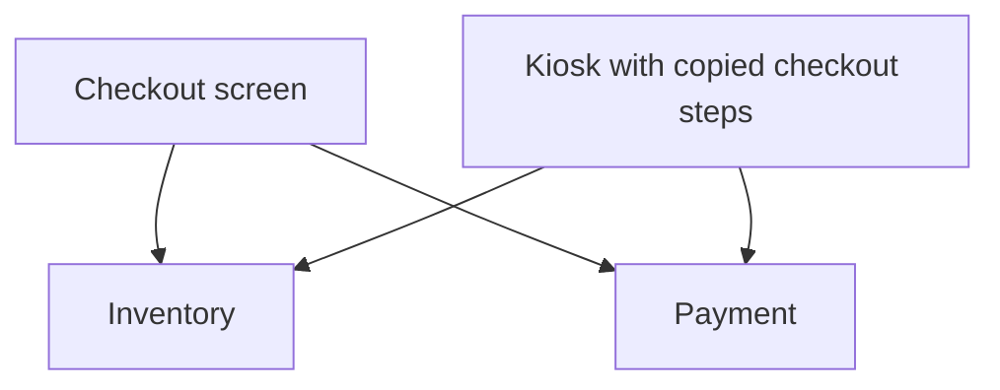
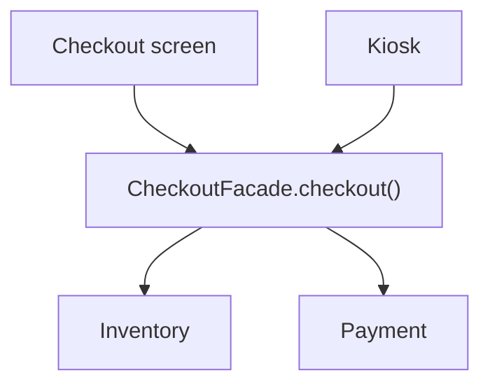
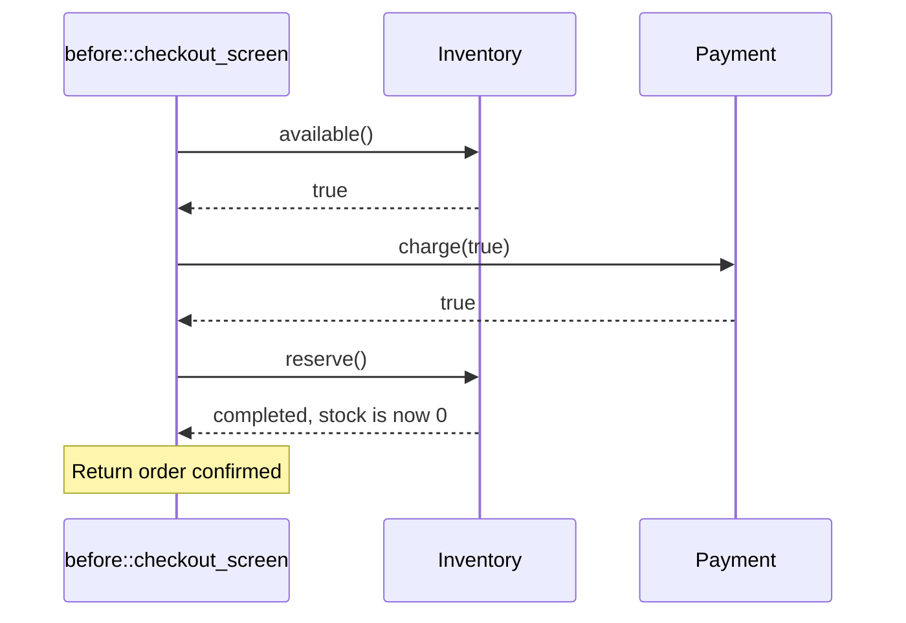
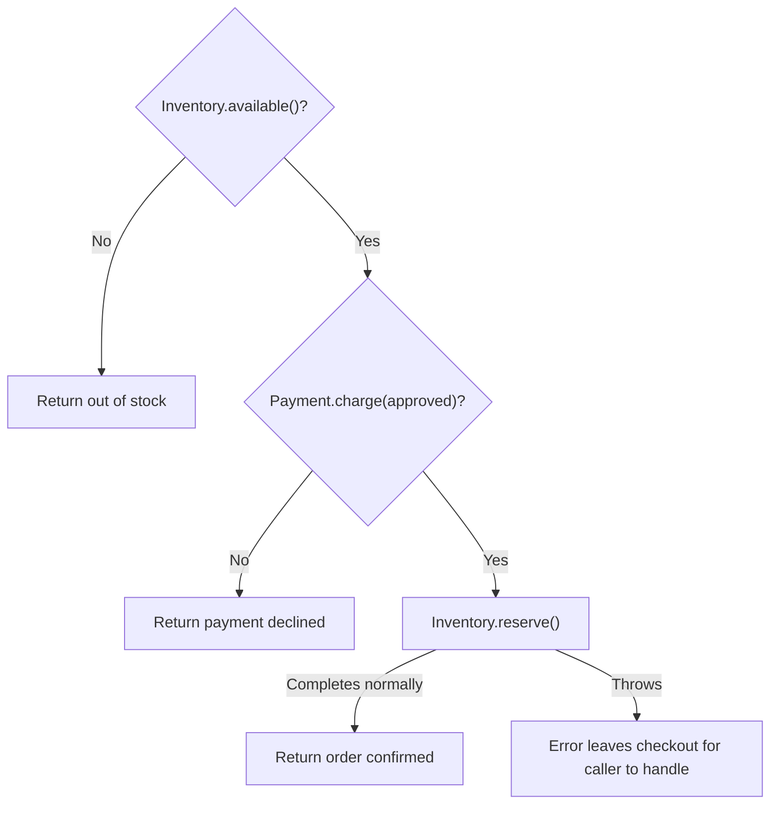
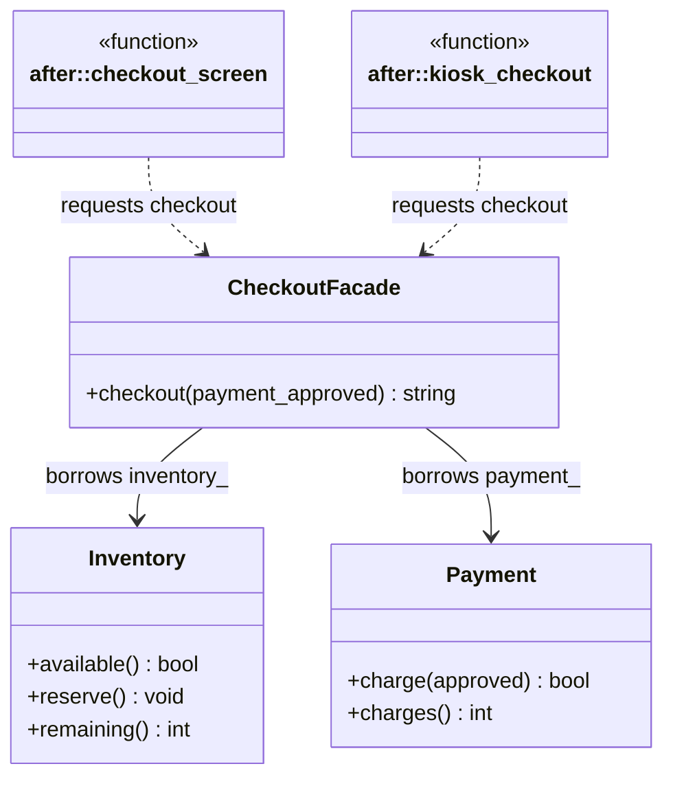
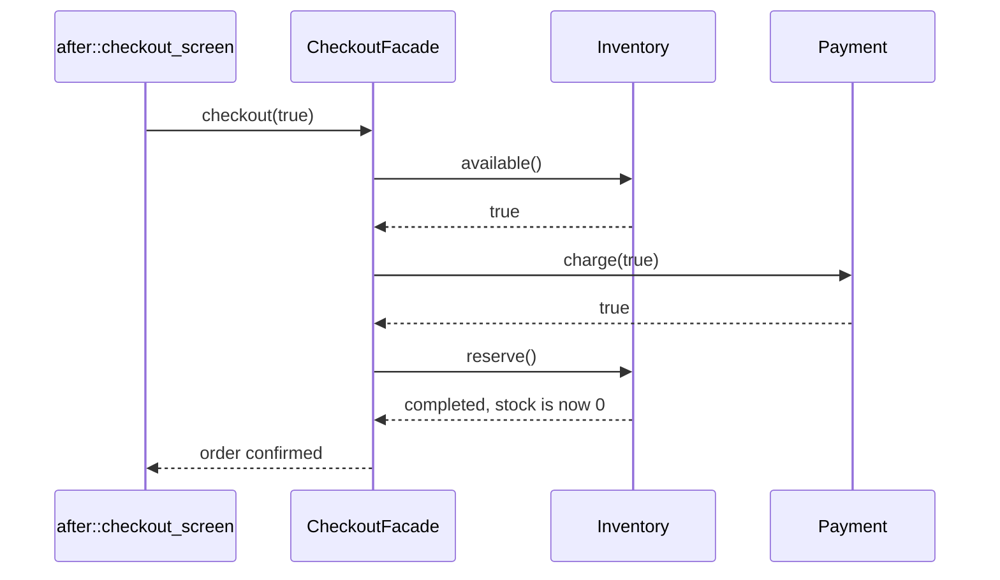
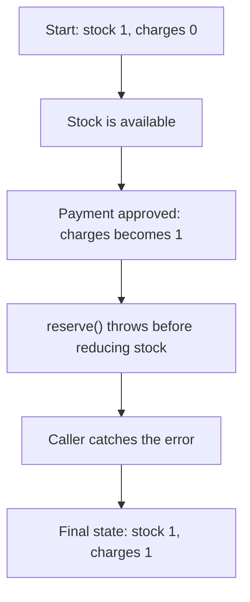

# Facade

## 1. Definition

**Facade gives you one simple way to use several parts of a system.**

Placing an order looks like one action: press **Place Order**. But the program
must check stock, take payment, and reserve the item. Someone needs to call those
parts in the right order.

Without a facade, the checkout screen does that work itself. With a facade, the
screen makes one request: `checkout()`. The facade takes care of the steps behind it.

**The idea is simple: ask for the whole job instead of managing each small step.**

Facade is a structural pattern, meaning it describes how parts of a program fit together.

## 2. The Problem It Solves

### Start with the User's Task

Imagine you are building a small shopping application. There is one item left.
When a customer presses **Place Order**, the application needs to:

1. Is an item available? If not, stop without charging.
2. Is payment approved? If not, stop without reserving stock.
3. Reserve the item, reducing the available stock.
4. Confirm the order only after those steps complete.

The order matters. We should not take payment for an item that is already sold.
We should not reduce stock when payment is declined.

### Understand the Parts Before Connecting Them

Two classes do the individual jobs:

| Class | Its job |
| --- | --- |
| `Inventory` | Check stock and reserve an item |
| `Payment` | Try to charge and report whether payment was approved |

`Inventory` does not take payments. `Payment` does not check stock. So neither
class can place an order by itself. The checkout screen must use both.

In pattern explanations, the code asking for work is called the **client**. Here,
the client is the checkout-screen code, not the person buying the item.

### Without a Facade: Each Client Knows the Details

Now suppose customers can also order from a kiosk. Its code needs the same steps.
If we copy the screen's checkout logic into the kiosk, both places must know how
stock and payment work together.

Arrows below mean **uses directly**, not execution order:



**Read it as a sentence:** both clients call inventory and payment themselves.
Both must get the steps right.

The program shows the screen's version before the change. The copied kiosk in
this picture shows what could happen as we add another way to order.

### Why Does This Become Hard to Maintain?

**The same steps appear in several places.** The screen and kiosk both check stock,
charge, and reserve. Adding a third caller means writing or copying those steps again.

**Changes are easy to miss.** Suppose we add a check before payment. We must update
every caller. If we forget the kiosk, it still uses the old checkout rules.

**Each caller needs too much detail.** It must know which methods to call, which
one comes first, and when to stop. If the payment methods change, several callers
may need changes too. This dependence on another part's details is called **coupling**.

We need one place for the checkout steps, so each caller can simply ask to place an order.

## 3. Understand the Idea Step by Step

### Introduce One Checkout Entry Point

We add a class named `CheckoutFacade`. It offers one method: `checkout()`.

Inside that method, the facade checks stock, requests payment, and reserves the
item. These are the same steps the screen performed before. We have moved them,
not changed what checkout does.

Now the screen and kiosk only need to call `checkout()` and handle its result.
They no longer need to know how to arrange the stock and payment calls.

This is what "a simpler interface" means here: a simpler way to ask for the job.

### Picture: After Introducing the Facade

Arrows still mean **uses directly**. Notice that both clients now point to the
facade instead of pointing to the individual services.



**Read it as a sentence:** the screen and kiosk ask the facade to place an order.
The facade calls inventory and payment for them.

### Who Is Responsible for What Now?

| Part | What it does | Checkout example |
| --- | --- | --- |
| Client | Asks for the job | Screen or kiosk calls `checkout()` |
| Facade | Arranges the steps | Checks stock, charges, then reserves |
| Subsystem classes | Do the individual jobs | `Inventory` manages stock; `Payment` handles charging |

**Subsystem** just means the parts doing the work underneath the facade.
`Inventory` and `Payment` keep their own jobs. They do not need to know who called
them, and other code can still use them directly when needed.

### What Changes, and What Does Not?

Suppose checkout needs another check before charging. We add that check inside
the facade. The screen and kiosk can keep calling the same `checkout()` method.
If we change what callers must pass in or what the result means, they may still
need updates.

The stock and payment work still happens. The improvement is that callers no
longer have to manage it. A facade does not automatically undo a payment when a
later step fails; we will see that limitation in the drawback example.

## 4. Real-World Scenario

### Exporting a Video

Consider a video editor. You choose a file name and press **Export**. Behind that
button, the program may need to read video frames, convert audio, encode the video
into the chosen format, and write the output file.

The menu and a command that exports many videos both need those steps. Rather
than putting the steps in both places, they can call `export_video(settings)`.
An export service handles the smaller tools in the right order.

That service plays the same role as our checkout facade:

- The menu asks for a finished video, just as the checkout screen asks for an order.
- The export service arranges the work, just as `CheckoutFacade` does.
- The video tools perform the individual jobs, just as inventory and payment do.

If a new format check is needed, we add it to the export service instead of every
caller. If writing the file fails, the service must still report the failure.
**Simplifying a task does not mean hiding whether it succeeded.**

This is a possible design for a video editor, not a description of a specific product.

## 5. Understand the C++ Example

Open [facade.cpp](../../../patterns/structural/facade.cpp) for the complete runnable
program. Let us follow the same checkout story in C++.

### Step A: Understand the Helper Classes

```cpp
class Inventory {
public:
    explicit Inventory(bool fail_reservation = false) : fail_reservation_(fail_reservation) {}
    bool available() const { return stock_ > 0; }
    void reserve() {
        if (!available()) { throw std::logic_error("Out of stock"); }
        if (fail_reservation_) { throw std::runtime_error("Reservation service failed"); }
        --stock_;
    }
    int remaining() const { return stock_; }

private:
    int stock_ = 1;
    bool fail_reservation_;
};
```

The inventory starts with one item. `available()` checks whether it is still there.
`reserve()` subtracts one, and `remaining()` tells us how many are left.

For now, `fail_reservation_` is false. Later we set it to true to show what happens
when reservation fails. `throw` reports that error and stops the normal call.

```cpp
class Payment {
public:
    bool charge(bool approved) {
        if (approved) { ++charges_; }
        return approved;
    }
    int charges() const { return charges_; }

private:
    int charges_ = 0;
};
```

This payment class is a simulation. `charge(true)` records one approved charge;
`charge(false)` records nothing. `charges()` lets us check the count. No real money moves.

### Step B: See the Client Without a Facade

```cpp
namespace before {
std::string checkout_screen(Inventory& inventory, Payment& payment, bool approved) {
    if (!inventory.available()) { return "out of stock"; }
    if (!payment.charge(approved)) { return "payment declined"; }
    inventory.reserve();
    return "order confirmed";
}
}
```

Read the function from top to bottom: check stock, try payment, reserve, confirm.
Each early `return` stops the function, so a failed check skips the later steps.

`before` is a namespace, a name used to group this version of the code. The `&`
parameters let the function use the existing inventory and payment objects.

This sequence diagram traces one successful call. Time runs down the page;
solid arrows call methods and dashed arrows return results.



The screen makes all three calls. It must know both the methods and their order.

### Step C: Move the Same Workflow into the Facade

```cpp
class CheckoutFacade {
public:
    CheckoutFacade(Inventory& inventory, Payment& payment) : inventory_(inventory), payment_(payment) {}
    std::string checkout(bool payment_approved) {
        if (!inventory_.available()) { return "out of stock"; }
        if (!payment_.charge(payment_approved)) { return "payment declined"; }
        inventory_.reserve();
        return "order confirmed";
    }

private:
    Inventory& inventory_;
    Payment& payment_;
};
```

The body of `checkout()` contains the same steps as the old screen function.
Now those steps have one shared home.

The constructor receives the inventory and payment objects and keeps references
to them. It does not create copies. Those objects must stay alive while the facade
uses them; this is called **borrowing**.

### Step D: Let Both Clients Request Checkout

```cpp
namespace after {
std::string checkout_screen(CheckoutFacade& checkout, bool approved) {
    return checkout.checkout(approved);
}

std::string kiosk_checkout(CheckoutFacade& checkout, bool approved) {
    return checkout.checkout(approved);
}
}
```

Now both clients make one call. They do not check stock or arrange the payment
steps themselves. They receive a result that a real screen could display to the user.

Setup still creates and connects the objects:

```cpp
Inventory shared_inventory;
Payment shared_payment;
CheckoutFacade checkout(shared_inventory, shared_payment);
```

Both clients use this same facade, so an item bought through the screen is also
gone when the kiosk checks. Setup creates the helpers first and the facade afterward,
keeping the helpers alive for as long as the facade needs them.

### C++ Flow Diagram

Read from the top and follow each answer. This is the control flow inside
`checkout()`, including ordinary rejection and the simulated reservation error.



No stock or declined payment gives a normal result message. A reservation failure
throws an error for the caller to handle. The facade does not claim success in either case.

### C++ Class Diagram

The two boxes marked `function` are free client functions, not additional classes.
Dotted arrows mean use during a call. Ordinary arrows mean borrowed service
references. There is no inheritance in this example.



There is only one stock count and one payment counter in these connected objects.
The facade uses them through references. Neither service needs to call back into the facade.

### C++ Sequence Diagram

Compare this with the earlier sequence without a facade. The successful service
operations are the same, but the screen sends only one request. Solid arrows call;
dashed arrows return. Time runs downward.



**Read it as a sentence:** the screen asks for checkout, the facade performs the
three calls, and the screen receives the answer. The work is the same; the screen
has less to manage.

### Step E: Verify the Before and After Versions

`demonstrate_before_after()` creates separate service objects for each version,
so both start with stock 1 and charges 0. It checks the following sequence:

| Request | Result in both versions | Stock afterward | Charges afterward |
| --- | --- | --- | --- |
| Screen, payment declined | `payment declined` | 1 | 0 |
| Screen, payment approved | `order confirmed` | 0 | 1 |
| Another approved request | `out of stock` | 0 | 1 |

In the after version, the last request comes through the kiosk. It sees the item
already sold by the screen and does not trigger another charge.

Checking the counts matters too: a correct message would not make a double charge acceptable.

Build and run from the workspace root:

```sh
cmake -S CPP_Design_Patterns_and_Principles -B CPP_Design_Patterns_and_Principles/build
cmake --build CPP_Design_Patterns_and_Principles/build --target facade
ctest --test-dir CPP_Design_Patterns_and_Principles/build -R '^facade$' --output-on-failure
./CPP_Design_Patterns_and_Principles/build/facade
```

Expected output:

```text
Without facade: screen coordinates Inventory and Payment -> order confirmed
With facade: screen and kiosk call checkout() -> order confirmed
Checkout success and failure paths verified
Drawback: checkout failed, but charges=1 and stock=1; the facade did not undo the earlier payment.
```

## 6. Benefits, Drawbacks, and Alternatives

### Why This Change Helps

**Benefits:** the caller becomes simpler, and shared checkout steps are easier to change.

| Benefit | What changed here |
| --- | --- |
| Simpler clients | Screen and kiosk request checkout rather than coordinating three service calls |
| One workflow to maintain | A new shared checkout step belongs in the facade rather than both clients |
| Less knowledge of internals | Clients do not need the stock and payment method names |
| Easier to test the shared steps | We can check checkout's result, stock, and charges in one place |

We still need to test inventory and payment themselves. The facade gives us one
place to test how they work together; it does not replace their tests.

### A Drawback You Can Run: Failure After Payment

**Drawbacks:** a simpler call does not guarantee that every step will succeed or
that earlier work will be undone after a failure.

The drawback function sets `Inventory(true)`, meaning reservation will fail.
Its important statements are:

```cpp
Inventory failing_inventory(true);
Payment payment;
CheckoutFacade checkout(failing_inventory, payment);
bool failed = false;
try { static_cast<void>(checkout.checkout(true)); }
catch (const std::runtime_error&) { failed = true; }
check(failed && payment.charges() == 1 && failing_inventory.remaining() == 1,
      "Reservation failed AFTER the simulated charge succeeded");
```

The `try` block attempts checkout, and `catch` handles the reservation error.
`check()` verifies the final values. `static_cast<void>` only means we are not using
the returned text; it does not hide the error.

Follow the values through this failure path:



Payment succeeded, but reservation failed. The program ends with one charge and
the item still in stock. **Throwing an error did not undo the payment.**

A real checkout needs a rule for this case, such as refunding the payment. It must
also avoid charging again if the caller retries. Putting the steps in one function
does not create an all-or-nothing transaction. That guarantee requires extra work.

### Other Costs to Watch For

**It can grow into a class that does everything.** Keep checkout-related work
together, but do not keep adding unrelated jobs such as marketing and user management.

**It can hide useful errors.** A screen may need to distinguish "payment declined"
from "payment service unavailable." A simpler call should still return useful information.

**One operation may not fit every caller.** A special use case may need a different
set of steps. Do not force it through checkout just because the facade exists.

**It adds another layer to follow.** When something goes wrong, you now look through
the facade to reach the service. This is worthwhile when it removes duplicated
steps, but less useful when it only wraps an already simple call.

### When to Use It, and When Not To

Use a facade when callers repeatedly arrange the same steps, or when a system is
difficult to use because callers must know many of its parts.

If the caller already makes one clear, simple call, another wrapper may add little.
A shared function can also act as a facade. We use a class here to keep the inventory
and payment references together.

### Facade, Adapter, and Mediator Are Not the Same

| Idea | Question it answers | Small example |
| --- | --- | --- |
| Facade | Can the caller request the whole job without arranging its parts? | Checkout combines stock and payment operations |
| Adapter | Can an existing component satisfy the operations or units my caller expects? | Convert a Fahrenheit sensor result to Celsius |
| Mediator | Can related objects coordinate without knowing each other directly? | Form fields report changes to a form coordinator |

Here, the facade calls the services because the screen requested checkout.
A mediator often works the other way around: participating objects report changes
to it, and it decides how the other objects should respond.

## 7. Check Your Understanding

**Question:** Did the facade remove the inventory and payment dependencies?

**Answer:** No. Inventory and payment still do the work. The screen no longer has
to arrange their calls itself.

**Question:** What happens when checkout needs an additional check before charging?

**Answer:** Add it inside `checkout()`. The screen and kiosk can keep making the
same call, as long as you have not changed what they must pass in or how they use
the result. Test the new step too.

**Question:** Must a facade own its helpers or hide them from all other code?

**Answer:** No. This facade uses objects created by setup. Other code can still use
those objects directly when needed.

**Question:** A checkout threw an exception. Does that prove no charge occurred?

**Answer:** No. In our drawback example, payment happened first. The later error
does not refund it; the application needs to handle that situation.

**Question:** Does putting checkout into one function stop two buyers claiming the last item?

**Answer:** No. If two checkouts run at the same time, both might see the last item
before either reserves it. Stock needs protection against that race. This small
example runs one call at a time and does not implement that protection.

Optional detail: [structural technical notes](../../../patterns/structural/README.md).

Further reading: [AlgoMaster's Facade lesson](https://algomaster.io/learn/lld/facade).