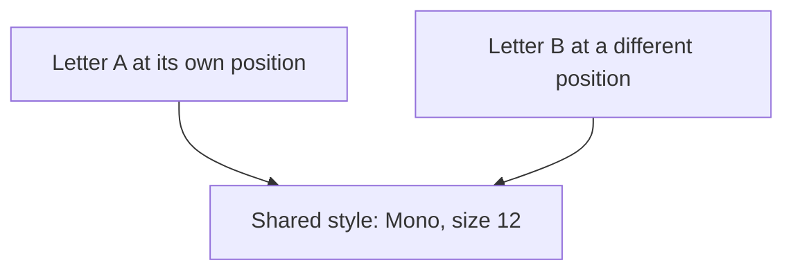
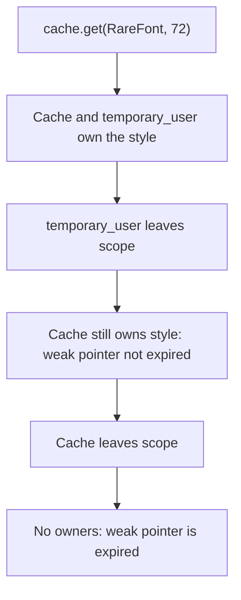
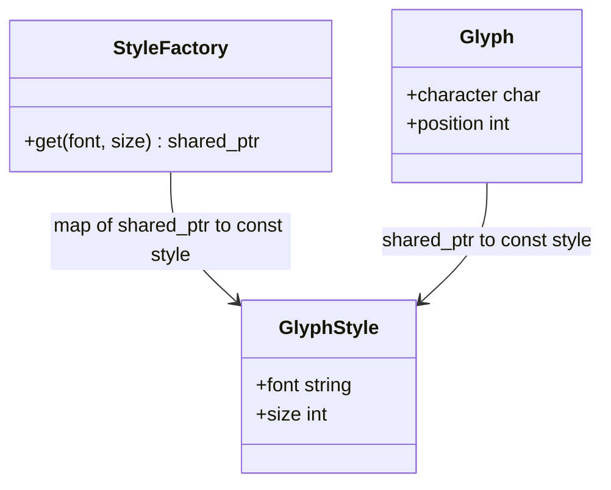
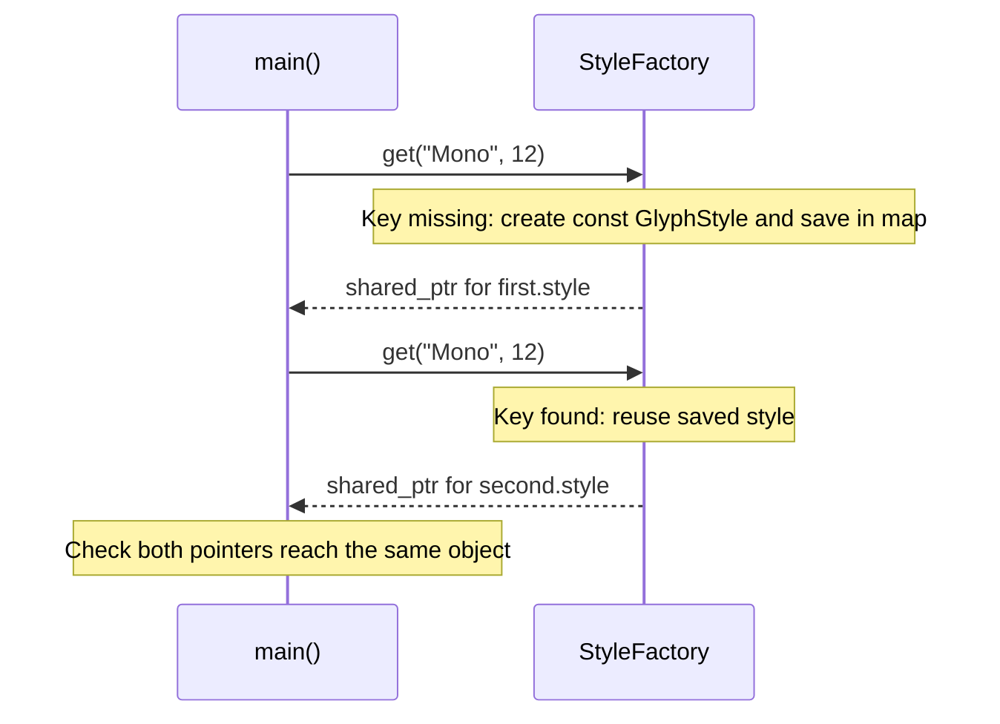

# Flyweight

## 1. Definition

**Flyweight saves memory by letting many objects share the same repeated data.**

For example, many letters can share a font style. The letter A and letter B still
need their own characters and screen positions.

## 2. The Problem It Solves

Imagine a document with thousands of letters using the same font and size. If each
letter stores another copy of that style, we pay for the same information thousands
of times.

Keep one style object instead, and let the letters refer to it. We cannot share
everything: A and B still have different characters and positions. The solution
is to share the style while keeping each letter's own details separate.

## 3. Understand the Idea Step by Step

1. Split each letter's data into shared style and individual character/position.
2. Keep a collection of existing styles.
3. For a requested font and size, reuse its style if it exists; otherwise create it.
4. Let letters refer to the style instead of copying it.

Pattern books call the shared style **intrinsic state** and the separate position
and character **extrinsic state**. Here, "state" just means stored data. The useful
question is: should changing one letter also change every other letter using this data?

### Picture: Two Letters, One Style

Read each arrow as "uses." There is one style object, but two separate letter objects.

**Read it as a sentence:** A and B use the same style while keeping different positions.

Shared styles are usually **immutable**, meaning they are not changed after creation.
Otherwise editing A's shared style would also change B. To give A a new appearance,
select another style for A. The lookup must include both font and size; font alone
would accidentally treat sizes 12 and 20 as the same style.

## 4. Real-World Scenario

A map displays thousands of markers. Their icon image can be shared, while each
marker keeps its own location and label. Moving a marker does not require copying
its icon image. A differently colored marker can select another shared icon style.

Moving one marker changes only its location. Changing its appearance means choosing
another icon; it does not mean editing the icon used by all the other markers.

## 5. Understand the C++ Example

Open [flyweight.cpp](../../../patterns/structural/flyweight.cpp).

A **glyph** is a displayed character. `GlyphStyle` holds font and size. `Glyph`
holds its character, position, and access to a style. `StyleFactory` looks up styles.

1. Request `(Mono, 12)` for the first glyph; the factory creates that style.
2. Request the same pair for the second glyph; the factory returns the same object.
3. Request `(Mono, 20)`; this needs a different style.
4. Checks compare pointers to confirm actual sharing, not just equal values.
5. Other checks confirm positions remain separate. Output is `AB share Mono`.

`shared_ptr<const GlyphStyle>` means several owners keep a style alive, and they
cannot edit it through these pointers. The factory retains styles while it exists.
The example does not remove unused styles or protect the lookup collection against
simultaneous changes from multiple threads.

### C++ Flow Diagram

Arrows show ownership changes in `demonstrate_drawback()`. The weak pointer observes
the style but does not keep it alive.

Sharing saves duplication when data is reused. It can also retain unused data
because this factory has no rule for removing old entries.

### C++ Class Diagram

Ordinary arrows here mean shared ownership, as their labels state. They are not
filled diamonds because the factory and several glyphs can own the same style.

Character and position stay per glyph. Font and size belong to the shared,
read-only object. The key includes both font and size.

### C++ Sequence Diagram

Read downward; solid arrows are calls, dashed arrows return pointers. The two
calls represent the first and second glyph initializers in `main()`.

The factory performs lookup on every request. A later request for size 20 uses a
different key and creates a different style, even though the font is still Mono.

## 6. Benefits, Drawbacks, and Alternatives

**Benefits:** many letters use one style instead of keeping identical copies. Each
letter can still move independently because its position stays separate.

**Drawbacks:** sharing needs pointers and a lookup collection, which have their own
cost. The drawback example shows a style staying alive after its last letter stops
using it because the factory still keeps it. A real cache may need a removal rule.
If nearly every style is different, little is saved. Shared styles should also stay
read-only so one edit cannot unexpectedly change many letters.

**Use it when:** repeated data is large enough that sharing genuinely helps. Simple
independent values are easier for small collections. Reusing an old object after
use, called pooling, is different from many current objects sharing one style.

## 7. Check Your Understanding

**Question:** Should a letter's screen position be stored in its shared font style?

**Answer:** No. Letters using the same font can be in different places. Keep position
with each letter and share only the font information that really is the same.

Optional detail: [structural technical notes](../../../patterns/structural/README.md).