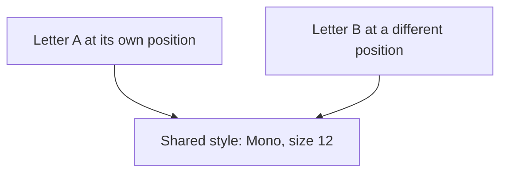

# Flyweight

## 1. Definition

**Flyweight saves memory by sharing repeated information instead of storing a copy
inside every object. Each object still keeps the details that belong only to it.**

For example, many letters can share a font style. The letter A and letter B still
need their own characters and screen positions.

## 2. The Problem It Solves

Imagine a document with thousands of letters. If every letter stores a full copy of
the same font information, much of the memory repeats identical data.

Sharing the entire letter would be wrong too: A and B must not be forced to have
the same position. The important decision is which data can be shared and which cannot.

## 3. Understand the Idea Step by Step

1. Split each letter's data into shared style and individual character/position.
2. Keep a collection of existing styles.
3. For a requested font and size, reuse its style if it exists; otherwise create it.
4. Let letters refer to the style instead of copying it.

**State** means stored information. **Intrinsic state** is the shared information,
such as the font style. **Extrinsic state** is kept separately for each use, such
as the letter's position. These technical names describe the two boxes of information.

### Picture: Two Letters, One Style

Read each arrow as "uses." There is one style object, but two separate letter objects.

**Read it as a sentence:** A and B use the same style while keeping different positions.

Shared styles are usually **immutable**, meaning they are not changed after creation.
Otherwise editing A's shared style would also change B. To give A a new appearance,
select another style for A. The lookup must include both font and size; font alone
would accidentally treat sizes 12 and 20 as the same style.

## 4. Real-World Scenario

A map displays thousands of markers. Their icon image can be shared, while each
marker keeps its own location and label. Moving a marker does not require copying
its icon image. A differently colored marker can select another shared icon style.

If almost every icon is different, sharing may save little. Measure the memory
saved before introducing a collection and lookup system just for this pattern.

## 5. Understand the C++ Example

Open [flyweight.cpp](../../../patterns/structural/flyweight.cpp).

A **glyph** is a displayed character. `GlyphStyle` holds font and size. `Glyph`
holds its character, position, and access to a style. `StyleFactory` looks up styles.

1. Request `(Mono, 12)` for the first glyph; the factory creates that style.
2. Request the same pair for the second glyph; the factory returns the same object.
3. Request `(Mono, 20)`; this needs a different style.
4. Checks compare pointers to confirm actual sharing, not just equal values.
5. Other checks confirm positions remain separate. Output is `AB share Mono`.

`shared_ptr<const GlyphStyle>` means several owners keep a style alive, and they
cannot edit it through these pointers. The factory retains styles while it exists.
The example does not remove unused styles or protect the lookup collection against
simultaneous changes from multiple threads.

## 6. Benefits, Drawbacks, and Alternatives

**Benefits:** fewer copies of large repeated data and a clear separation between
shared style and individual placement.

**Drawbacks:** pointers and lookups also cost memory and time. Keeping every style
forever can waste memory. Accidentally changing shared data affects many users.

**Use it when:** repeated data is large enough that sharing genuinely helps. Simple
independent values are easier for small collections. Reusing an old object after
use, called pooling, is different from many current objects sharing one style.

## 7. Check Your Understanding

**Question:** Should a letter's screen position be stored in its shared font style?

**Answer:** No. Letters using the same font can be in different places. Keep position
with each letter and share only the font information that really is the same.

Optional detail: [structural technical notes](../../../patterns/structural/README.md).