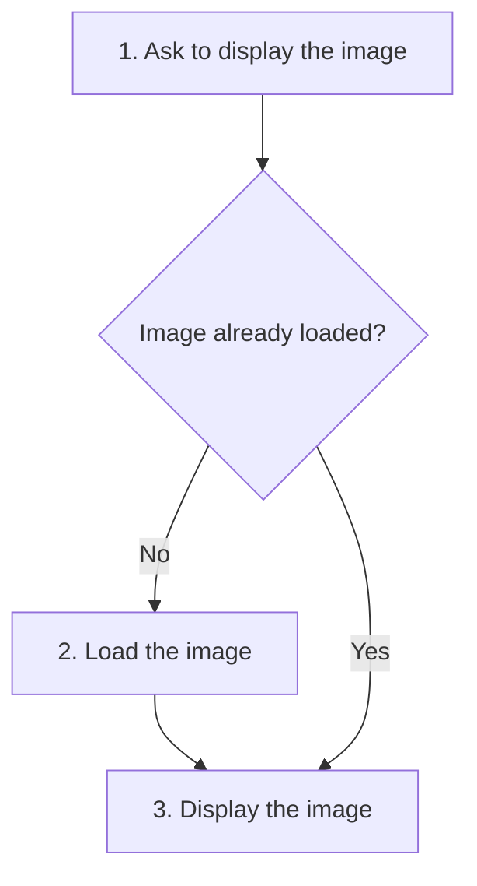
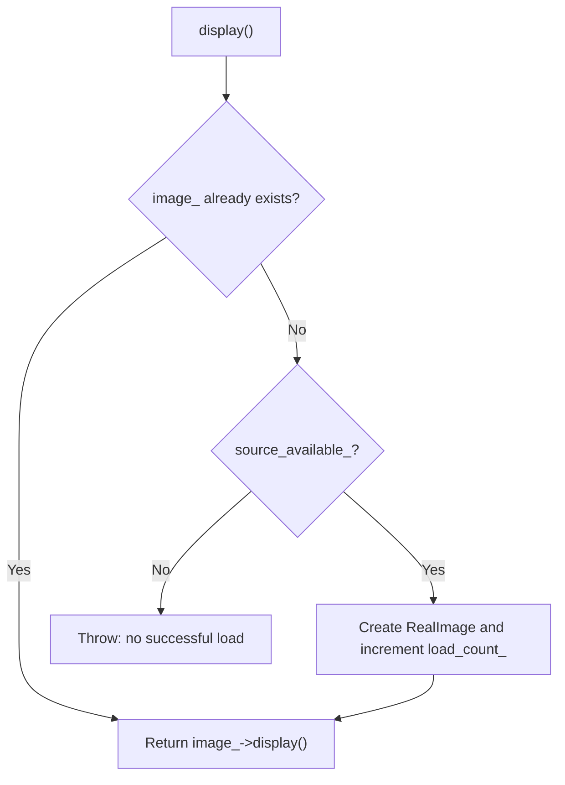
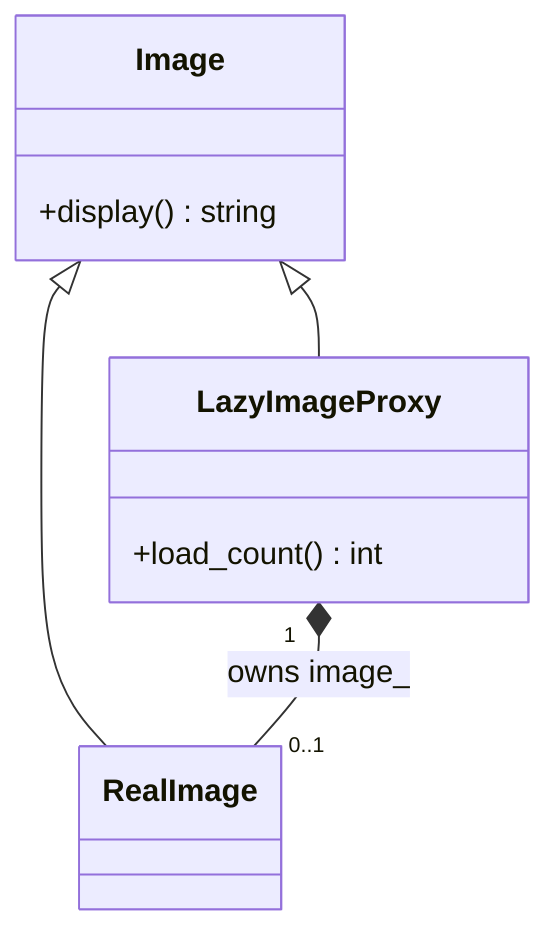
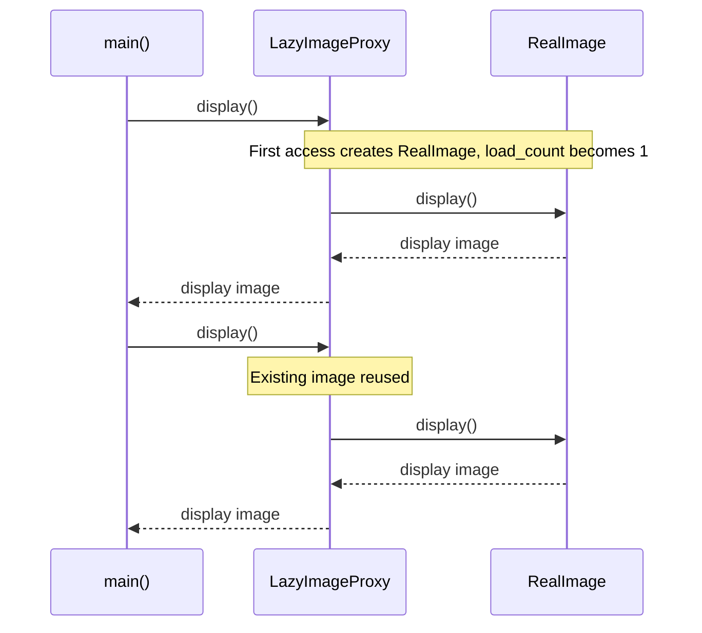

# Proxy

## 1. Definition

**Proxy is a stand-in that controls access to another object.** The caller makes
the usual request, and the proxy decides when to pass it to the real object.

Imagine a large image that is expensive to load. A small stand-in can wait until
someone actually asks to display it before creating the real image object.

## 2. The Problem It Solves

Suppose a document has hundreds of images, but the reader only opens its first
page. Loading them all at the start makes the reader wait for work they may never use.

We could ask each page to check whether each image is loaded. That repeats the
loading rule in every caller. Instead, give the page a proxy with the same
`display()` operation as an image. On the first call it loads the image; on later
calls it reuses it. The page still just asks to display an image.

## 3. Understand the Idea Step by Step

1. Give the stand-in and real object the same useful operations, such as `display()`.
2. Send the caller's request to the stand-in.
3. Let the stand-in check its access rule.
4. When appropriate, pass the request to the real object.

Both objects support `display()`, their shared **interface**. The real image is
sometimes called the **subject**. This proxy is **lazy**, meaning it waits until
first use. Other proxies may check permission or forward a call to another computer;
the common idea is to control access without changing how the caller asks.

### Picture: First Use Loads; Later Uses Reuse

Read downward. Follow "No" on the first display and "Yes" on later displays.

**Read it as a sentence:** load the image only if it is missing, then display it.

The page no longer manages loading, but loading still takes time and can fail.
With this design, that delay or error appears when `display()` is first called.

## 4. Real-World Scenario

A document viewer opens a file containing hundreds of large pictures. It first
creates lightweight image stand-ins. Visiting a page asks its stand-ins to display,
which triggers loading only for those images.

Images on unvisited pages remain unloaded. The viewer must still handle a missing
image and decide when to release images the reader no longer needs.

## 5. Understand the C++ Example

Open [proxy.cpp](../../../patterns/structural/proxy.cpp).

`Image` describes `display()`. `RealImage` does the work. `LazyImageProxy` starts
without a real image and counts how many it creates.

1. Construct the proxy; the creation count is zero.
2. The first `display()` creates a real image and raises the count to one.
3. It forwards the request and returns `display image`.
4. The second display uses the existing image.
5. Checks confirm two displays caused only one creation.

The proxy's `unique_ptr` owns the real image and destroys it automatically later.
This sample simulates loading rather than decoding an image file. Simultaneous calls
are not protected; a real shared proxy would need to coordinate creation and access.

### C++ Flow Diagram

Follow `LazyImageProxy::display()` from top to bottom. The decision boxes choose
whether to reuse, create, or report a failure.

Construction does not inspect the source. The drawback function chooses an
unavailable source, so failure appears at first display, with load count still zero.

### C++ Class Diagram

Triangles point to the common interface. The filled diamond means the proxy owns
its real image. `0..1` means absent before loading, present after a successful load.

The caller can ask either object to display through `Image`. Only the proxy adds
the loading decision and retains the created object for later calls.

### C++ Sequence Diagram

Time runs downward. Solid arrows call methods; dashed arrows return text. This
is the successful first access followed by reuse in `main()`.

The diagram shows no real disk or network access: loading is simulated with
construction and a counter. Real loading would also need latency and error handling.

## 6. Benefits, Drawbacks, and Alternatives

**Benefits:** unopened pages do not load their images. The loading rule has one
home, and callers keep using `display()` without repeating "load if needed."

**Drawbacks:** successfully creating a proxy does not prove the image can be loaded.
The drawback example creates a proxy for an unavailable source and fails only when
`display()` is called. The first display can also be slower than later ones. If
the saved image can change elsewhere, the proxy needs a rule for refreshing it.

**Use it when:** access control or delayed work has value. Directly creating and
using the object is simpler otherwise. Decorator adds behavior; Proxy primarily
controls access to the underlying object.

## 7. Check Your Understanding

**Question:** Is a lazy proxy automatically a Singleton?

**Answer:** No. Lazy means "create later." Singleton means "restrict to one shared
instance." Two separate lazy proxies may each create their own image when needed.

Optional detail: [structural technical notes](../../../patterns/structural/README.md).