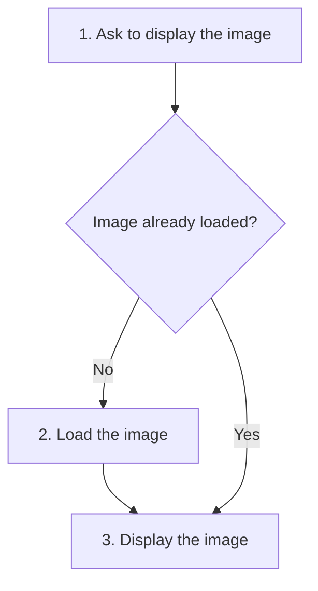

# Proxy

## 1. Definition

**Proxy puts a stand-in object in front of another object to control access to it.**
The caller makes the usual request; the proxy decides when or whether the real
object should do the work.

Imagine a large image that is expensive to load. A small stand-in can wait until
someone actually asks to display it before creating the real image object.

## 2. The Problem It Solves

Loading every image when a document opens could waste time and memory on pages
the user never visits. Making every caller implement its own "load if needed"
logic would repeat the same rules throughout the application.

Put the rule in a proxy that can be used wherever callers expect an image.

## 3. Understand the Idea Step by Step

1. Give the stand-in and real object the same useful operations, such as `display()`.
2. Send the caller's request to the stand-in.
3. Let the stand-in check its access rule.
4. When appropriate, pass the request to the real object.

A shared **interface** is the list of operations both objects support. The real
object is sometimes called the **subject**. A **lazy** proxy waits to create it until
it is needed. A permission-checking proxy checks who may use it. A remote proxy
forwards requests to another program, possibly on another machine.

### Picture: First Use Loads; Later Uses Reuse

Read downward. Follow "No" on the first display and "Yes" on later displays.

**Read it as a sentence:** load the image only if it is missing, then display it.

Using the same function name does not erase costs. The first display may take
longer or fail during loading. A saved answer may be out of date. Callers must be
told about differences that affect correctness.

## 4. Real-World Scenario

A document viewer opens a file containing hundreds of large pictures. It first
creates lightweight image stand-ins. Visiting a page asks its stand-ins to display,
which triggers loading only for those images.

The viewer still needs decisions about failed loads, freeing images no longer in
use, and two callers requesting the same unloaded image at once.

## 5. Understand the C++ Example

Open [proxy.cpp](../../../patterns/structural/proxy.cpp).

`Image` describes `display()`. `RealImage` does the work. `LazyImageProxy` starts
without a real image and counts how many it creates.

1. Construct the proxy; the creation count is zero.
2. The first `display()` creates a real image and raises the count to one.
3. It forwards the request and returns `display image`.
4. The second display uses the existing image.
5. Checks confirm two displays caused only one creation.

The proxy's `unique_ptr` owns the real image and destroys it automatically later.
This sample simulates loading rather than decoding an image file. Simultaneous calls
are not protected; a real shared proxy would need to coordinate creation and access.

## 6. Benefits, Drawbacks, and Alternatives

**Benefits:** avoids work that is never needed; keeps access rules in one place;
lets callers keep using the familiar operation.

**Drawbacks:** first-use delays and errors can surprise callers; saved results need
freshness rules; loading and cleanup become more complicated.

**Use it when:** access control or delayed work has value. Directly creating and
using the object is simpler otherwise. Decorator adds behavior; Proxy primarily
controls access to the underlying object.

## 7. Check Your Understanding

**Question:** Is a lazy proxy automatically a Singleton?

**Answer:** No. Lazy means "create later." Singleton means "restrict to one shared
instance." Two separate lazy proxies may each create their own image when needed.

Optional detail: [structural technical notes](../../../patterns/structural/README.md).