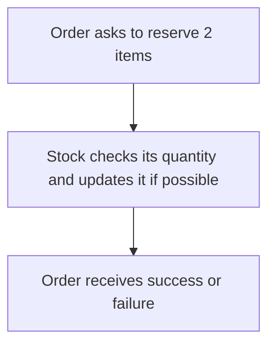

# High Cohesion and Low Coupling

## 1. Definition

**Keep closely related work together, and avoid making one part know unnecessary
details about another part.** These two ideas are called high cohesion and low coupling.

**Cohesion** asks, "Do the jobs inside this part belong together?" **Coupling** asks,
"How much does this part depend on the details of another part?"

## 2. The Problem It Solves

If every order screen changes the stock count directly, stock rules are scattered
through the program. A storage change can force edits in all those screens.

At the other extreme, putting stock, email formatting, and date utilities into one
large helper groups unrelated jobs. Neither arrangement is easy to understand.

## 3. Understand the Idea Step by Step

1. Identify data and rules that must agree, such as stock quantity and reservation checks.
2. Keep that work in the same responsible part.
3. Give other parts meaningful operations, such as `reserve(quantity)`.
4. Avoid exposing internal fields merely so other code can repeat the rules itself.

High cohesion is not simply a small class. A larger stock class can remain focused
if its operations all manage inventory. Low coupling does not mean no relationships:
order processing still needs stock, but should not need to know its storage layout.

### Picture: Ask Stock to Do Stock's Job

Read downward. Each arrow passes a request or result, not permission to edit private data.

**Read it as a sentence:** order processing requests a reservation; stock owns the
decision and update. The order does not read, subtract, and overwrite the count itself.

Adding an interface can help when implementations need to vary, but an interface is
not the whole principle. A complicated set of call-order requirements can still
make two parts strongly dependent on each other.

## 4. Real-World Scenario

A warehouse receives orders from a website and a support desk. Both ask the stock
service to reserve items. Stock rules stay in one place rather than being copied
into each order channel.

If orders arrive together, the reservation must check and update safely as one
protected action. Giving the rule a good home helps, but does not itself add locks
or database protection.

## 5. Understand the C++ Example

Open [cohesion_and_coupling.cpp](../../principles/cohesion_and_coupling.cpp).

`Stock` keeps the count and performs reservations. `Fulfillment` represents handling
orders and asks stock for that operation.

1. Start with three units.
2. Request two units; stock accepts and leaves one.
3. Request two again; stock rejects the request.
4. Rejection leaves the remaining quantity at one.
5. Checks verify both outcomes and the unchanged quantity after failure.

Fulfillment borrows the stock object, so stock must remain alive while it is used.
The example uses the concrete `Stock` class directly because only one implementation
is needed. The useful improvement is still real: callers rely on its operation,
not on the field containing its count.

## 6. Benefits, Drawbacks, and Alternatives

**Benefits:** rules have clear homes, internal changes affect fewer callers, and
readers can understand each part with less knowledge of the entire system.

**Drawbacks:** separating too much creates unnecessary forwarding. Some work naturally
belongs together, and attempts to remove every dependency can obscure that fact.

**Use it by asking:** what must a reader know to safely use this part, and where
would a real rule change need to be made? Start with meaningful operations before
adding abstract interfaces everywhere.

## 7. Check Your Understanding

**Question:** Would returning an editable reference to the stock count reduce coupling?

**Answer:** No. It exposes how quantity is stored and lets callers bypass stock's
rules. Asking for a reservation requires less internal knowledge and preserves control.

Optional detail: [principles technical notes](../../principles/README.md).