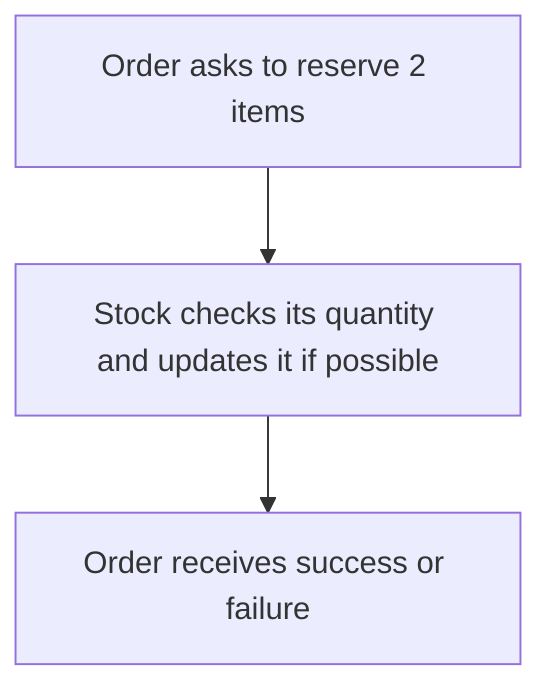
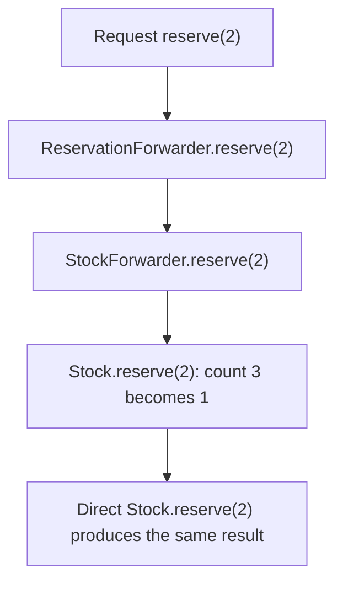
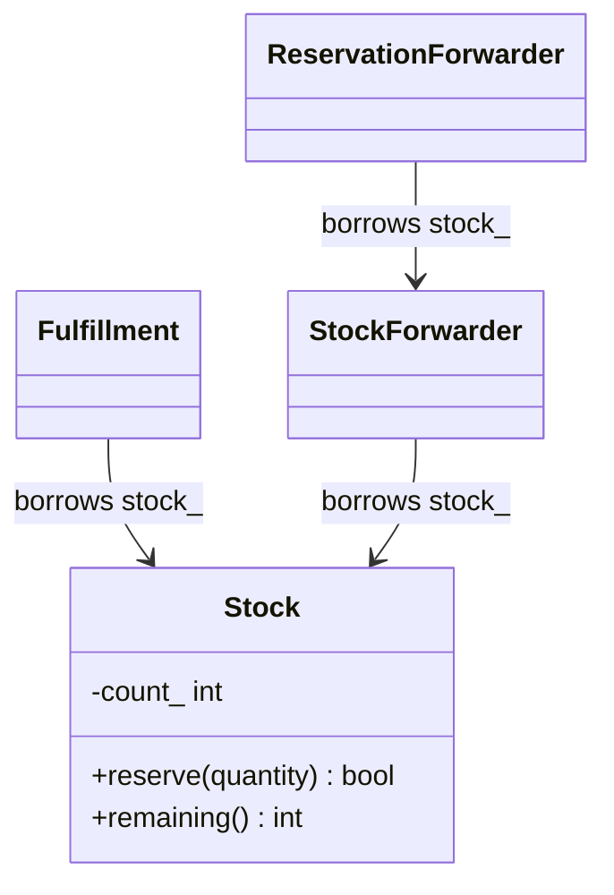
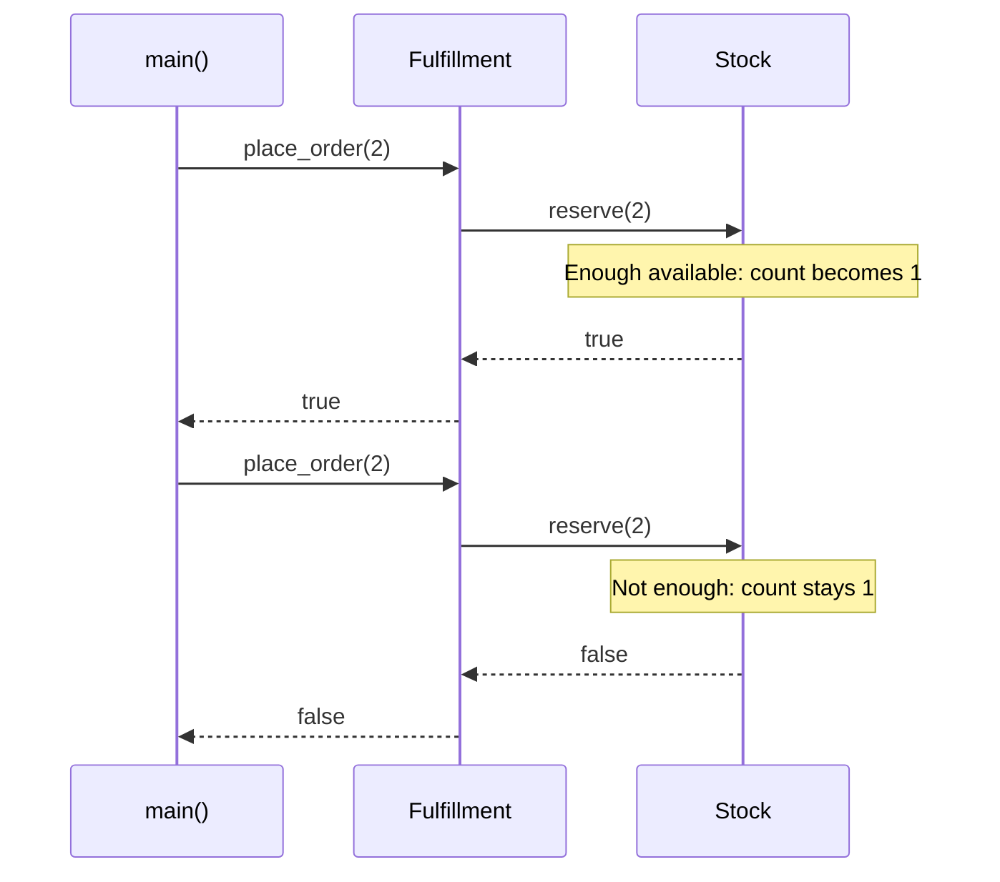

# High Cohesion and Low Coupling

## 1. Definition

**High cohesion means keeping related work together. Low coupling means avoiding
unnecessary knowledge of another part's details.**

**Cohesion** asks, "Do the jobs inside this part belong together?" **Coupling** asks,
"How much does this part depend on the details of another part?"

## 2. The Problem It Solves

Suppose each order screen reads a stock count, checks it, subtracts the requested
quantity, and writes it back. Each screen must understand how stock is stored and
remember the same reservation rules. A storage change reaches all of them.

Let `Stock` keep both the count and the rules for changing it. Other code simply
calls `reserve(quantity)`. Keeping the stock work together improves cohesion;
letting callers use one meaningful operation reduces coupling to storage details.

Putting email formatting into `Stock` would not help. It would group unrelated
work, even if both jobs happen during an order.

## 3. Understand the Idea Step by Step

1. Identify data and rules that must agree, such as stock quantity and reservation checks.
2. Keep that work in the same responsible part.
3. Give other parts meaningful operations, such as `reserve(quantity)`.
4. Avoid exposing internal fields merely so other code can repeat the rules itself.

Stock can have several methods and still be focused if they all manage inventory.
Order processing still needs stock; that connection is useful. What it no longer
needs is permission to read, subtract, and overwrite the private count itself.

### Picture: Ask Stock to Do Stock's Job

Read downward. Each arrow passes a request or result, not permission to edit private data.

**Read it as a sentence:** order processing requests a reservation; stock owns the
decision and update. The order does not read, subtract, and overwrite the count itself.

An abstract interface is not required for this improvement. The main change is
asking stock to reserve items instead of making every caller perform stock's job.

## 4. Real-World Scenario

A warehouse receives orders from a website and a support desk. Both ask the stock
service to reserve items. Stock rules stay in one place rather than being copied
into each order channel.

If orders arrive together, the reservation must check and update safely as one
protected action. Giving the rule a good home helps, but does not itself add locks
or database protection.

## 5. Understand the C++ Example

Open [cohesion_and_coupling.cpp](../../principles/cohesion_and_coupling.cpp).

`Stock` keeps the count and performs reservations. `Fulfillment` represents handling
orders and asks stock for that operation.

1. Start with three units.
2. Request two units; stock accepts and leaves one.
3. Request two again; stock rejects the request.
4. Rejection leaves the remaining quantity at one.
5. Checks verify both outcomes and the unchanged quantity after failure.

Fulfillment borrows the stock object, so stock must remain alive while it is used.
The example uses the concrete `Stock` class directly because only one implementation
is needed. The useful improvement is still real: callers rely on its operation,
not on the field containing its count.

### C++ Flow Diagram

Arrows show forwarding in the drawback example. Each layer passes the same quantity.

The wrappers add neither rules nor translation. They make the dependency longer
to follow without removing meaningful knowledge of the stock operation.

### C++ Class Diagram

Ordinary arrows are borrowed references, not ownership or inheritance. The two
paths distinguish the main example from its intentionally excessive wrappers.

Stock checks and updates its own count: related work stays together. Depending on
that clear operation is reasonable; low coupling does not mean having no dependencies.

### C++ Sequence Diagram

Read downward; solid arrows call, dashed arrows return. These are the two
`place_order(2)` checks in `main()` with initial stock 3.

The caller cannot make inventory negative by bypassing the reservation rule.
No SQL or abstract interface is needed to demonstrate this separation of responsibilities.

## 6. Benefits, Drawbacks, and Alternatives

**Benefits:** stock checks and updates its own count. A reader can understand an
order's reservation request without learning how stock is stored, and a storage
change need not reach every order screen.

**Drawbacks:** adding layers is not the same as removing unnecessary dependence.
The drawback example forwards `reserve(2)` through two wrappers that add no rule
or translation. The caller still needs a reservation; there are just more calls
to follow. Keep useful connections direct when another layer does not help.

**Use it by asking:** what must a reader know to safely use this part, and where
would a real rule change need to be made? Start with meaningful operations before
adding abstract interfaces everywhere.

## 7. Check Your Understanding

**Question:** Would returning an editable reference to the stock count reduce coupling?

**Answer:** No. It exposes how quantity is stored and lets callers bypass stock's
rules. Asking for a reservation requires less internal knowledge and preserves control.

Optional detail: [principles technical notes](../../principles/README.md).