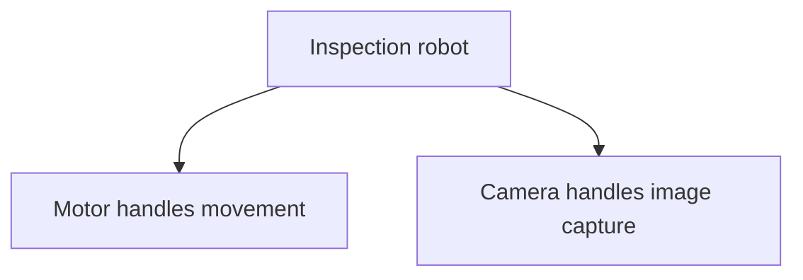
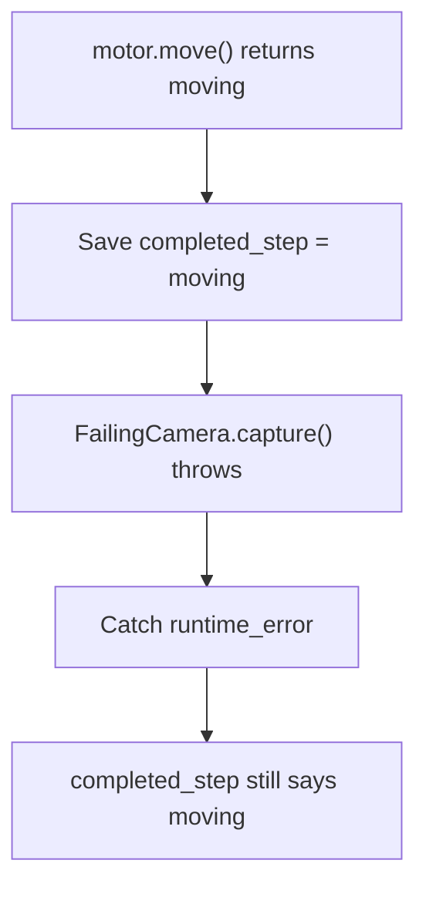
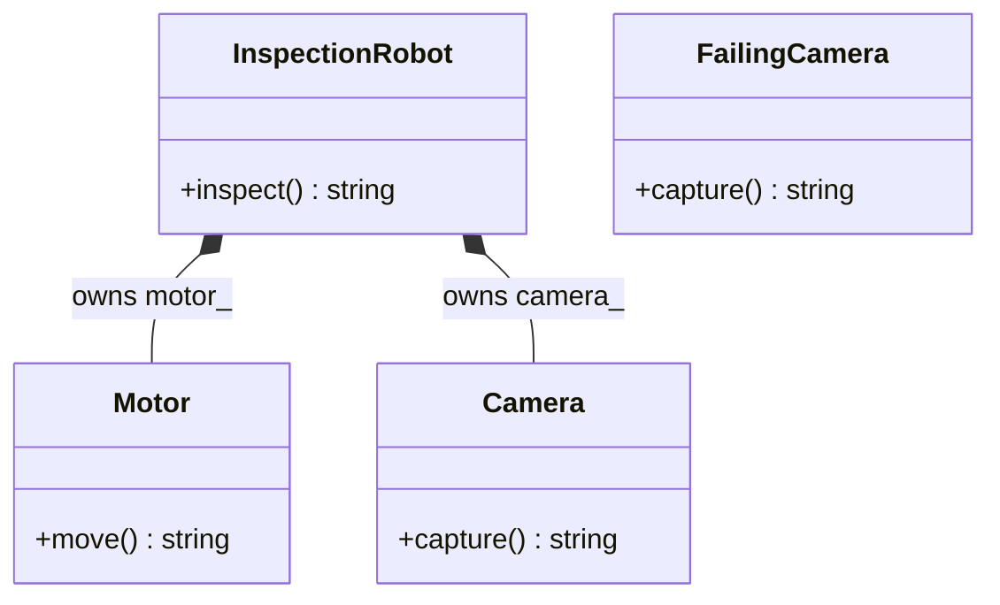
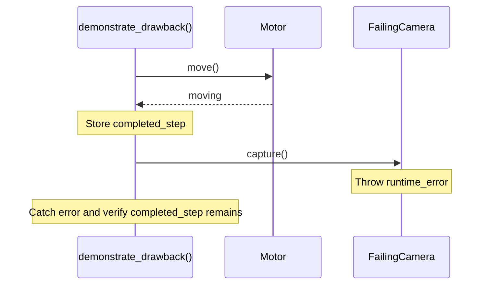

# Favor Composition Over Inheritance

## 1. Definition

**Prefer giving an object useful parts over inheriting from those parts just to
reuse their functions.**

A robot has a motor and a camera. It is not itself a motor or a camera. Keeping
those parts inside the robot expresses that relationship directly.

## 2. The Problem It Solves

Suppose a robot needs to move and take a picture. Inheriting from `Motor` would make
it usable as a motor, and inheriting from `Camera` would make it usable as a camera.
Neither statement describes why we needed those functions: the robot uses both parts.

Store a motor and a camera inside the robot instead. Its `inspect()` operation asks
them to do their jobs. The robot offers an inspection operation without exposing
every motor and camera operation as if it were the part itself.

## 3. Understand the Idea Step by Step

1. Identify the abilities the object needs, such as movement and image capture.
2. Give each ability a suitable helper object.
3. Store or receive those helpers as parts of the main object.
4. Ask the helpers to perform their work when needed.

Putting `Motor` and `Camera` members inside the robot is **composition**. Asking
the camera to capture an image is **delegation**. By contrast, public **inheritance**
says the new type can replace its base type. "Uses a camera" and "can replace a
camera" are different claims.

### Picture: A Robot Has Parts

Read each arrow as "contains and uses." The arrows do not specify execution order.

**Read it as a sentence:** the robot uses its motor to move and its camera to capture
an image. It does not claim to be either part.

The parts can be ordinary member objects, as they are here. We do not need pointers
or interfaces unless there is a reason to select different kinds of parts.

## 4. Real-World Scenario

A media player uses a decoder, an audio output, and a playlist. The player should
not inherit all decoder operations just to play a file; it can keep a decoder as a helper.

Changing the audio output need not change how the playlist stores tracks. If users
need different output devices, the player can select a helper that supports the
required audio operations.

## 5. Understand the C++ Example

Open [composition.cpp](../../principles/composition.cpp).

`InspectionRobot` contains `Motor` and `Camera` objects directly as members. It does
not derive from either class.

1. Creating the robot also creates its two member objects.
2. `inspect()` asks the motor for a movement description.
3. It asks the camera for a capture description.
4. The returned strings form `moving: photo`.
5. The program checks that combined result.

The members exist for the robot's lifetime and are cleaned up with it. No separate
memory allocation is needed for these parts. The functions return descriptions;
they do not control real hardware. For real movement followed by capture, write
separate ordered statements and handle failures, rather than assuming string-expression
evaluation guarantees physical timing.

### C++ Flow Diagram

Arrows follow the deliberately ordered statements in `demonstrate_drawback()`.
The normal robot expression is separate from this failure demonstration.

Combining helpers does not undo earlier work when a later helper fails. These
are text results, not real motor movement or camera I/O.

### C++ Class Diagram

Filled diamonds mean contained value members. The robot owns its motor and camera;
it does not inherit from either of them.

`FailingCamera` is a separate demonstration type, not a subtype of `Camera` and
not a field of `InspectionRobot`. Matching method names alone do not make it swappable here.

### C++ Sequence Diagram

Solid arrows call; dashed arrows return. This is the explicit failure sequence,
so the completed first step is unambiguous.

In normal `InspectionRobot::inspect()`, the concatenation expression does not
guarantee the relative evaluation order of `move()` and `capture()`. Real physical
sequencing would require explicit statements and an agreed failure policy.

## 6. Benefits, Drawbacks, and Alternatives

**Benefits:** the motor and camera keep their own jobs, while the robot describes
how they are used for inspection. It does not claim to be either part.

**Drawbacks:** the robot still has to connect the work and handle failures. In the
ordered drawback example, the motor step completes before the camera throws; the
earlier step is not undone. Swappable parts also need agreed operations and clear
lifetimes. Composition helps organize the parts, not automatically coordinate every outcome.

**Use inheritance when:** the new type really keeps the base type's promises. A
specific renderer can honestly be a renderer. This principle is a preference against
misusing inheritance, not a ban on it.

## 7. Check Your Understanding

**Question:** Should a robot inherit from `Camera` because it can take pictures?

**Answer:** Not for that reason. It has a camera capability. Inheritance would claim
the whole robot can replace a camera wherever one is expected, which is a different
and possibly false promise.

Optional detail: [principles technical notes](../../principles/README.md).