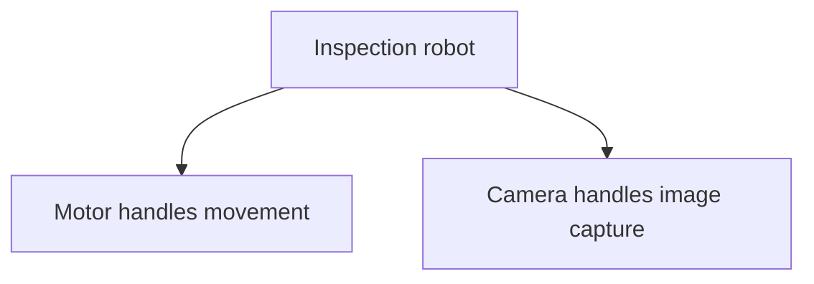

# Favor Composition Over Inheritance

## 1. Definition

**Build an object from useful parts when it has or uses those parts. Do not make
it inherit from another class merely to reuse a few functions.**

A robot has a motor and a camera. It is not itself a motor or a camera. Keeping
those parts inside the robot expresses that relationship directly.

## 2. The Problem It Solves

Inheritance can bring along operations and assumptions that do not fit the new class.
The class may appear to promise abilities it cannot properly provide. Many combinations
of abilities can also produce a large family of specialized derived classes.

Using parts lets the object expose only the operations appropriate to its own job.

## 3. Understand the Idea Step by Step

1. Identify the abilities the object needs, such as movement and image capture.
2. Give each ability a suitable helper object.
3. Store or receive those helpers as parts of the main object.
4. Ask the helpers to perform their work when needed.

**Composition** means building with objects as parts. **Delegation** means asking a
helper to do some work. **Inheritance** creates a derived class from a base class;
public inheritance promises the derived object can be used in place of that base.

### Picture: A Robot Has Parts

Read each arrow as "contains and uses." The arrows do not specify execution order.

**Read it as a sentence:** the robot uses its motor to move and its camera to capture
an image. It does not claim to be either part.

Parts do not always need to be replaceable while the program runs. Ordinary member
objects are often enough. Pointers and extra interfaces are useful when replacement
is actually needed, not because they make a diagram look more flexible.

## 4. Real-World Scenario

A media player uses a decoder, an audio output, and a playlist. The player should
not inherit all decoder operations just to play a file; it can keep a decoder as a helper.

If different audio outputs are required, the player can use a shared output interface.
It still needs clear rules for starting, stopping, and handling failures across its parts.

## 5. Understand the C++ Example

Open [composition.cpp](../../principles/composition.cpp).

`InspectionRobot` contains `Motor` and `Camera` objects directly as members. It does
not derive from either class.

1. Creating the robot also creates its two member objects.
2. `inspect()` asks the motor for a movement description.
3. It asks the camera for a capture description.
4. The returned strings form `moving: photo`.
5. The program checks that combined result.

The members exist for the robot's lifetime and are cleaned up with it. No separate
memory allocation is needed for these parts. The functions return descriptions;
they do not control real hardware. For real movement followed by capture, write
separate ordered statements and handle failures, rather than assuming string-expression
evaluation guarantees physical timing.

## 6. Benefits, Drawbacks, and Alternatives

**Benefits:** useful parts remain separate, the robot's public operations stay focused,
and it does not inherit promises that do not describe a robot.

**Drawbacks:** forwarding work to helpers adds some code. Replaceable helpers need
agreed operations and lifetime rules. Some frameworks genuinely require derived classes.

**Use inheritance when:** the new type really keeps the base type's promises. A
specific renderer can honestly be a renderer. This principle is a preference against
misusing inheritance, not a ban on it.

## 7. Check Your Understanding

**Question:** Should a robot inherit from `Camera` because it can take pictures?

**Answer:** Not for that reason. It has a camera capability. Inheritance would claim
the whole robot can replace a camera wherever one is expected, which is a different
and possibly false promise.

Optional detail: [principles technical notes](../../principles/README.md).